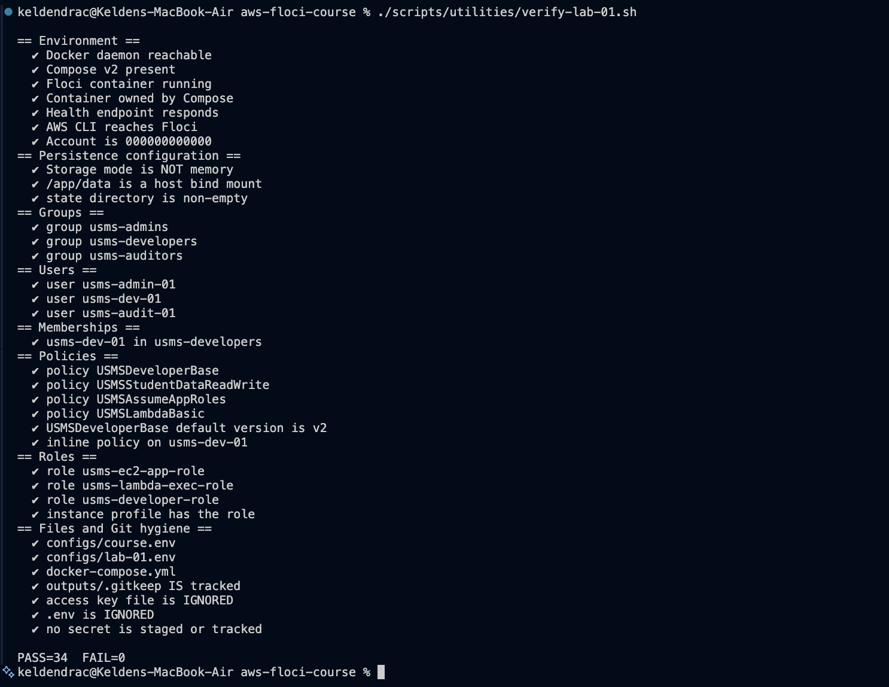
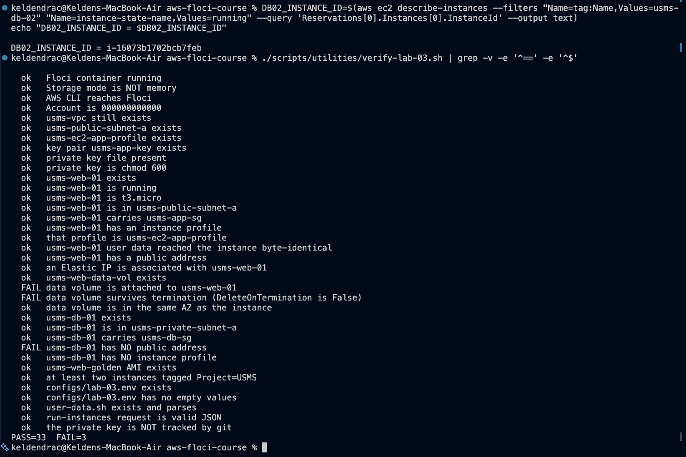
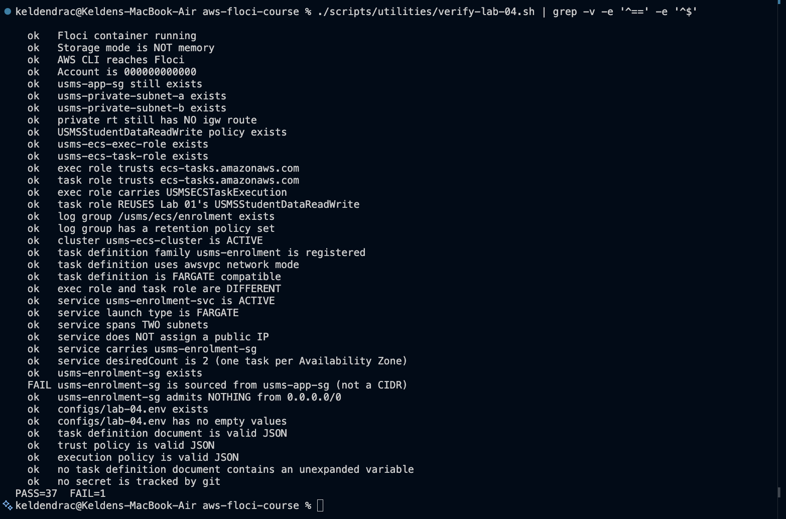

# AWS CLI + Floci - USMS Course Project

Infrastructure for the **University Student Management System (USMS)**, built lab by lab
with the AWS CLI against [Floci](https://floci.io), a local AWS emulator.

## Quick start

```bash
source configs/course.env
./scripts/setup/floci-up.sh
./scripts/utilities/whoami.sh
```

## Daily workflow

```bash
./scripts/setup/floci-up.sh      # start or resume (idempotent)
# ... lab work ...
./scripts/setup/floci-down.sh    # pause; state is kept
```

## Never run these

| Command | Why |
|---|---|
| `docker compose down -v` | `-v` deletes volumes |
| `docker volume prune` | Unfiltered; use scripts/cleanup/floci-prune-volumes.sh |
| `floci start ...` | Bypasses Compose; disables persistence |
| `rm -rf ~/floci-data` | That directory is the IAM state |

## Labs

| Lab | Topic | Status | Report |
|-----|-------|--------|--------|
| 01  | IAM   | [x] complete | [lab-01-report.md](labs/lab-01-iam/lab-01-report.md) |
| 02  | VPC   | [x] complete | [lab-02-report.md](labs/lab-02-vpc/lab-02-report.md) |
| 03  | EC2   | [x] complete | [lab-03-report.md](labs/lab-03-ec2/lab-03-report.md) |
| 04  | ECS   | [x] complete | [lab-04-report.md](labs/lab-04-ecs/lab-04-report.md) |

### Lab 01 verification



Reproduce with:

```bash
source configs/course.env
./scripts/setup/floci-up.sh
source configs/lab-01.env
./scripts/utilities/verify-lab-01.sh
```

### Lab 02 verification


The one failure is a documented Floci limitation (group-to-group security
group rules are not persisted by this emulator build), not a build error -
see [lab-02-report.md](labs/lab-02-vpc/lab-02-report.md) Section 7.

Reproduce with:

```bash
source configs/course.env
./scripts/setup/floci-up.sh
source configs/lab-01.env
source configs/lab-02.env
./scripts/utilities/verify-lab-02.sh
```

### Lab 03 verification



The three failures are documented Floci limitations, not build errors: this
emulator build has no `AttachVolume` (two checks), and it gives every
instance the placeholder public address `127.0.0.1` (one check). See
[lab-03-report.md](labs/lab-03-ec2/lab-03-report.md) Sections 3.10 and 7.

Reproduce with:

```bash
source configs/course.env
./scripts/setup/floci-up.sh
source configs/lab-01.env
source configs/lab-02.env
source configs/lab-03.env
./scripts/utilities/verify-lab-03.sh
```

### Lab 04 verification



The one failure is the documented Floci limitation from Lab 02: the enrolment
security group's rule was written as a group reference to `usms-app-sg`, and
this emulator build does not store group references. This Floci build is on
support path B (ECS only): Application Auto Scaling is not implemented. See
[lab-04-report.md](labs/lab-04-ecs/lab-04-report.md) Sections 3.7 and 7.

Reproduce with:

```bash
source configs/course.env
./scripts/setup/floci-up.sh
source configs/lab-01.env
source configs/lab-02.env
source configs/lab-03.env
source configs/lab-04.env
./scripts/utilities/verify-lab-04.sh
```

## Conventions

- All resources are prefixed `usms-`
- Region: `us-east-1`  ·  Floci account: `000000000000`
- Storage mode: `hybrid`, bind-mounted to `~/floci-data`
- Secrets live in `outputs/` and are **never** committed
