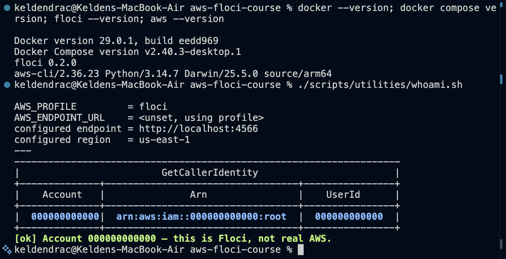
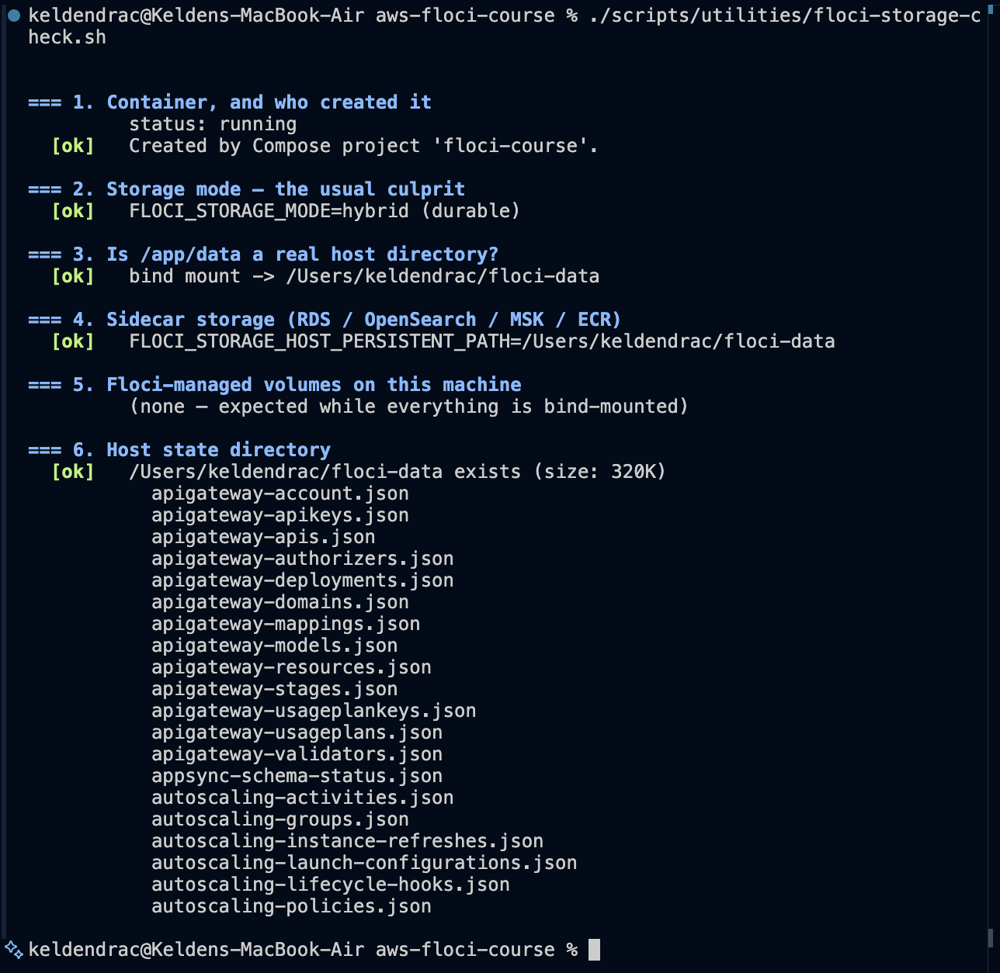
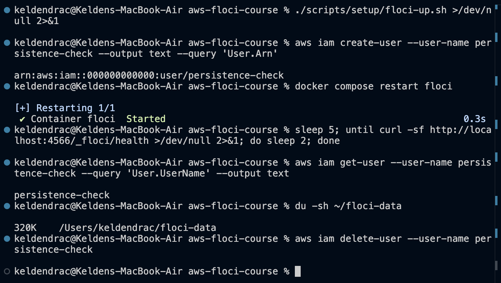
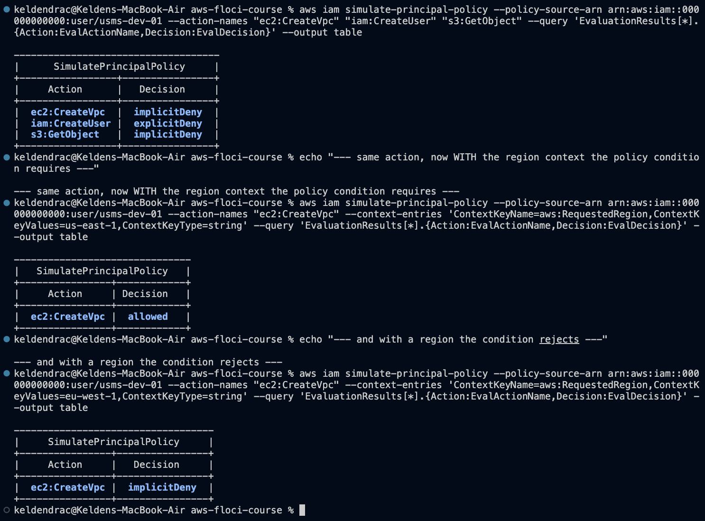

# Lab 01 - IAM - completed

Full write-up: [lab-01-report.md](lab-01-report.md) - exercises: [exercises.md](exercises.md)

## What exists after this lab
- Environment: Floci via docker-compose.yml, FLOCI_STORAGE_MODE=hybrid,
  bind-mounted to ~/floci-data, persistence proven in Step 14
- Groups: usms-admins, usms-developers, usms-auditors, usms-qa
- Users: usms-admin-01, usms-dev-01, usms-audit-01, usms-qa-01
- Customer managed policies: USMSDeveloperBase (v3), USMSStudentDataReadWrite,
  USMSAssumeAppRoles, USMSLambdaBasic, USMSReportingReadOnly,
  USMSAnalyticsPartnerRead, USMSAssumePartnerRole, USMSBackupOperator
- Inline policy: USMSSelfManageCredentials on usms-dev-01
- Roles: usms-ec2-app-role, usms-lambda-exec-role, usms-developer-role,
  usms-analytics-partner-role, usms-backup-operator-role
- Instance profile: usms-ec2-app-profile

The groups, users and roles added by Exercises 1, 3 and 4 are included above;
the core Steps 16-33 foundation is the first three of each.

## Reproduce
    source ~/aws-floci-course/configs/course.env
    ./scripts/setup/floci-up.sh
    source ~/aws-floci-course/configs/lab-01.env
    ./scripts/utilities/verify-lab-01.sh

## Evidence

The four items this lab requires as evidence.

### 1. whoami.sh showing account 000000000000

### 2. floci-storage-check.sh, all six sections [ok]

### 3. Step 14 persistence proof

A user created before a full container restart still existed after it, with real
files on disk.

### 4. verify-lab-01.sh with FAIL=0

All 19 screenshots are displayed in context in
[lab-01-report.md](lab-01-report.md).

## Problems I hit and how I fixed them

### 1. AWS CLI v1 was shadowing v2 on PATH
`aws --version` reported `aws-cli/1.42.52` from a pip install at
`~/Library/Python/3.9/bin/aws`, which won on PATH over the Homebrew v2 binary.
This matters because the `endpoint_url` profile setting used in Step 12 requires
CLI 2.13+; on v1 every command would have silently gone to real AWS instead of
Floci. Fixed with `/usr/bin/python3 -m pip uninstall -y awscli`, after which
`aws --version` reports 2.36.23.

### 2. zsh does not treat `#` as a comment interactively
Pasting command blocks that carried trailing `# comments` passed the comment
text to the command as arguments. Fixed with `setopt interactive_comments`,
persisted to `~/.zshrc`.

### 3. A stray `floci` container from a previous `floci start`
An exited container named `floci` existed that Compose had not created, so
`floci-up.sh`'s section-2 guard correctly refused to run rather than adopt a
container with no durable storage. This is exactly the Step 7 Cause 3 failure
the guard exists to catch. Removed with `floci stop --remove`, then
`./scripts/setup/floci-up.sh`.

### 4. `iam:GetAccountAuthorizationDetails` is not implemented by Floci
Step 26C calls it to write `outputs/lab-01-iam-snapshot.json`. Floci 1.5.34
answers `UnsupportedOperation`, leaving a 0-byte file. Nothing in
`verify-lab-01.sh` or the assessment checklist depends on it, but an empty
artefact is misleading. Wrote `scripts/utilities/iam-snapshot.sh`, which
assembles an equivalent document from the `list-*` calls Floci does support and
preserves the same top-level keys (`UserDetailList`, `GroupDetailList`,
`RoleDetailList`, `Policies`), so the Step 26D query
`jq '.UserDetailList[] | {UserName, Groups: .GroupList}'` works unchanged.

### 5. The policy simulator returned `implicitDeny` for `ec2:CreateVpc`
Step 32 expects `allowed`. Investigating rather than assuming a Floci bug showed
the opposite - the simulator is correct and the lab's expected output is
simplified. `BuildNetworkingForLab02` allows the action only under
`StringEquals: {"aws:RequestedRegion": "us-east-1"}`. With no context supplied,
the condition cannot evaluate true, the statement does not match, and the
default deny applies. Re-running with
`--context-entries ContextKeyName=aws:RequestedRegion,ContextKeyValues=us-east-1,ContextKeyType=string`
returns `allowed`; supplying `eu-west-1` returns `implicitDeny` again. This is
the condition working exactly as designed.

### 6. `floci snapshot` is unavailable on this server build
Step 33.2 offers `floci snapshot save`. Server 1.5.34 answers
`Snapshot API not available on this server version`. Used the lab's documented
filesystem fallback instead: stop Floci, `tar -czf ~/floci-data-lab-01.tar.gz -C ~ floci-data`,
start Floci. Stopping first matters - archiving a live data directory can capture
a half-written file.

### 7. Exercise 3 asks for a MaxSessionDuration that AWS does not permit
The exercise requires a role that "cannot hold a session longer than 30 minutes"
and hints that 1800 is the value for `--max-session-duration`. The AWS CLI
rejects it before sending the request: `Invalid value for parameter
MaxSessionDuration, value: 1800, valid min value: 3600`. Real AWS constrains
`MaxSessionDuration` to 3600-43200 seconds (1-12 hours), so a 30-minute cap
cannot be expressed that way and the exercise's stated expected outcome
(`MaxSessionDuration is 1800`) is unreachable.

The requirement is still satisfiable, just not with that parameter. I set
`MaxSessionDuration` to its floor of 3600 and enforced the real limit in the
trust policy:

    "Condition": {
      "NumericLessThanEquals": { "sts:DurationSeconds": "1800" }
    }

`sts:DurationSeconds` is evaluated at `AssumeRole` time, so any request for more
than 1800 seconds is denied outright rather than silently truncated. Calling
`assume-role --duration-seconds 1800` then returns an `Expiration` exactly 30
minutes ahead. That is a stronger control than the parameter would have been:
`MaxSessionDuration` only caps the ceiling, whereas the condition denies the
oversized request and leaves an audit trail. Evidence:
`screenshots/16-exercises-1-2-3.png`.

On `sts:ExternalId` (the exercise asks whether one should be added): yes, in a
real deployment. The partner is a third party, which is exactly the confused-deputy
scenario ExternalId exists to prevent - without it, any other customer of that
partner's analytics service could ask the partner to assume our role on their
behalf. It is omitted here only because the exercise's four stated requirements
do not include it and no partner-supplied secret exists to use as the value.

### 8. The lab's own .gitignore silently blocked one of the lab's policy files
Found during final cleanup, not by any check. Step 6's `.gitignore` includes
`*credentials*` as a catch-all for credential files. Step 25 then creates
`policies/usms-self-manage-credentials.json` - a **policy document containing no
secret whatsoever**, which matches that pattern purely on the word
"credentials". The guide's structure lists that file under `policies/`
and its folder table marks `policies/` as commit-to-Git, but the
file was never staged and would have been missing from the submitted repository.

Nothing warned about it: `git add .` skips ignored files silently, and
`verify-lab-01.sh` does not check for it. I only caught it by running
`git status --ignored`.

Fixed with a negation, the same mechanism that makes `outputs/.gitkeep` work:

    *credentials*
    !policies/usms-self-manage-credentials.json

The negation is effective here for the same reason it is in `outputs/*` - the
parent directory `policies/` is not itself excluded, so Git still descends into
it and evaluates the re-include. Verified both directions afterwards:
`git check-ignore -v` now reports the policy as matched by the negation on line
29, while `.env` and `outputs/usms-dev-01-access-key.json` remain blocked by
lines 13 and 24.

The general lesson is that a broad substring pattern like `*credentials*` is
convenient but imprecise, and an over-broad ignore rule fails silently in the
direction that loses work rather than the direction that leaks it. Worth running
`git status --ignored` before submitting anything.

### 9. Floci reports its own session name on assumed-role identities
`sts assume-role` correctly returned
`arn:aws:sts::000000000000:assumed-role/usms-developer-role/usms-dev-01-lab01`,
but a subsequent `sts get-caller-identity` using those credentials reported the
session as `floci-session` rather than `usms-dev-01-lab01`. Cosmetic in Floci,
but worth knowing: in real AWS the session name is what makes CloudTrail entries
traceable back to an individual, so this is one of the emulator behaviours that
must not be relied on.
