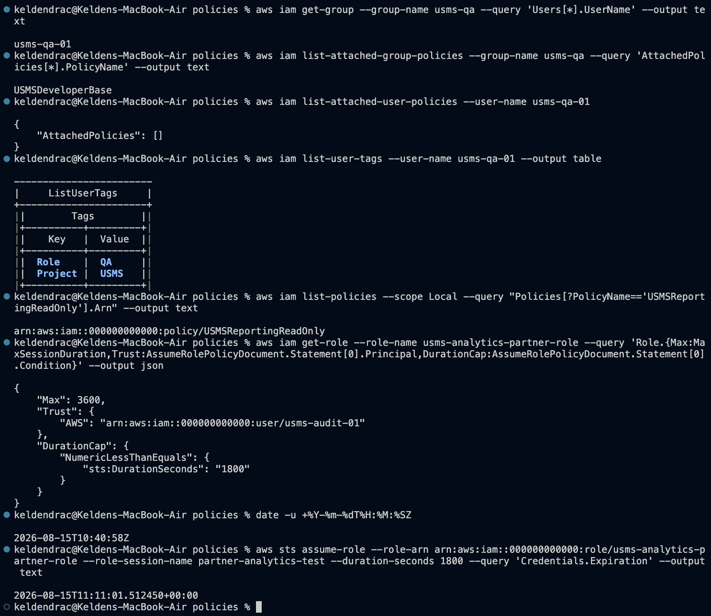
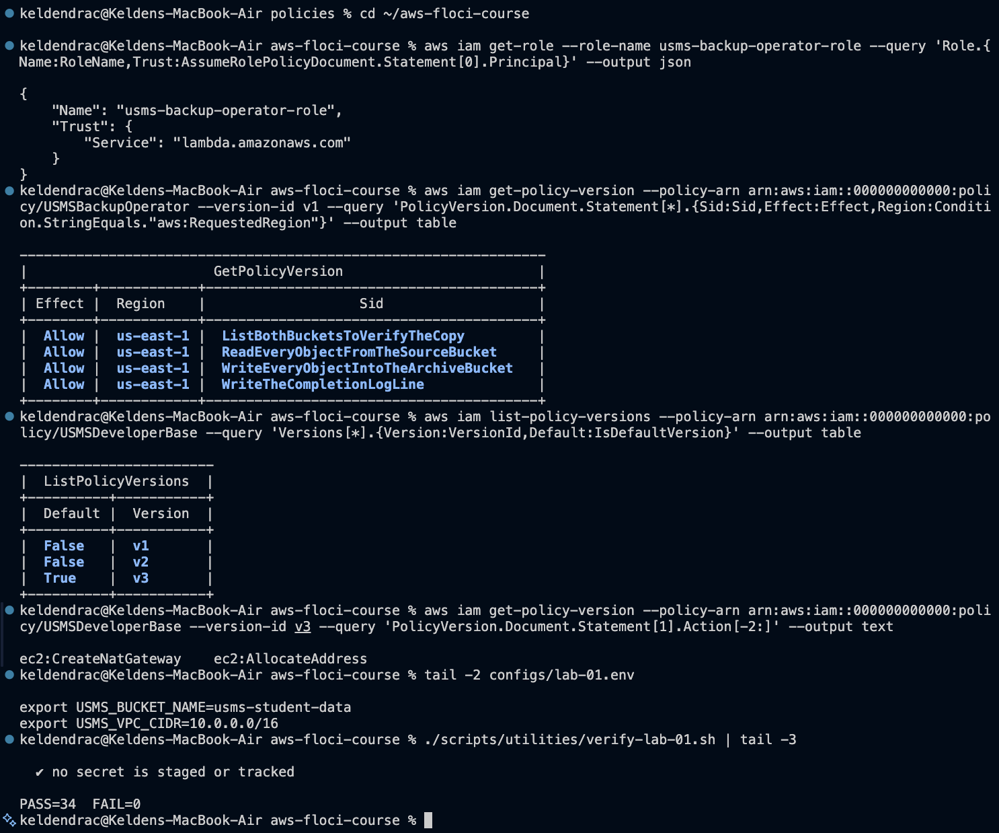

# Lab 01 - Independent Exercises 1-5

Environment: Floci 1.5.34, AWS CLI 2.36.23, account `000000000000`, `us-east-1`.
Evidence is embedded below, in Exercise 3 and Exercise 5.

---

## Exercise 1 - The QA identity

Create group `usms-qa` and user `usms-qa-01` inside it, tagged `Role=QA` and
`Project=USMS`. Attach the existing `USMSDeveloperBase` to the **group**. No
policy attached directly to the user. Capture the ARN with `--query` /
`--output text`.

### Commands

```bash
aws iam create-group --group-name usms-qa
QA_ARN=$(aws iam create-user --user-name usms-qa-01 \
  --tags Key=Role,Value=QA Key=Project,Value=USMS \
  --query 'User.Arn' --output text)
aws iam add-user-to-group --group-name usms-qa --user-name usms-qa-01
aws iam attach-group-policy --group-name usms-qa \
  --policy-arn arn:aws:iam::000000000000:policy/USMSDeveloperBase
echo "$QA_ARN"
```

### Output

```
arn:aws:iam::000000000000:user/usms-qa-01
```

### Verification - all three expected outcomes met

```
$ aws iam get-group --group-name usms-qa --query 'Users[*].UserName' --output text
usms-qa-01

$ aws iam list-attached-group-policies --group-name usms-qa --query 'AttachedPolicies[*].PolicyName' --output text
USMSDeveloperBase

$ aws iam list-attached-user-policies --user-name usms-qa-01
{
    "AttachedPolicies": []
}

$ aws iam list-user-tags --user-name usms-qa-01 --output table
| Role    | QA   |
| Project | USMS |
```

The empty list is the point of the exercise: permissions reach `usms-qa-01`
entirely through group membership. Adding or removing a QA engineer is now a
membership change, not five policy attachments.

---

## Exercise 2 - The read-only reporting policy

`USMSReportingReadOnly`: list the bucket, read objects **only** under
`transcripts/`, explicitly deny every `s3:Put*` and `s3:Delete*`.
Document at `policies/usms-reporting-readonly-policy.json`, one `Sid` per
statement, validated locally first.

### The policy

```json
{
  "Version": "2012-10-17",
  "Statement": [
    {
      "Sid": "ListTheStudentDataBucket",
      "Effect": "Allow",
      "Action": ["s3:ListBucket", "s3:GetBucketLocation"],
      "Resource": "arn:aws:s3:::usms-student-data"
    },
    {
      "Sid": "ReadTranscriptObjectsOnly",
      "Effect": "Allow",
      "Action": ["s3:GetObject"],
      "Resource": "arn:aws:s3:::usms-student-data/transcripts/*"
    },
    {
      "Sid": "DenyEveryWriteAndDelete",
      "Effect": "Deny",
      "Action": ["s3:Put*", "s3:Delete*"],
      "Resource": [
        "arn:aws:s3:::usms-student-data",
        "arn:aws:s3:::usms-student-data/*"
      ]
    }
  ]
}
```

### Commands and output

```bash
$ python3 -m json.tool usms-reporting-readonly-policy.json > /dev/null && echo "Valid JSON"
Valid JSON

$ REPORT_POLICY_ARN=$(aws iam create-policy --policy-name USMSReportingReadOnly \
    --description "Read transcripts under transcripts/ only. All writes and deletes explicitly denied." \
    --policy-document file://usms-reporting-readonly-policy.json \
    --query 'Policy.Arn' --output text)

$ aws iam list-policies --scope Local --query "Policies[?PolicyName=='USMSReportingReadOnly'].Arn" --output text
arn:aws:iam::000000000000:policy/USMSReportingReadOnly
```

### Design notes

Three deliberate choices:

- **Two ARN forms, because two different resources.** `s3:ListBucket` acts on the
  bucket (`arn:aws:s3:::usms-student-data`); `s3:GetObject` acts on objects
  (`…/transcripts/*`). Combining them into one statement would silently produce a
  policy that cannot list *and* cannot download.
- **The prefix restriction lives in the resource ARN,** not in a condition. Only
  keys under `transcripts/` match, so a report service cannot wander into
  `reports/` or anything else in the same bucket.
- **The `Deny` covers both ARN forms.** `s3:DeleteBucket` acts on the bucket
  while `s3:DeleteObject` acts on objects - denying only one form would leave the
  other reachable if a broader policy were ever attached alongside. Explicit deny
  always wins, so this holds regardless of what else is granted later.

---

## Exercise 3 - The third-party analytics role

Role `usms-analytics-partner-role`: assumable by `usms-audit-01`, sessions no
longer than 30 minutes, read only `arn:aws:s3:::usms-student-data/reports/*`,
tagged `Project=USMS` and `External=true`. Both halves of the trust handshake.
Trust and permissions in separate files.

### The lab's stated approach does not work

```
$ aws iam create-role --role-name usms-analytics-partner-role \
    --assume-role-policy-document file://trust-analytics-partner.json \
    --max-session-duration 1800 ...

aws: [ERROR]: An error occurred (ParamValidation): Parameter validation failed:
Invalid value for parameter MaxSessionDuration, value: 1800, valid min value: 3600
```

AWS constrains `MaxSessionDuration` to **3600-43200 seconds (1-12 hours)**. A
30-minute cap cannot be expressed with that parameter, so the exercise's stated
expected outcome (`MaxSessionDuration is 1800`) is unreachable on real AWS. The
CLI rejected it client-side, before any request was sent.

### How the requirement is actually satisfied

Set `MaxSessionDuration` to its floor and enforce the real limit as a condition
on `sts:DurationSeconds` in the **trust policy**, where it is evaluated at
`AssumeRole` time.

`policies/trust-analytics-partner.json`:

```json
{
  "Version": "2012-10-17",
  "Statement": [
    {
      "Sid": "AllowAuditUserToAssumeForPartnerAnalytics",
      "Effect": "Allow",
      "Principal": { "AWS": "arn:aws:iam::000000000000:user/usms-audit-01" },
      "Action": "sts:AssumeRole",
      "Condition": {
        "NumericLessThanEquals": { "sts:DurationSeconds": "1800" }
      }
    }
  ]
}
```

`policies/usms-analytics-partner-policy.json`:

```json
{
  "Version": "2012-10-17",
  "Statement": [
    {
      "Sid": "ReadReportObjectsOnly",
      "Effect": "Allow",
      "Action": ["s3:GetObject"],
      "Resource": "arn:aws:s3:::usms-student-data/reports/*"
    }
  ]
}
```

### Commands

```bash
PARTNER_POLICY_ARN=$(aws iam create-policy --policy-name USMSAnalyticsPartnerRead \
  --policy-document file://usms-analytics-partner-policy.json \
  --query 'Policy.Arn' --output text)

PARTNER_ROLE_ARN=$(aws iam create-role --role-name usms-analytics-partner-role \
  --description "Partner university analytics. Sessions capped at 30 min by trust condition, reports/ prefix only." \
  --assume-role-policy-document file://trust-analytics-partner.json \
  --max-session-duration 3600 \
  --tags Key=Project,Value=USMS Key=External,Value=true \
  --query 'Role.Arn' --output text)

aws iam attach-role-policy --role-name usms-analytics-partner-role \
  --policy-arn arn:aws:iam::000000000000:policy/USMSAnalyticsPartnerRead

# second half of the handshake: the caller must be permitted to assume it
ASSUME_PARTNER_ARN=$(aws iam create-policy --policy-name USMSAssumePartnerRole \
  --policy-document file://usms-assume-partner-role-policy.json \
  --query 'Policy.Arn' --output text)
aws iam attach-group-policy --group-name usms-auditors --policy-arn "$ASSUME_PARTNER_ARN"
```

### Verification

```
$ aws iam get-role --role-name usms-analytics-partner-role \
    --query 'Role.{Max:MaxSessionDuration,Trust:AssumeRolePolicyDocument.Statement[0].Principal,DurationCap:AssumeRolePolicyDocument.Statement[0].Condition}' --output json
{
    "Max": 3600,
    "Trust": { "AWS": "arn:aws:iam::000000000000:user/usms-audit-01" },
    "DurationCap": {
        "NumericLessThanEquals": { "sts:DurationSeconds": "1800" }
    }
}

$ date -u +%Y-%m-%dT%H:%M:%SZ
2026-08-15T10:40:58Z

$ aws sts assume-role --role-arn arn:aws:iam::000000000000:role/usms-analytics-partner-role \
    --role-session-name partner-analytics-test --duration-seconds 1800 \
    --query 'Credentials.Expiration' --output text
2026-08-15T11:11:01.512450+00:00
```

**Recorded expiration: `2026-08-15T11:11:01Z`** - 30 minutes and 3 seconds after
the `date` above it, the 3 seconds being command latency. The cap is enforced
where it matters: at assume time.



The condition is a stronger control than the parameter would have been.
`MaxSessionDuration` caps a ceiling; `NumericLessThanEquals` on
`sts:DurationSeconds` *denies* an oversized request outright, which fails loudly
and leaves an audit trail instead of silently truncating.

On `sts:ExternalId` - it should be added in any real deployment; the reasoning is
in `notes/lab-01-notes.md`. It is omitted here because the four stated
requirements do not include it and no partner-supplied value exists.

---

## Exercise 4 - Least-privilege policy from a job description

> "The USMS backup operator runs a nightly job. It must copy every object out of
> the student data bucket into a separate archive bucket `usms-archive`, verify
> what it copied, and write a completion log line to CloudWatch Logs. It must
> never be able to delete anything, never read IAM, and it must only ever run in
> `us-east-1`."

**Identity chosen: a role** (`usms-backup-operator-role`, trusting
`lambda.amazonaws.com`). Full justification and the three abuse vectors are in
`notes/lab-01-notes.md`.

### Working out the action list

| Requirement | Actions | Resource |
|---|---|---|
| Copy every object | `s3:GetObject` **+** `s3:PutObject` - there is no `s3:CopyObject` | source `/*`, destination `/*` |
| Verify what it copied | `s3:ListBucket`, `s3:GetObjectAttributes` | **bucket** ARNs, not object ARNs |
| Completion log line | `logs:CreateLogGroup`, `logs:CreateLogStream`, `logs:PutLogEvents` | the log group |
| Never delete | *(no action granted - implicit deny)* | - |
| Never read IAM | *(no action granted - implicit deny)* | - |
| `us-east-1` only | `Condition` on `aws:RequestedRegion` | every statement |

`policies/usms-backup-operator-policy.json` - 4 statements, no `Action: "*"`,
no `Resource: "*"` on any `Allow`, region condition on all four:

```
Sid                                  Effect  Region
ListBothBucketsToVerifyTheCopy       Allow   us-east-1
ReadEveryObjectFromTheSourceBucket   Allow   us-east-1
WriteEveryObjectIntoTheArchiveBucket Allow   us-east-1
WriteTheCompletionLogLine            Allow   us-east-1
```

### Commands

```bash
python3 -m json.tool usms-backup-operator-policy.json > /dev/null && echo "Valid JSON"

BACKUP_POLICY_ARN=$(aws iam create-policy --policy-name USMSBackupOperator \
  --description "Nightly copy from student data to archive, verify, and log. us-east-1 only. No deletes." \
  --policy-document file://usms-backup-operator-policy.json \
  --query 'Policy.Arn' --output text)

BACKUP_ROLE_ARN=$(aws iam create-role --role-name usms-backup-operator-role \
  --description "Nightly backup job. Role, not user - no long-lived key on disk." \
  --assume-role-policy-document file://trust-backup-operator.json \
  --tags Key=Project,Value=USMS --query 'Role.Arn' --output text)

aws iam attach-role-policy --role-name usms-backup-operator-role \
  --policy-arn "$BACKUP_POLICY_ARN"
```

### Verification

```
$ aws iam get-role --role-name usms-backup-operator-role \
    --query 'Role.{Name:RoleName,Trust:AssumeRolePolicyDocument.Statement[0].Principal}' --output json
{
    "Name": "usms-backup-operator-role",
    "Trust": { "Service": "lambda.amazonaws.com" }
}

$ aws iam get-policy-version --policy-arn arn:aws:iam::000000000000:policy/USMSBackupOperator \
    --version-id v1 --query 'PolicyVersion.Document.Statement[*].{Sid:Sid,Effect:Effect,Region:Condition.StringEquals."aws:RequestedRegion"}' --output table
| Allow | us-east-1 | ListBothBucketsToVerifyTheCopy       |
| Allow | us-east-1 | ReadEveryObjectFromTheSourceBucket   |
| Allow | us-east-1 | WriteEveryObjectIntoTheArchiveBucket |
| Allow | us-east-1 | WriteTheCompletionLogLine            |
```

Deletion and IAM read are blocked by **implicit** deny - no statement grants
them, so the default deny stands. No explicit `Deny` was added: it would be
redundant, and reserving explicit denies for real guardrails keeps their meaning
clear.

---

## Exercise 5 - Prepare the identity Lab 2 will use

Determine which of Lab 2's eleven required actions `usms-dev-01` is missing, add
exactly those in a **v3** of `USMSDeveloperBase`, set v3 default with v1 and v2
retained, and add `USMS_VPC_CIDR` to `configs/lab-01.env`.

### Finding the gap by reading, not guessing

Compared Lab 2's required list against the `Allow` actions in
`usms-developer-base-policy-v2.json`:

```
present  ec2:CreateVpc                  present  ec2:AssociateRouteTable
present  ec2:CreateSubnet               present  ec2:DescribeAvailabilityZones
present  ec2:CreateInternetGateway      present  ec2:ModifyVpcAttribute
present  ec2:AttachInternetGateway      MISSING  ec2:CreateNatGateway
present  ec2:CreateRouteTable           MISSING  ec2:AllocateAddress
present  ec2:CreateRoute
```

**Exactly two missing: `ec2:CreateNatGateway` and `ec2:AllocateAddress`.**

Why `ec2:AllocateAddress` belongs with the NAT gateway: a NAT gateway needs a
static public address to masquerade behind, and that address is an Elastic IP,
which must be allocated to the account before the gateway can be created.
Granting `CreateNatGateway` alone produces a policy that fails at the first step
with a confusing error about the missing address, not about the NAT gateway.

### Commands

```bash
# v3 built programmatically from v2 (Step 27's technique), adding only the two
python3 - << 'PY'
import json, pathlib
doc = json.loads(pathlib.Path("usms-developer-base-policy-v2.json").read_text())
for st in doc["Statement"]:
    if st.get("Sid") == "BuildNetworkingForLab02":
        st["Action"] += ["ec2:CreateNatGateway", "ec2:AllocateAddress"]
pathlib.Path("usms-developer-base-policy-v3.json").write_text(json.dumps(doc, indent=2))
PY

aws iam create-policy-version \
  --policy-arn arn:aws:iam::000000000000:policy/USMSDeveloperBase \
  --policy-document file://usms-developer-base-policy-v3.json \
  --set-as-default --query 'PolicyVersion.VersionId' --output text

echo 'export USMS_VPC_CIDR=10.0.0.0/16' >> ~/aws-floci-course/configs/lab-01.env
```

`create-policy-version` was used rather than delete-and-recreate, so the policy
ARN is unchanged and every existing attachment keeps working.

### Verification

```
$ aws iam list-policy-versions --policy-arn arn:aws:iam::000000000000:policy/USMSDeveloperBase \
    --query 'Versions[*].{Version:VersionId,Default:IsDefaultVersion}' --output table
| False | v1 |
| False | v2 |
| True  | v3 |

$ aws iam get-policy-version --policy-arn arn:aws:iam::000000000000:policy/USMSDeveloperBase \
    --version-id v3 --query 'PolicyVersion.Document.Statement[1].Action[-2:]' --output text
ec2:CreateNatGateway    ec2:AllocateAddress

$ tail -2 configs/lab-01.env
export USMS_BUCKET_NAME=usms-student-data
export USMS_VPC_CIDR=10.0.0.0/16
```

v1 and v2 both still exist and either could be restored with a single
`set-default-policy-version` - no re-upload needed.

### The verification script was updated, as the exercise requires

`verify-lab-01.sh` asserted the default version was `v2`. After this exercise
that assertion is wrong and the script reports one failure. Changed the check to
`v3`, with a comment recording why:

```bash
check "USMSDeveloperBase default version is v3" \
  "test \"\$(aws iam get-policy --policy-arn arn:aws:iam::$ACCOUNT_ID:policy/USMSDeveloperBase --query 'Policy.DefaultVersionId' --output text)\" = v3"
```

```
$ ./scripts/utilities/verify-lab-01.sh | tail -3
  ✔ no secret is staged or tracked

PASS=34  FAIL=0
```

A verification script that is never updated is a verification script nobody
trusts - a permanently failing check trains people to ignore the output, which is
worse than having no check at all.


