# Lab 01 - Identity and Access Management
## Lab Report

**Student:** Kelden P. Dorji
**Project:** University Student Management System (USMS)
**Environment:** Floci 1.5.34 (local AWS emulator), account `000000000000`, region `us-east-1`
**Repository:** `aws-floci-course`
**Verification:** `scripts/utilities/verify-lab-01.sh` -> **PASS=34 FAIL=0**

---

## 1. Summary

This lab built the IAM foundation for USMS on a locally emulated AWS account, and
equally importantly, built an environment in which that foundation survives a
restart. Part A established a Compose-managed Floci instance with durable storage
and proved both isolation from real AWS and persistence across a container
restart. Part B created the identity layer: 3 groups, 3 tagged users, 4 customer
managed policies, 1 inline policy, 3 roles across two trust models, and an
instance profile. Five independent exercises extended it with a QA identity, a
reporting policy, a time-limited partner role, a least-privilege backup role
designed from a job description, and a third policy version preparing for Lab 2.

Every artefact is verified by a 34-check script and evidenced by 19 screenshots.

**What exists at the end of this lab**

| Category | Resources |
|---|---|
| Groups | `usms-admins`, `usms-developers`, `usms-auditors`, `usms-qa` |
| Users | `usms-admin-01`, `usms-dev-01`, `usms-audit-01`, `usms-qa-01` |
| Customer managed policies | `USMSDeveloperBase` (v3), `USMSStudentDataReadWrite`, `USMSAssumeAppRoles`, `USMSLambdaBasic`, `USMSReportingReadOnly`, `USMSAnalyticsPartnerRead`, `USMSAssumePartnerRole`, `USMSBackupOperator` |
| Inline policy | `USMSSelfManageCredentials` on `usms-dev-01` |
| Roles | `usms-ec2-app-role`, `usms-lambda-exec-role`, `usms-developer-role`, `usms-analytics-partner-role`, `usms-backup-operator-role` |
| Instance profile | `usms-ec2-app-profile` |

### Evidence index

Each screenshot is displayed in the section that discusses it.

| # | Proves | Section |
|---|---|---|
| 00 | Directory tree created before Floci was started | [3.1](#31-git-hygiene-before-any-secret-existed) |
| 01 | `.gitignore` is the oldest commit; `outputs/*` negation works | [3.1](#31-git-hygiene-before-any-secret-existed) |
| 02 | Compose-managed Floci, hybrid storage, verified bind mount | [3.2](#32-durable-storage-the-core-of-part-a) |
| 03 | Docker, Compose v2, AWS CLI **2.36.23**, account `000000000000` | [3.3](#33-isolation-and-persistence-two-claims-two-proofs) |
| 04 | Requests resolve to `localhost:4566`; stopping Floci breaks the CLI | [3.3](#33-isolation-and-persistence-two-claims-two-proofs) |
| 05 | A user created before a full restart still existed after it | [3.3](#33-isolation-and-persistence-two-claims-two-proofs) |
| 06 | All six storage-diagnostic sections `[ok]` | [3.2](#32-durable-storage-the-core-of-part-a) |
| 07 | 3 groups, membership both directions, `AttachmentCount=2` | [4.1](#41-identities-and-policies) |
| 08 | json/table/text, `--query`, JMESPath filter, skeleton, exit codes | [4.2](#42-cli-skills) |
| 09 | Inline vs attached; `${aws:username}` intact; v2 default | [4.3](#43-inline-policies-and-versions) |
| 10 | 3 roles, two trust models, instance profile holds the role | [4.4](#44-roles-and-the-two-sided-handshake) |
| 11 | `ASIA` prefix, session token, expiry, return to normal identity | [4.4](#44-roles-and-the-two-sided-handshake) |
| 12 | Key ignored by Git with rule named, `chmod 600`, second profile | [4.5](#45-credential-safety) |
| 12b | All three decision types, condition proven live by context | [7](#7-problems-encountered) |
| 13 | Every ARN populated, no blanks, no `None` | [4.6](#46-recording-state-for-lab-2) |
| 14 | **`PASS=34 FAIL=0`** | [4.7](#47-verification) |
| 15 | Clean tree, no secrets tracked, ignore-commit oldest | [4.8](#48-git-history) |
| 16 | QA identity, reporting policy, 30-minute partner role | [5](#5-exercises-1-5) |
| 17 | Backup operator role; v3 default with v1/v2 retained | [5](#5-exercises-1-5) |

---

## 2. Part A - Environment (Steps 1-15)

### 3.1 Git hygiene before any secret existed

The project structure was created before Floci was ever started.

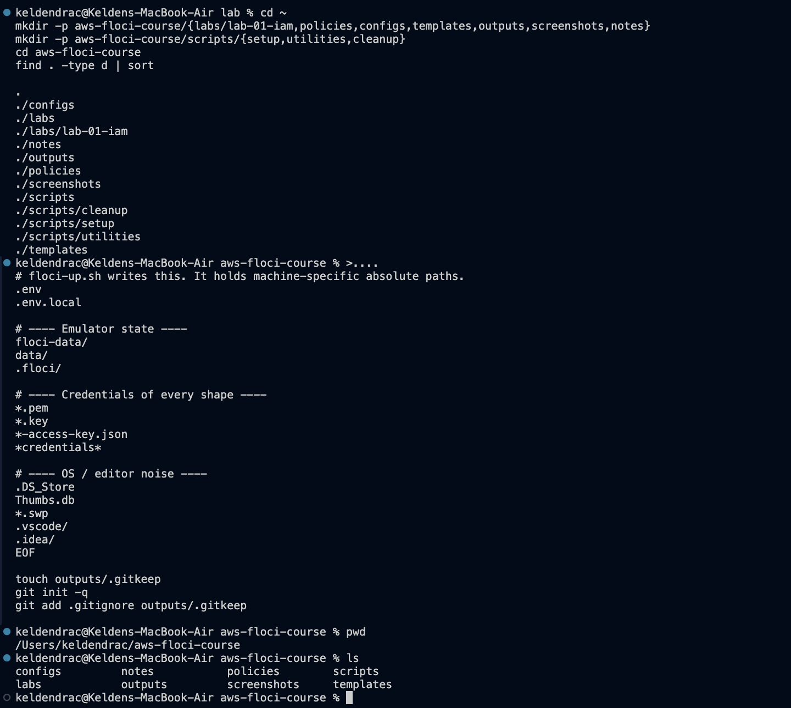

The `.gitignore` was written and committed **before** the repository contained
anything and before any command had produced a credential. This is the single
ordering decision that makes "no secret was ever committed" a demonstrable
property rather than a claim.

The rule is `outputs/*`, not `outputs/`. This is a genuine bug, not a style
preference: Git cannot re-include a file whose parent directory is excluded, so
`outputs/` would make `!outputs/.gitkeep` silently inert and the directory would
vanish from the repository. Verified in both directions below. `git ls-files`
returns `outputs/.gitkeep`, a planted fake secret is invisible to `git status`,
and `git check-ignore -v` names the exact rule that blocked it.

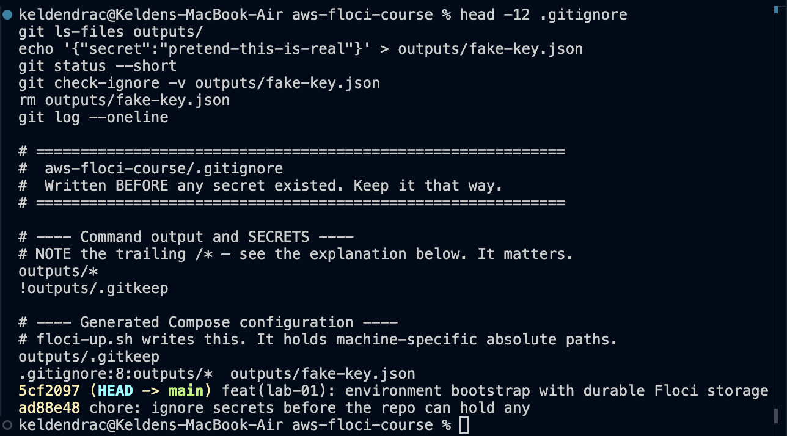

### 3.2 Durable storage, the core of Part A

Floci defaults to `FLOCI_STORAGE_MODE=memory`, in which nothing survives a
restart. Three settings in `docker-compose.yml` make persistence real: the mode
itself (`hybrid`), the container-side path, and an **absolute** host path for
sidecar services. `floci-up.sh` then verifies its own work, asking Docker what is
actually mounted and failing if the answer is not a host bind mount.

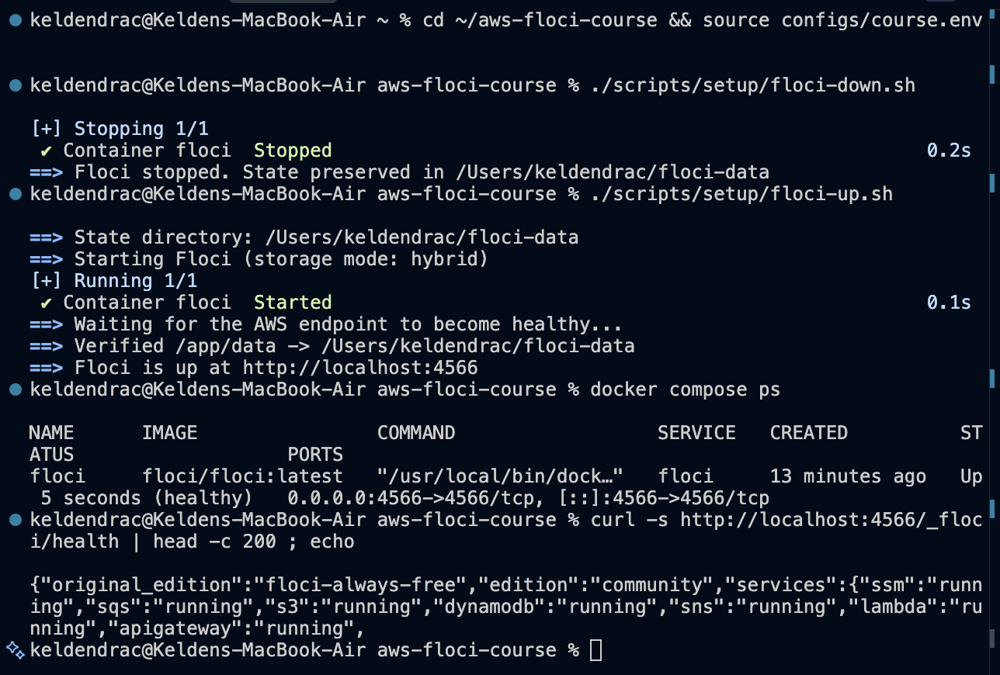

`floci-storage-check.sh` confirms all six diagnostic sections `[ok]`, with no
dangling volumes.


### 3.3 Isolation and persistence, two claims and two proofs

These are routinely confused, and passing one says nothing about the other.

**Isolation**, proven three independent ways. First, the account is
`000000000000`, not a real 12-digit number:


Second, `--debug` shows the request resolving to `localhost:4566` and returning
`200`. Third, stopping the container breaks the CLI entirely, which would be
impossible if requests were secretly reaching real AWS.

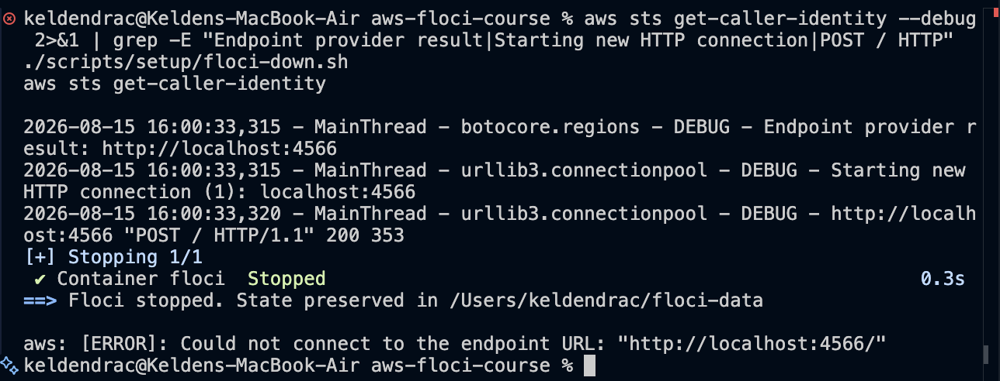

**Persistence**, proven by creating something and looking for it again:


The weaker version of this test, restarting and observing that
`get-caller-identity` still returns the same root ARN, proves nothing. The root
identity is a constant that returns identically in memory mode with no disk at
all. The test must create something.

---

## 3. Part B - IAM foundation (Steps 16-33)

### 4.1 Identities and policies

Groups were created before any user, so users could be placed correctly from
birth. All three users carry `Project=USMS` and a `Role` tag. Membership was
verified from **both** directions, "who is in this group?" and "which groups is
this user in?", which is what an access investigation actually requires.

Permissions attach to groups, never directly to users, with one deliberate
exception in Step 25 that exists to teach inline policies.

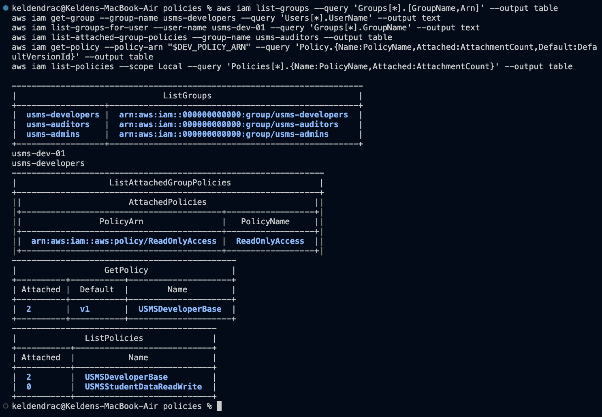

`USMSDeveloperBase` demonstrates least privilege in practice: broad wildcards on
*read* actions (`ec2:Describe*`), an enumerated list of specific *write* actions
rather than `ec2:*`, a region condition, and an explicit `Deny` on identity
escalation. That third statement is the privilege-escalation guardrail. Because
explicit deny always wins, it holds even if someone later attaches
`AdministratorAccess` to the group by mistake.

One policy object, two group attachments. `AttachmentCount: 2` confirms it above.
Changing the policy once updates both groups, which is the entire point of
customer managed policies.

`USMSStudentDataReadWrite` gets the bucket-vs-object ARN distinction right, with
separate statements for `arn:aws:s3:::usms-student-data` (the bucket, for
`ListBucket`) and `arn:aws:s3:::usms-student-data/*` (the objects, for
`GetObject`). Combining them is the most frequently made S3 policy error in the
industry, and it fails silently.

### 4.2 CLI skills

All six CLI-skills checklist items in a single frame: the three output formats,
a value captured into a shell variable with `--query`, a JMESPath filter
expression, `--generate-cli-skeleton`, and exit codes `0` and `254`.

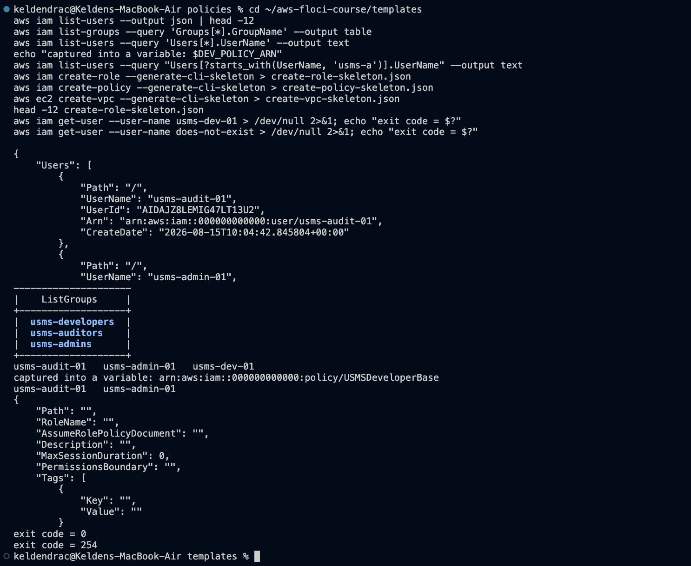

### 4.3 Inline policies and versions

`USMSSelfManageCredentials` is inline on `usms-dev-01`, scoped to
`${aws:username}` so the document says "your own user" for whoever calls it. The
heredoc used the **quoted** `<< 'EOF'` form specifically so the shell would not
expand that variable into an empty string and silently create a broken policy.

The two listings differ, and that is the practical lesson. An auditor running
only `list-attached-user-policies` sees an empty list and concludes the user has
no direct permissions. That is false, and it is how permissions get missed in a
security review. A complete audit needs four lookups: group policies, attached
user policies, inline user policies, and in real AWS permission boundaries and
SCPs.

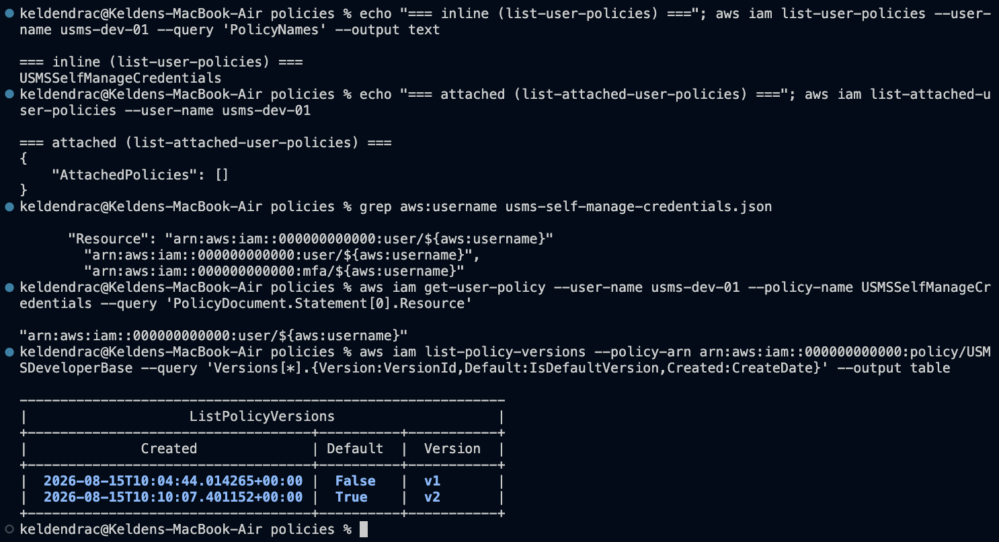

`USMSDeveloperBase` v2 was created with `--set-as-default`, adding
`ec2:DeleteVpc` and `ec2:DescribeAvailabilityZones`. v1 remained, and rollback
would be a single `set-default-policy-version` with no re-upload. Exercise 5
later added v3; all three versions coexist.

### 4.4 Roles and the two-sided handshake

Three roles across two trust models:

| Role | Trust principal | Purpose |
|---|---|---|
| `usms-ec2-app-role` | `ec2.amazonaws.com` | Lab 3 application server |
| `usms-lambda-exec-role` | `lambda.amazonaws.com` | Lab 5 notification function |
| `usms-developer-role` | `arn:...:user/usms-dev-01` | Human elevation, `MaxSessionDuration` 3600 |

An EC2 instance cannot be given a role directly. It receives an **instance
profile**, a thin wrapper containing exactly one role. The console does this
invisibly; with the CLI it must be done explicitly, and forgetting it is a common
Lab 3 failure.

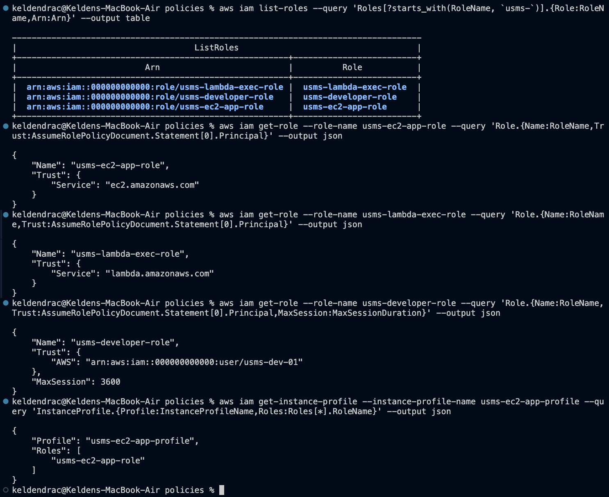

Assuming a role requires **both** halves to agree. The role's trust policy must
name the caller, **and** the caller must hold `sts:AssumeRole` permission on that
role ARN (`USMSAssumeAppRoles`). Either missing produces an identical
`AccessDenied`, and in real AWS the missing second half is nearly always the
cause.

`sts assume-role` returned temporary credentials with the three tells of a
temporary credential: an `ASIA` prefix rather than `AKIA`, a session token, and
an expiry one hour out. The token's *length* was printed rather than its value,
so no credential appears anywhere in this submission. Identity was returned to
normal afterwards, confirmed by `whoami.sh`.

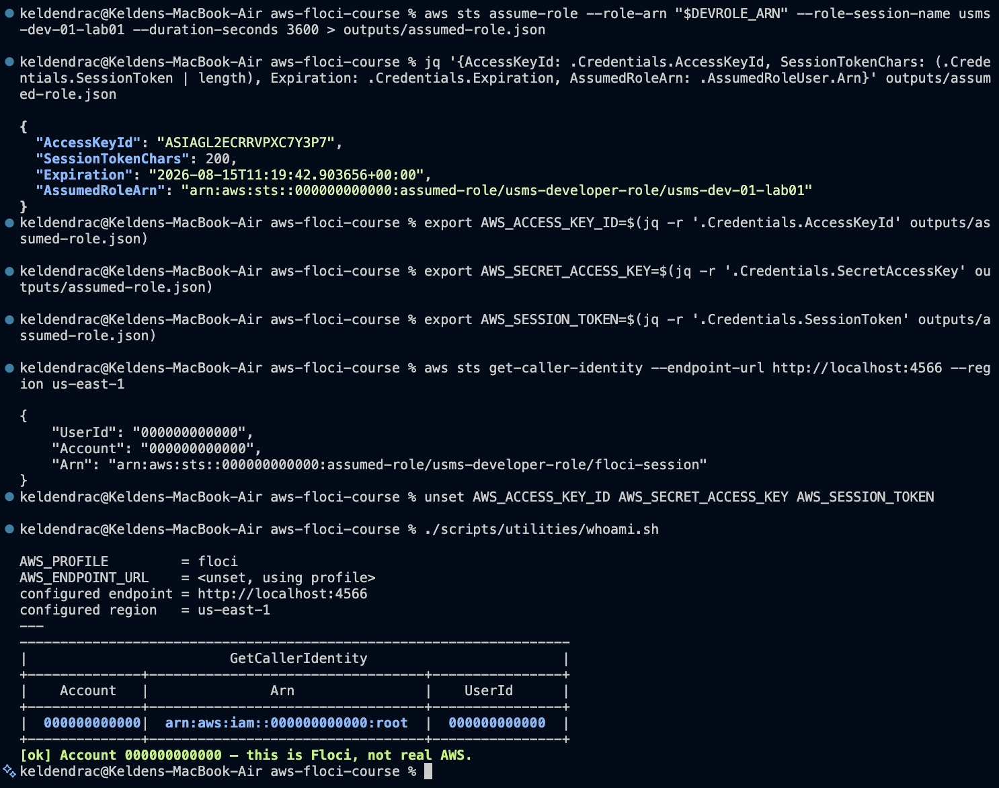

### 4.5 Credential safety

The access key was redirected **straight into a file**, so the secret never
appeared on screen, in scrollback, or in any screenshot. Three independent
confirmations: absent from `git status`, `git check-ignore -v` naming the exact
rule, and permissions `-rw-------`.

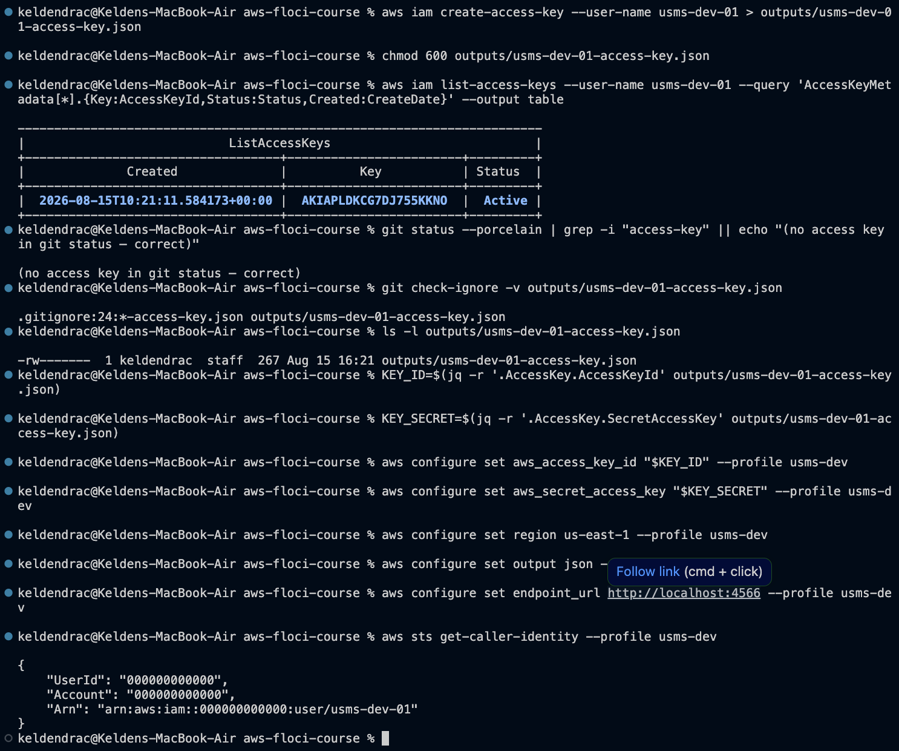

Note which rule fired. The fake secret in Step 6 matched `outputs/*` on line 8;
this real key matched `*-access-key.json` on line 24 instead, because Git reports
the **last** matching pattern. Two independent rules cover this file, and that
redundancy is deliberate. A key saved to the wrong directory by mistake is still
caught.

### 4.6 Recording state for Lab 2

`configs/lab-01.env` was generated with an **unquoted** heredoc, deliberately the
opposite choice from the policy files, because here the `$(aws ...)` substitutions
must run and bake real ARNs into the file. Every value is populated, with no
blanks and no `None`.

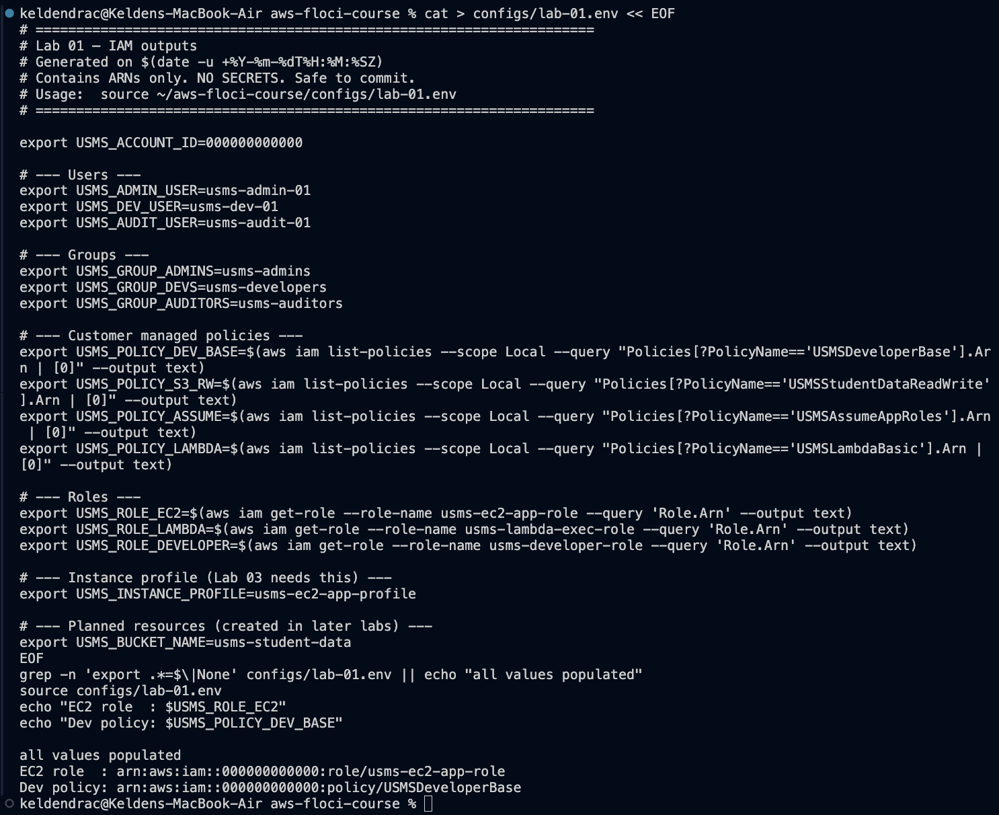

### 4.7 Verification


### 4.8 Git history

Four commits with `chore: ignore secrets before the repo can hold any` as the
oldest, a clean working tree, only `outputs/.gitkeep` tracked under `outputs/`,
and three separate ignore rules protecting the real secrets.

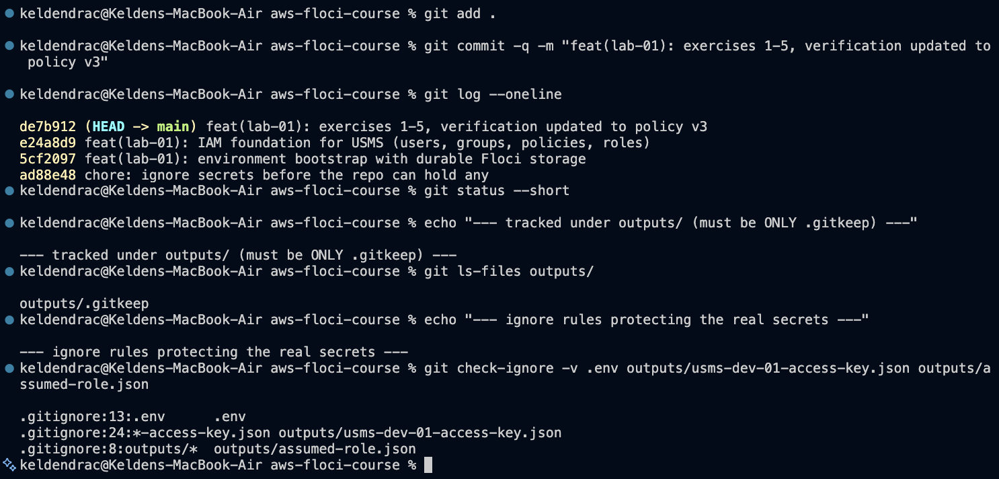

---

## 4. Exercises 1-5

Full commands, output and design reasoning in [`exercises.md`](exercises.md).

| # | Deliverable | Result |
|---|---|---|
| 1 | QA identity | `usms-qa-01` in `usms-qa`, tagged; policy on the **group**, user's attached list empty |
| 2 | `USMSReportingReadOnly` | Prefix-scoped read on `transcripts/`, explicit deny on all `Put*`/`Delete*` across both ARN forms |
| 3 | Partner analytics role | 30-minute cap enforced; expiry `10:40:58Z` -> `11:11:01Z` |
| 4 | Backup operator | Role (not user); 4 statements, all region-locked; no wildcards on any `Allow` |
| 5 | Lab 2 preparation | v3 default, v1/v2 retained; `USMS_VPC_CIDR` added; verify script updated |


Two findings worth surfacing here rather than burying in the appendix.

**Exercise 3 asks for something AWS does not permit.** The exercise requires a
30-minute session cap via `--max-session-duration 1800`, but AWS constrains that
parameter to 3600-43200 seconds. The CLI rejected it client-side. The requirement
is still satisfiable: set the parameter to its floor and enforce the real limit
with a `NumericLessThanEquals` condition on `sts:DurationSeconds` in the trust
policy, which is evaluated at `AssumeRole` time. That is a stronger control than
the parameter would have been, because it *denies* an oversized request rather
than silently capping it, so the attempt fails loudly and leaves an audit trail.

**Exercise 4's copy operation has no single permission.** There is no
`s3:CopyObject` action. A server-side copy is authorised as `s3:GetObject` on the
source and `s3:PutObject` on the destination, two permissions on two resources.
"Verify what it copied" needs `s3:ListBucket` on the **bucket** ARNs, not the
object ARNs. Deletion is blocked by implicit deny; no explicit `Deny` was added
because it would be redundant, and reserving explicit denies for genuine
guardrails keeps their signal strong.

---

## 5. Review questions

Answered in full in [`../../notes/lab-01-notes.md`](../../notes/lab-01-notes.md).
Summarised:

1. **Trust vs permissions.** The missing piece is a trust policy naming the
   principal. IAM separates the documents because "what may this role do" and
   "who may become this role" are owned by different people, change at different
   rates, and only the trust policy can name a cross-account principal.
2. **Explicit vs implicit deny.** `iam:CreateUser` is explicitly denied by
   `DenyDangerousIdentityChanges`; `dynamodb:PutItem` is implicitly denied because
   nothing mentions it. The simulator distinguishes them. The fixes are opposite:
   adding an `Allow` resolves implicit deny and does nothing at all for explicit.
3. **Roles over keys.** Nothing secret is stored on the machine, and credentials
   rotate automatically with a far tighter blast radius than a developer's key.
4. **The S3 ARN trap.** Bucket and object are different resources.
   `s3:GetObject` on the bucket ARN matches nothing. Two statements are required.
5. **The Floci illusion.** Success proves requests were syntactically valid and
   accepted, not that policies are correct, because Floci does not authorise
   against IAM policies. Verify by simulating with explicit request context
   including the negative cases, and by testing in a throwaway real account
   against CloudTrail.
6. **The persistence trap.** Three independent causes: mode not set by
   `--persist`, sidecars using a different variable, and flags not remembered.
   All are caught in under a minute by creating a resource, restarting, and
   looking again.
7. **Configuration as evidence.** A committed `docker-compose.yml` converts the
   environment from an unverifiable typed command into a reviewable artefact, and
   the commit graph lets a reader verify *ordering*, that ignore rules preceded
   every artefact, which no typed command can demonstrate.

---

## 6. Problems encountered

Nine issues arose. Full write-ups in [`README.md`](README.md). The four with
transferable lessons:

**`iam:GetAccountAuthorizationDetails` is not implemented by Floci.** Step 26C
depends on it and it returned `UnsupportedOperation`, leaving a 0-byte artefact.
Wrote `scripts/utilities/iam-snapshot.sh` to assemble an equivalent document from
supported `list-*` calls, preserving the same top-level keys so the Step 26D
query works unchanged.

**The policy simulator disagreed with the lab, and the simulator was right.**
`ec2:CreateVpc` returned `implicitDeny` where the lab expects `allowed`. Rather
than assuming an emulator bug, testing with explicit context showed the
`aws:RequestedRegion` condition was simply unsatisfied.


Supplying `us-east-1` returned `allowed`; `eu-west-1` returned `implicitDeny`. A
conditional `Allow` is not an `Allow` until the condition's context key is
present. A permission that works from one call shape can fail from another that
omits the key.

**The lab's own `.gitignore` silently blocked one of the lab's policy files.**
`*credentials*` matches `policies/usms-self-manage-credentials.json`, a policy
document containing no secret. The guide lists that file as belonging in a
committed directory, but it was never staged, and nothing warned. `git add .`
skips ignored files silently and the verification script does not check for it.
Caught only by running `git status --ignored` during final cleanup, and fixed
with a negation, effective for the same reason `!outputs/.gitkeep` is, because
the parent directory is not itself excluded. An over-broad ignore rule fails
silently in the direction that *loses work* rather than the direction that leaks
it.

**AWS CLI v1 was shadowing v2 on PATH.** A pip-installed `aws-cli/1.42.52` won
over the Homebrew v2 binary. Since v1 ignores the profile's `endpoint_url`, every
command would have silently gone to **real AWS** instead of Floci, the exact
failure the isolation proofs exist to catch.

---

## 7. Floci limitations versus real AWS

Recording these matters because the lab's central warning is that success against
an emulator is not evidence of correctness.

| Behaviour | Floci 1.5.34 | Real AWS |
|---|---|---|
| Request authorisation | Not enforced; every caller reports as account root | Signature verified, policies evaluated |
| `sts:AssumeRole` | Succeeds even without a trust policy | Denied unless both handshake halves agree |
| Assumed-role session name | Reported as `floci-session` | The supplied name, which is what makes CloudTrail traceable |
| `GetAccountAuthorizationDetails` | `UnsupportedOperation` | Supported; basis of most IAM audit tooling |
| `floci snapshot` | Not available on this build | N/A, filesystem archive used instead |
| MFA | Meaningless; no console login | Mandatory for human users in practice |

The practical consequence: this lab exercised the IAM **control plane**, creating,
reading and versioning policy objects, and never once exercised policy
**enforcement**. A policy with a typo'd action or an unsatisfiable condition would
have been created and listed just as happily.

---

## 8. Section 10 - Lab Assessment Checklist

### Environment

- [x] Docker installed and daemon running - `03`
- [x] Docker Compose v2 available - `03`
- [x] Project structure created BEFORE Floci was started - `00`
- [x] `.gitignore` written and committed as the FIRST commit - `01`, `15`
- [x] Proved `outputs/.gitkeep` is tracked (the `outputs/*` negation works) - `01`
- [x] Explained why `FLOCI_STORAGE_MODE` defaults to memory and why that matters - notes
- [x] `docker-compose.yml` written with hybrid storage and an absolute bind mount - `02`, `06`
- [x] `floci-up.sh` brings the environment up and verifies its own mount - `02`
- [x] AWS CLI v2 installed (`2.36.23`) - `03`
- [x] Profile `floci` configured with `endpoint_url` - `03`
- [x] `aws sts get-caller-identity` returns account `000000000000` - `03`
- [x] Proved with `--debug` that requests go to `localhost:4566` - `04`
- [x] Proved that stopping Floci breaks the CLI - `04`
- [x] **PROVED PERSISTENCE**: created a user, restarted, found it again - `05`
- [x] `~/floci-data` contains real files - `05`, `06`
- [x] `floci-storage-check.sh` passes all six sections - `06`
- [x] `whoami.sh` works and fails loudly on a wrong account - `03` *(success path evidenced; the failure branch is implemented and was never triggered, since the account was never wrong)*
- [x] `README.md` written - repo root
- [x] Part A committed to Git - `15`

### IAM - Identities

- [x] 3 groups created - `07`
- [x] 3 users created and tagged - `07`; tags `Project=USMS` plus `Role=Administrator|Developer|Auditor` verified on all three
- [x] Each user placed in the correct group - `07`
- [x] Membership verified from BOTH directions - `07`

### IAM - Policies

- [x] AWS managed policy attached to auditors (`ReadOnlyAccess`) - `07`
- [x] `USMSDeveloperBase` written, validated locally, created, attached to 2 groups - `07`
- [x] `USMSStudentDataReadWrite` written with correct bucket AND object ARNs - `07`, policy file
- [x] Inline policy `USMSSelfManageCredentials` on `usms-dev-01` - `09`
- [x] Explained the difference between attached and inline in notes - notes
- [x] Policy version v2 created and set as default - `09`
- [x] Confirmed v1 still exists and could be rolled back to - `09`, `17`

### IAM - Roles

- [x] `usms-ec2-app-role` with an `ec2.amazonaws.com` trust policy - `10`
- [x] `usms-lambda-exec-role` with a `lambda.amazonaws.com` trust policy - `10`
- [x] `usms-developer-role` with an account-principal trust policy - `10`
- [x] Instance profile `usms-ec2-app-profile` created and contains the role - `10`
- [x] `sts assume-role` executed; temporary credentials obtained - `11`
- [x] Identified the `ASIA` prefix and the `SessionToken` - `11`
- [x] Returned to normal identity afterwards (`whoami.sh` confirms) - `11`

### Credentials and safety

- [x] Access key created for `usms-dev-01`, redirected straight into `outputs/` - `12`
- [x] `chmod 600` applied - `12`
- [x] `git check-ignore` names the rule that protects the key file - `12`
- [x] Second profile `usms-dev` created and tested - `12`
- [x] Can explain the 5-step key rotation procedure - notes

### CLI skills demonstrated

- [x] Used `--output json`, `table` AND `text` - `08`
- [x] Used `--query` to extract a single value into a variable - `08`
- [x] Used a JMESPath filter `[?...]` - `08`, `10`
- [x] Used `file://` to submit a policy document - every `create-policy` call; documented in `exercises.md`
- [x] Used `--generate-cli-skeleton` - `08`; output in `templates/`
- [x] Checked an exit code with `$?` - `08` (`0` then `254`)

### Wrap-up

- [x] `configs/lab-01.env` generated with real ARNs, every value populated, no secrets - `13`
- [x] Snapshot saved - `floci snapshot` unavailable on this build; filesystem fallback used: `~/floci-data-lab-01.tar.gz` (9.3K)
- [x] `verify-lab-01.sh` passes with `FAIL=0` - `14`, and again at v3 in `17`
- [x] `labs/lab-01-iam/README.md` written - this directory
- [x] Git history shows `.gitignore` as the oldest commit - `15`
- [x] Exercises 1-5 attempted and documented - `16`, `17`, `exercises.md`

**All boxes satisfied.** Two carry the qualification noted inline: the `whoami.sh`
failure branch was never triggered because the account was never wrong, and the
snapshot used the lab's documented filesystem fallback because `floci snapshot`
is unavailable on server 1.5.34.

---

## 9. Reproducing this lab

```bash
source ~/aws-floci-course/configs/course.env
./scripts/setup/floci-up.sh
source ~/aws-floci-course/configs/lab-01.env
./scripts/utilities/verify-lab-01.sh
```

Expected: `PASS=34  FAIL=0`.
