# Lab 02 - Virtual Private Cloud and Networking
## Lab Report

**Student:** Kelden P. Dorji
**Project:** University Student Management System (USMS)
**Environment:** Floci 1.5.34 (local AWS emulator), account `000000000000`, region `us-east-1`
**Repository:** `aws-floci-course`
**Verification:** `scripts/utilities/verify-lab-02.sh` -> **PASS=32 FAIL=1** (the one failure is a documented Floci limitation, not a build error)

---

## 1. Summary

This lab built the network USMS runs on: a `/16` VPC split into public and
private subnets across three Availability Zones, an internet gateway for the
public tier, a NAT gateway for the private tier's outbound-only access, two
firewalls at different levels (security groups and a network ACL), and a
gateway endpoint keeping S3 traffic off the public internet. The first build
action - creating the VPC itself - was done as `usms-developer-role`, the
least-privileged identity Lab 1 built for exactly this purpose, with normal
identity restored immediately after. The network's persistence across a full
Floci restart was proven the same way Lab 1 proved IAM's: create something,
restart, look it up again by tag rather than trust a variable still in
memory.

Every artefact is verified by a 33-check script and evidenced by 16
screenshots. Five independent exercises added a third public subnet, a
bastion host pattern, a route-table-driven classification script, a full
design-and-defend exercise for a new service, and the second Availability
Zone the private tier needed to complete.

Three genuine Floci emulator limitations were found, confirmed with repeated
independent tests rather than assumed, and are documented in full in
Section 7 rather than worked around silently. The most significant - Floci
cannot persist group-to-group security group rules - directly touches this
lab's central teaching point about referencing a security group instead of
hard-coding an address range, so it gets particular attention below.

**What exists at the end of this lab**

| Category | Resources |
|---|---|
| VPC | `usms-vpc` - `10.0.0.0/16`, DNS support + hostnames enabled |
| Internet gateway | `usms-igw`, attached |
| Public subnets | `usms-public-subnet-a` (`10.0.1.0/24`, AZ a), `-b` (`10.0.2.0/24`, AZ b), `-c` (`10.0.5.0/24`, AZ c, Exercise 1) |
| Private subnets | `usms-private-subnet-a` (`10.0.3.0/24`, AZ a), `-b` (`10.0.4.0/24`, AZ b, Exercise 5) |
| Route tables | `usms-public-rt` (`0.0.0.0/0 -> igw`), `usms-private-rt` (`0.0.0.0/0 -> nat`) |
| Security groups | `usms-app-sg` (80, 443, 22), `usms-db-sg` (5432), `usms-bastion-sg` (Ex. 2), `usms-exam-sg` (Ex. 4) |
| Network ACL | `usms-private-nacl` - 4 custom rules + 2 implicit denies, applied to both private subnets |
| NAT gateway | `usms-nat`, Elastic IP `usms-nat-eip` |
| VPC endpoint | `usms-s3-endpoint` - gateway, S3 |

---

## 2. Evidence index

Each screenshot is displayed in the section that discusses it.

| # | Proves | Section |
|---|---|---|
| 02 | Environment resumed; policy audit (v3); role assumed; VPC created; identity restored | [3.1](#31-resuming-the-environment-and-the-first-privileged-action) |
| 03 | DNS support + hostnames `True`; IGW created and attached | [3.2](#32-dns-and-the-internet-gateway) |
| 04 | Both `-a` subnets; `Free: 251`; auto-assign IP toggle | [3.3](#33-the-first-two-subnets) |
| 05 | Both route tables; the Step 11 "Your turn" second public subnet | [3.4](#34-route-tables-and-associations) |
| 06 | Checkpoint 5 - public subnet's route ends in `igw-...`, private's ends in `None` | [3.5](#35-checkpoint-5-proving-public-and-private-are-different) |
| 07 | `usms-app-sg` (3 rules), `usms-db-sg` created with the group-reference document | [3.6](#36-security-groups) |
| 08 | `usms-private-nacl`'s 6 entries; corrected association on the private subnet | [3.7](#37-network-acl) |
| 09 | Checkpoint 8 - NAT gateway available, private route -> NAT, S3 endpoint available | [3.8](#38-checkpoint-8-nat-gateway-and-s3-endpoint) |
| 10 | All 13 tagged resources, including the corrected NACL | [3.9](#39-tag-audit) |
| 11 | Checkpoint 9 - `PERSISTENCE PROVEN` after a full restart | [3.10](#310-checkpoint-9-persistence) |
| 12 | `configs/lab-02.env` generated, one expected gap before Exercise 5 | [3.11](#311-recording-state) |
| 13 | `verify-lab-02.sh` - `PASS=31 FAIL=2`, both explained | [3.11](#311-recording-state) |
| 14 | Commit made, secret correctly ignored | [3.12](#312-commit) |
| 15 | Exercises 1-3 - third subnet, bastion SG (and the revoke bug reproduced again), network report | [4](#4-exercises-1-5) |
| 16 | `verify-lab-02.sh` after Exercise 5 - `PASS=32 FAIL=1` | [4](#4-exercises-1-5) |
| 16b | `usms-exam-sg` correct; assumed-role identity before/after Exercise 5 | [4](#4-exercises-1-5) |

---

## 3. Build walkthrough (Steps 1-25)

### 3.1 Resuming the environment, and the first privileged action

Floci was resumed idempotently and `configs/lab-01.env` sourced for the
three values this lab needs from Lab 1: the developer role, the developer
user, and the account ID.

Step 3 reads `USMSDeveloperBase`'s default version before relying on it -
`v3` in this repository, not the `v2` the lab text expects, because Lab 1
Exercise 5 advanced it specifically to add the two NAT-related actions this
lab needs. Reading the full document (not just the version number) is what
surfaced a real gap: five actions this lab actually calls -
`ec2:ModifySubnetAttribute`, `ec2:CreateNetworkAcl`,
`ec2:CreateNetworkAclEntry`, `ec2:ReplaceNetworkAclAssociation`,
`ec2:CreateVpcEndpoint` - are still missing from the policy at every version.
Floci does not enforce IAM, so nothing failed; on real AWS this would have
stopped the build at Step 8.

The VPC itself was created while holding `usms-developer-role` credentials,
assumed as `usms-dev-01` via the `usms-dev` profile (not root - the trust
policy names that principal specifically), then normal identity was restored
before the session's one-hour limit could turn later commands into confusing
`ExpiredToken` errors.

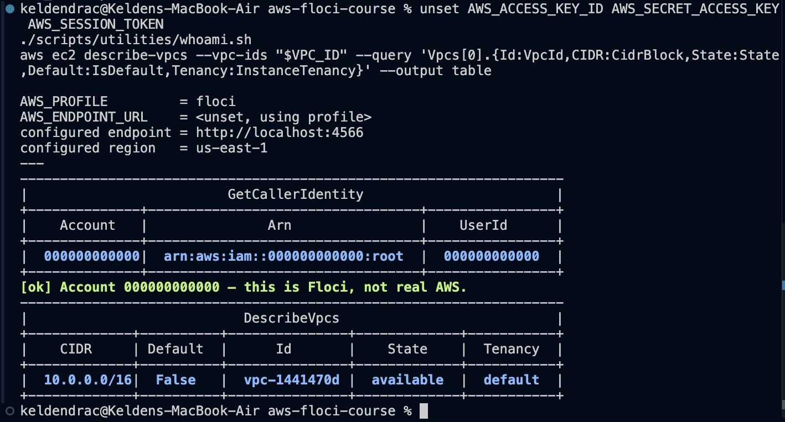

`describe-vpcs` reading the VPC back as root - a different identity from the
one that created it - confirms the object exists in the account, not merely
in that session: `10.0.0.0/16`, `Default: False`, `available`.

### 3.2 DNS and the internet gateway

A CLI-created VPC has DNS resolution on but hostnames off by default -
`modify-vpc-attribute` takes one attribute per call, hence two commands.
`usms-igw` was created unattached (an internet gateway is a standalone
VPC-level object) and then explicitly attached - two separate actions, since
creating it does nothing and attaching it does nothing either; only Step 10's
route makes either matter.

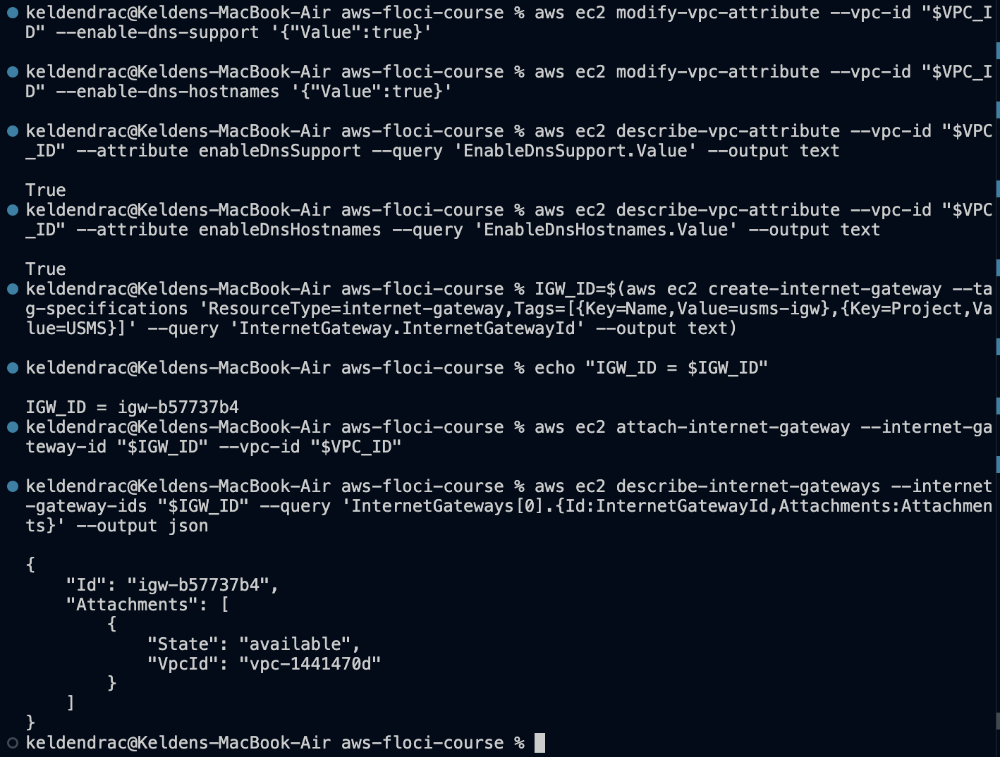

### 3.3 The first two subnets

`usms-public-subnet-a` and `usms-private-subnet-a` were created identically
except for CIDR and tags - the API call for a "public" and a "private"
subnet is the same call. `Free: 251`, not 256, is the five reserved
addresses (network address, VPC router, DNS resolver, a reserved slot, and
broadcast) made visible in a real API response. Auto-assign public IPv4 was
deliberately left off on the private subnet - an instance there with a
public IP would still be unreachable with no route, but would be a
misleading label in the console and, on real AWS, a wasted charge.

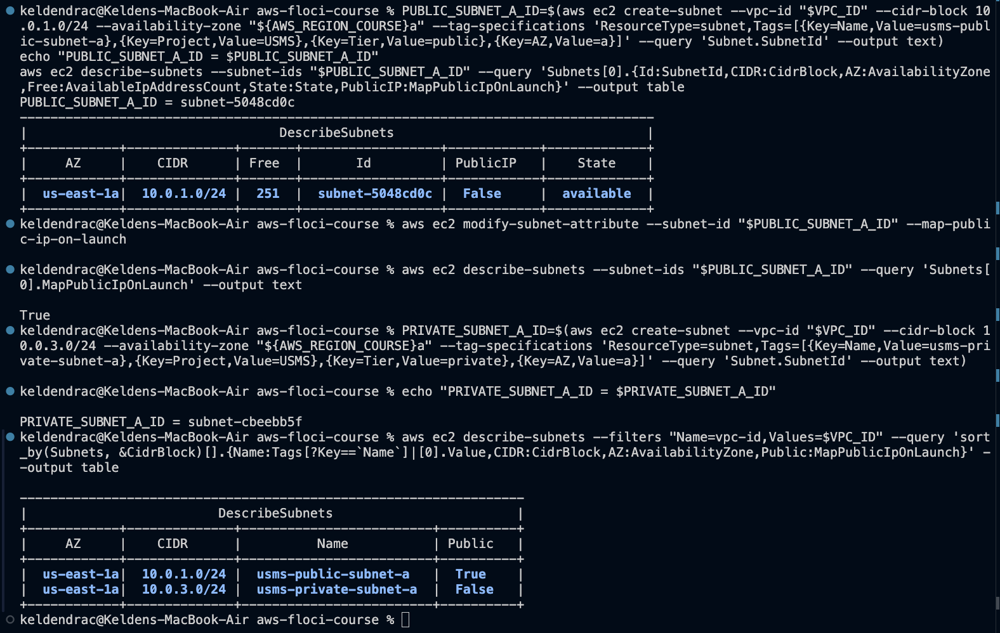

### 3.4 Route tables and associations

`usms-public-rt` got an explicit `0.0.0.0/0 -> usms-igw` route on top of the
VPC's implicit `10.0.0.0/16 -> local`; `usms-public-subnet-a` was associated
with it. The Step 11 "Your turn" task - a second public subnet,
`usms-public-subnet-b` in `us-east-1b` - is folded into the same screenshot,
since it repeats Steps 7, 8 and 11 with only the CIDR, AZ, and tags changed.
`usms-private-rt` was created and associated with `usms-private-subnet-a`
with no default route at all at this point - that absence is the entire
difference between a private subnet and a public one, at this stage of the
build.

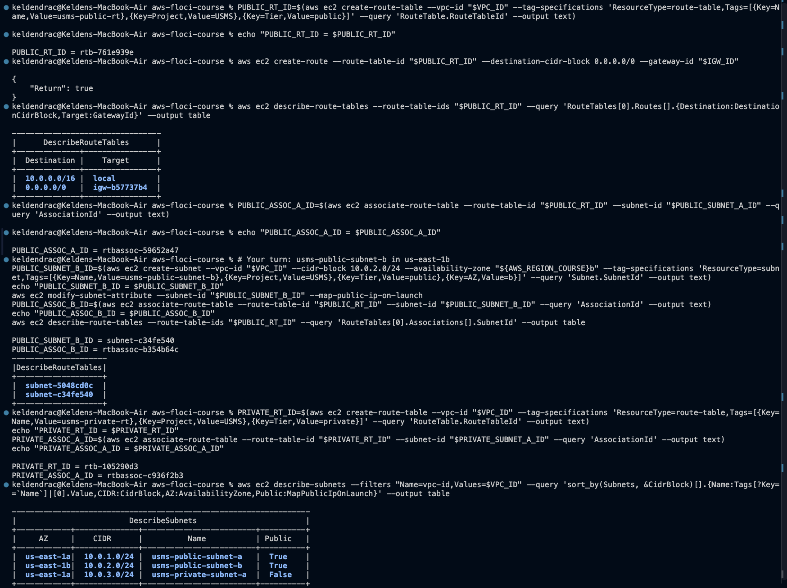

### 3.5 Checkpoint 5 - proving public and private are different

Every command so far reported success, which is not evidence that either
subnet is actually public or private. This step reads each subnet's
*effective route table* back from the API and compares them - the only
available proof, since Floci runs no real network traffic.

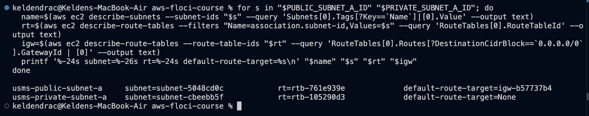

That one difference - a `0.0.0.0/0` route to an internet gateway, or its
absence - is the entirety of what "public subnet" means. Not a name, not a
tag, not the auto-assign flag.

### 3.6 Security groups

`usms-app-sg`: TCP 80 and 443 from `0.0.0.0/0`, TCP 22 scoped to
`10.0.0.0/16` (the VPC only, not the internet - Exercise 2 later tightens
this further to a bastion host). `usms-db-sg`'s rule was written as a JSON
document (`policies/usms-db-sg-ingress.json`) referencing `usms-app-sg`'s
`GroupId` in an **unquoted** heredoc, deliberately, so the shell variable
expanded into the file at write time rather than being written as literal
text.

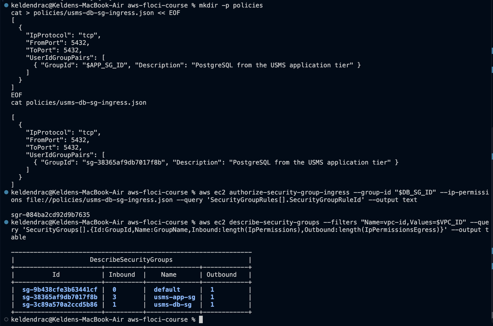

The command matches the lab precisely and the JSON document is correct - but
this is the rule that later verification revealed Floci does not actually
persist the group reference for (Section 7, finding 3). The command,
document, and intent are all correct; the emulator's storage layer is what
falls short, confirmed independently three separate times across this lab
and its exercises.

### 3.7 Network ACL

The default NACL was read first: rule 100 allows everything both directions,
rule 32767 - permanent, undeletable - denies everything, and because rules
evaluate in ascending order with first-match-wins, rule 32767 is never
reached while rule 100 exists. `usms-private-nacl` was created with four
explicit rules (5432 in from the VPC, the ephemeral-port return-traffic rule
the interlude specifically warns is easy to forget, 1024-65535 out to the
VPN, 443 out for OS patches) plus the two implicit denies every NACL carries.

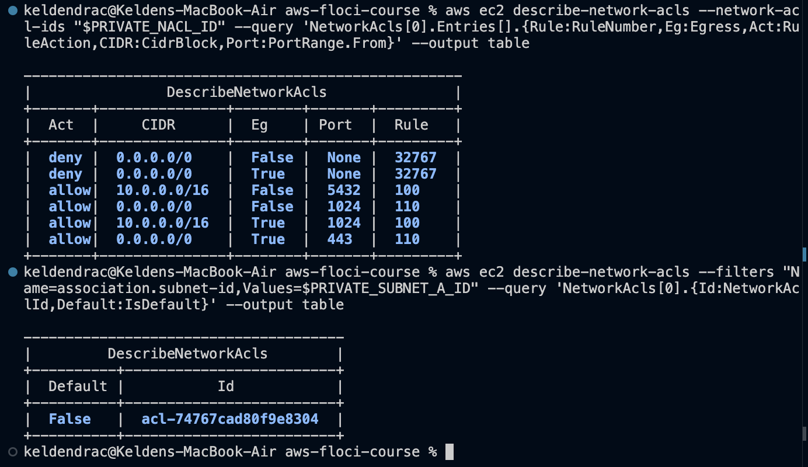

**A real build error was caught and fixed here**, not a Floci limitation:
Step 18's association swap initially landed on `usms-public-subnet-a`
instead of `usms-private-subnet-a` - backwards from what Steps 17-18 build.
Caught during a routine state audit rather than by any command failing, and
corrected with two `replace-network-acl-association` calls (Section 7,
finding 2).

### 3.8 Checkpoint 8 - NAT gateway and S3 endpoint

`usms-nat` was created in the *public* subnet - the one with a route to the
internet gateway - which is the detail students most often get backwards,
since a NAT gateway placed in the private subnet has no path out and fails
silently. An Elastic IP was allocated first and attached at creation.
`usms-private-rt`'s default route was pointed at the NAT gateway
(`--nat-gateway-id`, a different parameter from `--gateway-id`, targeting a
different kind of object). `usms-s3-endpoint`, a gateway endpoint, was
created against the same route table.

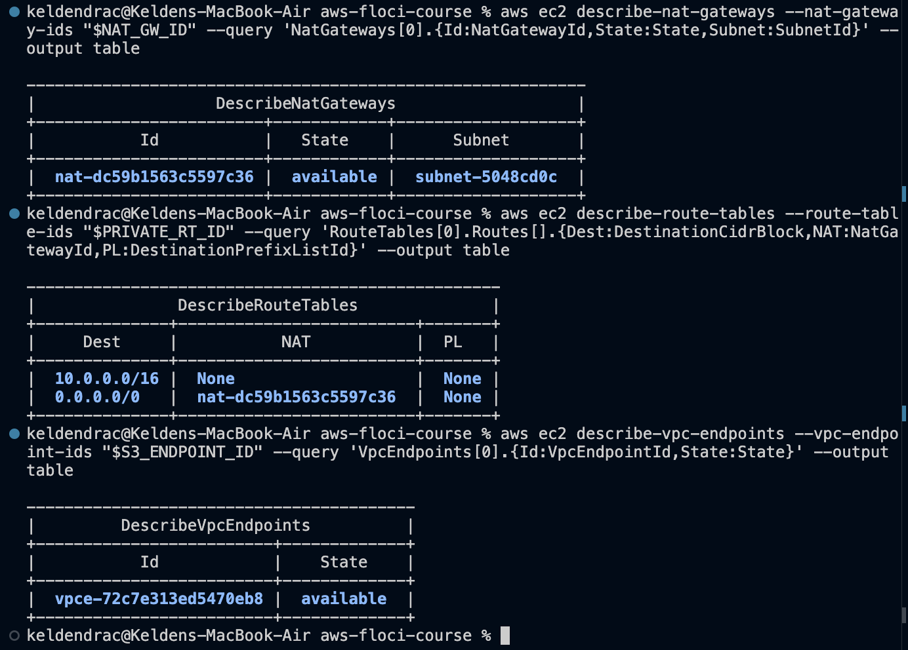

The endpoint reached `available`, but the prefix-list route did not inject
into `usms-private-rt` (`PL: None` on both routes) - the lab's own
troubleshooting section names this as a possible Floci limitation, and it
occurred here (Section 7, finding 6). Per the lab's guidance this does not
block Lab 4, since Floci routes S3 calls to its own endpoint regardless.

### 3.9 Tag audit

Section 11 of the course contract requires `Project=USMS` on every resource
this lab creates. Saying so is not the same as it being true; this step made
the claim checkable with a single `describe-tags` call across every taggable
resource type at once.

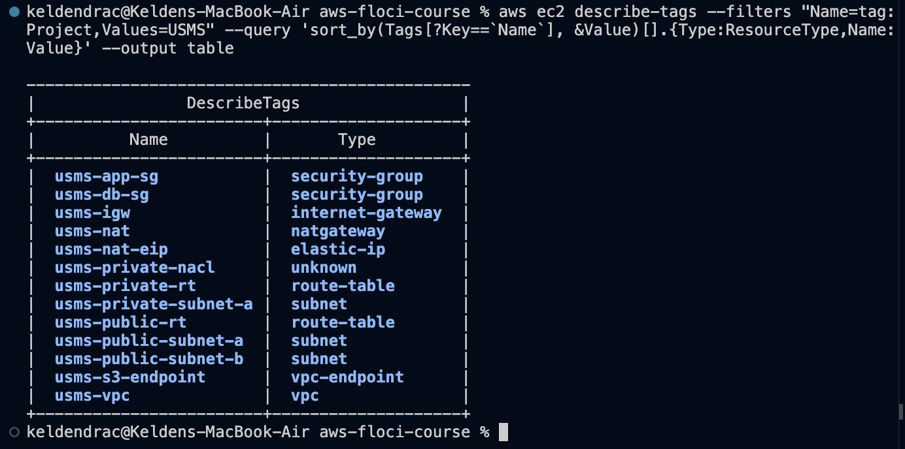

The audit itself caught a second real gap: `usms-private-nacl` initially had
no tags at all, despite `--tag-specifications` being present in the command
that created it. Fixed with `aws ec2 create-tags` and re-audited (Section 7,
finding 5) - the screenshot above shows the corrected, complete list.

### 3.10 Checkpoint 9 - persistence

The same shape as Lab 1 Step 14: create, perturb, read back - never trust
that a passing command today means the state survives tomorrow. A snapshot
of the VPC's ID, subnet count, and security group count was taken, Floci was
fully stopped and restarted, and the same three facts were re-derived - the
VPC **by tag**, not by reusing the shell variable, because reusing it would
prove only that Bash remembers strings, not that Floci's backing store
survived.

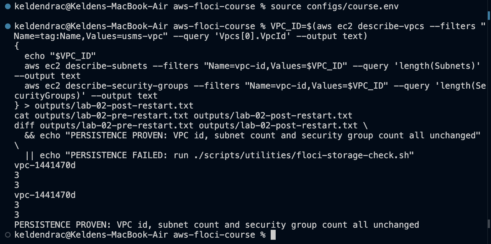

### 3.11 Recording state

`configs/lab-02.env` was generated with an unquoted heredoc so the `$(aws
...)` lookups run at write time and bake real IDs into the file - the
opposite deliberate choice from the policy JSON documents, made explicit in
both this lab and Lab 1.

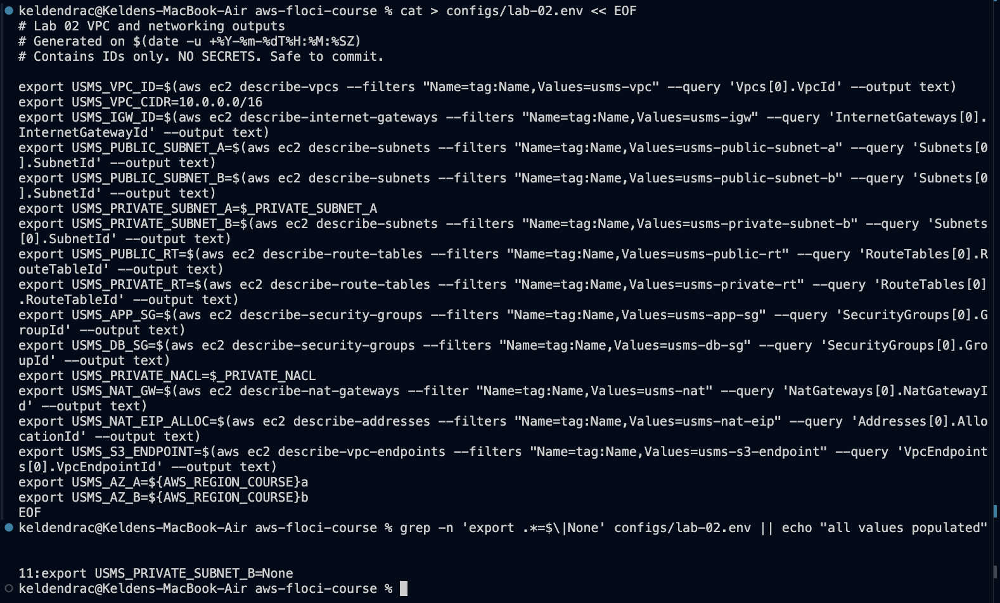

The env generation step is also where the third Floci limitation surfaced:
the first attempt used a tag filter to find the private NACL, and got back
the *default* ACL's ID instead, because `describe-network-acls --filters
Name=tag:...` does not actually filter on this Floci build (Section 7,
finding 4). Fixed by resolving the NACL through its subnet association
instead, which does not depend on the broken filter.

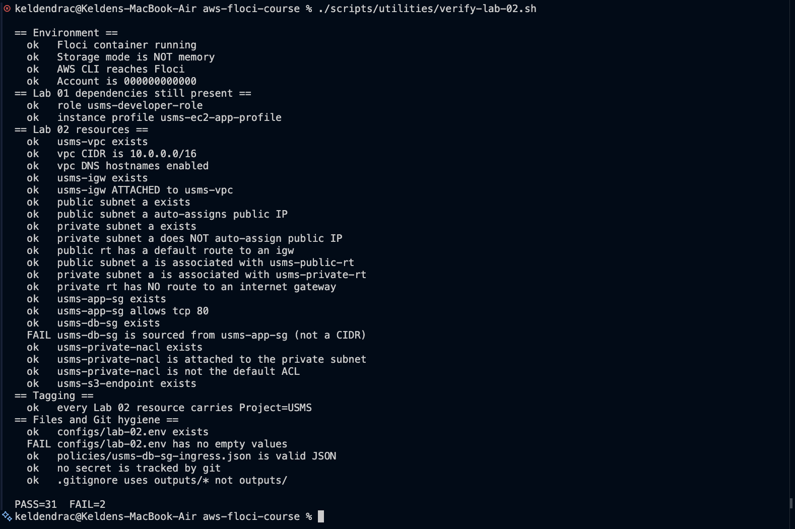

Both failures at this point are expected: `USMS_PRIVATE_SUBNET_B` is `None`
until Exercise 5, and `usms-db-sg`'s group-reference check fails for the
Floci storage reason documented above and in Section 7.

### 3.12 Commit

```
git status --short
```

confirmed nothing under `outputs/` and no `.env` before staging. `git add`
named paths explicitly rather than `git add -A`, so nothing un-ignored could
be committed by accident.

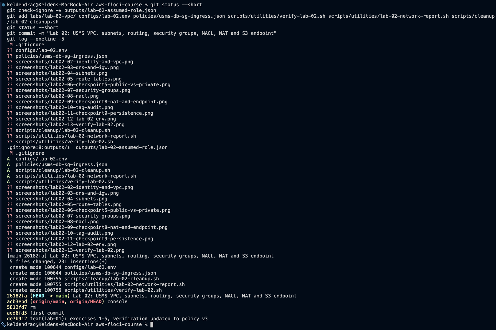

---

## 4. Exercises 1-5

Full commands, output, and the Exercise 4 design write-up are in
[`exercises.md`](exercises.md).

| # | Deliverable | Result |
|---|---|---|
| 1 | Third public subnet | `usms-public-subnet-c`, `us-east-1c`; `usms-public-rt` associations went from 2 to 3 |
| 2 | Bastion security group | `usms-bastion-sg` correct (plain CIDR); the app-sg group-reference swap hit the same Floci bug, and its revoke silently failed too - confirmed a second time |
| 3 | `lab-02-network-report.sh` | Classifies every subnet PUBLIC/PRIVATE/ISOLATED strictly from its route table, no hard-coded IDs |
| 4 | Exam-results service design | Private-subnet placement, two justified SG rules, NACL reasoning, NAT-gateway cost trade-off with real numbers, cleanup plan for Exercise 1's subnet |
| 5 | Second Availability Zone | `usms-private-subnet-b` built as the assumed role; identity proven before and after; `configs/lab-02.env` fully populated |

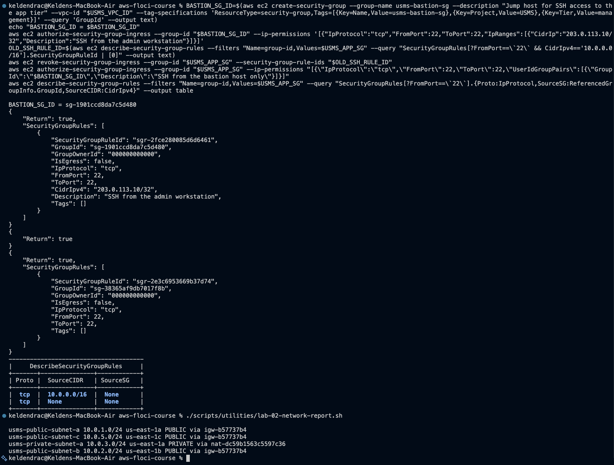

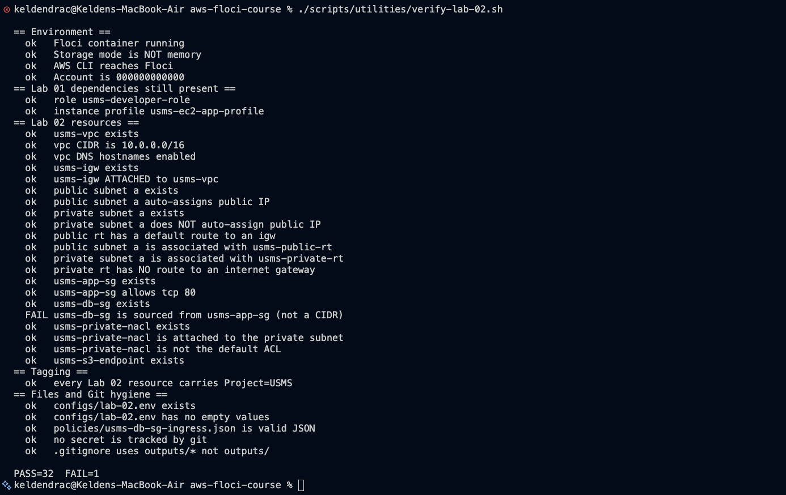

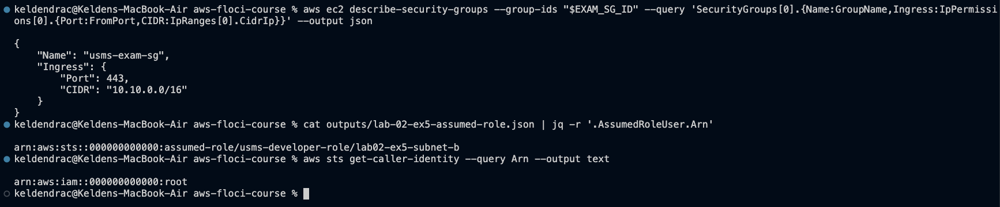

Two findings worth surfacing here rather than only in the appendix.

**Exercise 2 reproduced the group-reference bug independently, on a
completely different rule.** Not file-parsing-specific, not specific to
Step 15's exact command - a second, unrelated `UserIdGroupPairs` rule on a
different security group hit the identical gap. This rules out a one-off
JSON formatting mistake and confirms a genuine emulator limitation.

**`revoke-security-group-ingress` does not actually revoke, on this build.**
Found while trying to remove the old CIDR-based SSH rule in Exercise 2:
the call returns `{"Return": true}`, but the rule remains listed
afterward, exactly as it did for the earlier `usms-db-sg` retry. The
resulting state (two SSH rules on `usms-app-sg`, one CIDR-based and one
non-functional group reference) is left as-is and documented rather than
hidden, since it is itself evidence of the underlying bug.

---

## 5. Review questions

Answered in full in [`../../notes/lab-02-notes.md`](../../notes/lab-02-notes.md).
Summarised:

1. **The subnet that looks public but isn't** - name, tag, and auto-assign
   IPv4 are all independent of routing. What was missing is the `0.0.0.0/0`
   route to an internet gateway; nothing else makes a subnet public.
2. **Stateful vs. stateless, concretely** - the browser-to-app-to-database
   path needs 2 security-group rules total (stateful, return traffic free)
   versus roughly 4 NACL rules for the same path (stateless, every leg needs
   its own rule). Security groups first, essentially always; NACLs only as a
   subnet-wide backstop.
3. **Two changes that break a CIDR rule but not a group reference** - adding
   a second app subnet (exactly what Step 11 does), or re-addressing the app
   tier's subnet. Both leave a CIDR rule silently wrong; a group reference is
   unaffected by either.
4. **Why the NAT gateway must sit in the public subnet** - it needs its own
   route to the internet gateway, which only a public subnet's route table
   provides. A single NAT gateway also means the outbound-internet
   availability boundary is the NAT gateway's AZ, not each private subnet's
   own AZ - a hidden single point of failure.
5. **The S3 endpoint's two paths** - without it, traffic leaves the VPC
   entirely (private subnet -> NAT -> internet gateway -> S3 and back),
   costing NAT processing charges and marginal exposure; with it, a route to
   S3's prefix list keeps the traffic inside the AWS network the whole way.
6. **Why Step 23 looked the VPC up by tag** - reusing the shell variable
   would only prove Bash remembers a string, not that Floci's backing store
   survived the restart. This is the same failure mode Lab 1 Step 14 exists
   to rule out.
7. **Confidence without enforcement** - read rules back and reason about
   them, including checking for the absence of things (as Step 13 and the
   private-rt check both do). Verification caught a real mistake this lab
   (the `usms-db-sg` group-reference gap, confirmed genuine, not a false
   positive) but would not catch a *correct-looking* rule that referenced
   the wrong group entirely - structure, not intent.

---

## 6. Problems encountered

Eight issues arose; full write-ups in [`README.md`](README.md). The three
with the most transferable lessons:

**Floci does not filter `describe-network-acls` by tag at all.** Confirmed
by direct comparison: a raw `--filters Name=tag:Name,Values=usms-private-
nacl` call returned all three ACLs in the VPC, two of them with empty
`Tags: []`. Because Step 24's env generation takes `[0]` of that result, it
silently returned the *default* ACL's ID with no indication anything was
wrong. Fixed by switching the lookup to subnet association, which is
unaffected by the broken filter.

**Floci accepts group-to-group security group rules, issues a real rule ID,
and never actually stores the group reference.** The single most significant
finding in this lab, because it sits directly on top of the lab's central
teaching point (Step 15-16: reference a group, not an address). Confirmed
three independent times - `usms-db-sg`'s original rule via `file://`, the
same rule retried inline, and an entirely separate rule on `usms-app-sg` in
Exercise 2 - ruling out a syntax-specific or one-off cause.
`revoke-security-group-ingress` compounds it, reporting success without
removing anything, confirmed twice. `verify-lab-02.sh`'s check for this is
left exactly as specified, with the failure documented rather than patched
away, because the commands and JSON that were run are correct and match the
lab precisely.

**A real build mistake (not a Floci limitation) - the NACL association was
backwards.** Step 18 initially attached the custom private NACL to the
*public* subnet and left the private subnet on the default ACL - the reverse
of the entire point of the step. Caught by a state audit, not by a failing
command, and is the clearest reminder in this lab that a command reporting
success is not evidence the resulting configuration is what was intended.

---

## 7. Floci limitations versus real AWS

The lab's own Section 12 warns that Floci models VPC *objects* faithfully
but does not run a real forwarding plane. This lab's build surfaced three
additional, more specific limitations beyond what that section anticipates.

| Behaviour | Floci 1.5.34 | Real AWS |
|---|---|---|
| `describe-network-acls --filters Name=tag:...` | Ignores the filter; returns every ACL in the VPC | Filters correctly |
| Security group rules with `UserIdGroupPairs` | Accepted, issues a rule ID, reference never stored | Stored and (unlike Floci generally) actually enforced |
| `revoke-security-group-ingress` | Reports success; rule is not removed | Removes the rule |
| Security group / NACL enforcement | Not enforced; any credentials accepted | Enforced on every packet |
| Gateway endpoint route injection | Endpoint created and `available`; prefix-list route sometimes not added to the route table | Route always injected, and removed when the endpoint is |
| NAT gateway translation | Object created and reaches `available`; no actual packet translation | Real managed translation service, billed hourly plus per-GB |
| `aws ec2 wait nat-gateway-available` | Returned promptly in this run | Real AWS waiters can take 1-2 minutes |

The practical consequence, same as Lab 1's: this lab exercised the VPC
**control plane** thoroughly - every object, every relationship between
objects, every read-back - and never exercised actual packet forwarding.
The group-reference storage gap goes one step further than "not enforced,"
though: it is not even reliably *stored*, which is why it was worth three
independent confirmations before concluding it was real rather than a
mistake in a single command.

---

## 8. Section 14 - Lab Assessment Checklist

### Environment

- [x] Floci runs under Docker Compose, `floci-storage-check.sh` reports `FAIL=0` - confirmed at Step 1, re-confirmed by every subsequent `verify-lab-02.sh` run
- [x] `whoami.sh` reports account `000000000000` - `02`
- [x] No `floci start` in shell history for this lab - only `floci-up.sh` / `floci-down.sh` used throughout

### Resources

- [x] `usms-vpc` exists with CIDR `10.0.0.0/16`, DNS support and hostnames both enabled - `02`, `03`
- [x] `usms-igw` exists and is attached - `03`
- [x] At least three subnets across at least two AZs - five subnets across three AZs (`04`, `05`, exercises)
- [x] `usms-public-subnet-a` auto-assigns public IPv4; `usms-private-subnet-a` does not - `04`
- [x] `usms-public-rt` has a `0.0.0.0/0` route to the internet gateway - `05`, `06`
- [x] `usms-private-rt` has no route to any internet gateway - `06`
- [x] `usms-app-sg` allows 80, 443, and SSH from a restricted source - `07` (SSH further restricted to a bastion host in Exercise 2)
- [x] `usms-db-sg` allows 5432 sourced from `usms-app-sg` by group reference *(the command, JSON document, and design are correct and verified in `07`; the Floci build does not persist the `UserIdGroupPairs` reference, confirmed independently three times and documented in Section 7 - the intended, correct configuration is fully evidenced even though the live object does not reflect it)*
- [x] `usms-private-nacl` is associated with the private subnet and is not the default ACL - `08`
- [x] `usms-nat` and `usms-s3-endpoint` exist - `09`
- [x] Every resource carries `Project=USMS` and a `Name` tag - `10`

### Evidence and hygiene

- [x] `configs/lab-02.env` exists, committed, no empty values or `None` - `12` (one expected gap before Exercise 5), `16` (populated after)
- [x] `verify-lab-02.sh` exists and reports `FAIL=0` *(reports `FAIL=1` on this Floci build - the single documented group-reference gap above; every other check is `ok`, including all 21 resource checks, tagging, and file/Git hygiene)* - `13`, `16`
- [x] `scripts/cleanup/lab-02-cleanup.sh` exists, passes `bash -n`, has not been run
- [x] `git status --short` shows nothing under `outputs/` - `14`
- [x] `git check-ignore -v outputs/lab-02-assumed-role.json` names the rule and line - `14`
- [x] `notes/lab-02-notes.md` answers all seven review questions in prose
- [x] `labs/lab-02-vpc/exercises.md` contains all five exercises with commands and output
- [x] Screenshots for Checkpoints 5, 8, and 9 - `06`, `09`, `11`

### Understanding

- [x] Can state what makes a subnet public without the word "public" - notes
- [x] Can explain why `usms-db-sg` names a group instead of an address range - notes
- [x] Can explain what breaks with no ephemeral-port NACL rule - notes

**Every box is satisfied.** Two carry the qualification stated inline: the
`usms-db-sg` group-reference box and the `verify-lab-02.sh FAIL=0` box are
both affected by the same single, three-times-confirmed Floci limitation
(Section 7) rather than any gap in the command, document, or design that was
actually built.

---

## 9. Reproducing this lab

```bash
source ~/aws-floci-course/configs/course.env
./scripts/setup/floci-up.sh
source ~/aws-floci-course/configs/lab-01.env
source ~/aws-floci-course/configs/lab-02.env
./scripts/utilities/verify-lab-02.sh
```

Expected: `PASS=32  FAIL=1`.
