# Lab 03 - Amazon EC2 and Deploying the USMS Application
## Lab Report

**Student:** Kelden P. Dorji
**Project:** University Student Management System (USMS)
**Environment:** Floci 1.5.34 (local AWS emulator), account `000000000000`, region `us-east-1`, AWS CLI 2.36.23
**Repository:** `aws-floci-course`
**Verification:** `scripts/utilities/verify-lab-03.sh` -> **PASS=33 FAIL=3** (all three failures are documented Floci limitations, not build errors - Section 7)

---

## 1. Summary

This lab put servers into the network Lab 2 built. `usms-web-01` was launched
into `usms-public-subnet-a` with one `run-instances` call that drew on three
labs at once: a subnet and security group from Lab 2, the instance profile
from Lab 1, and a key pair and bootstrap script from this lab. `usms-db-01`
followed into `usms-private-subnet-a` with the database security group and,
deliberately, no instance profile. Around those two instances the lab added
an Elastic IP, a data volume, a golden image, a second web server in the
other Availability Zone, and a verification script with 36 checks.

The important result is the evidence rather than the resources. The
permission chain from instance to policy was traced link by link. The
user-data script was proven byte-identical *on the instance itself*. The
reachability chain was checked one link at a time. The two tiers' wiring was
read back. All of it survived a full emulator restart, found again by tag
rather than through a shell variable.

Floci 1.5.34 turned out to do more than the lab text expects: it boots every
instance as a real Amazon Linux 2023 Docker container and actually runs the
user-data script inside it. It also does less than the lab text expects in
several specific places. `AttachVolume`, `CreateImage`, the `userData`
attribute read-back and credit specifications are unsupported. Every instance
gets the public address `127.0.0.1`. The emulator's SSH-port allocator and
container lifecycle both misbehave across restarts. Each of these is shown in
a screenshot, worked around where a workaround existed, and set out in
Section 7 against what real AWS does.

**What exists at the end of this lab**

| Category | Resources |
|---|---|
| Key pair | `usms-app-key`; private key at `outputs/usms-app-key.pem`, `chmod 600`, git-ignored |
| Web tier | `usms-web-01` `i-f66018e669eb1530a` (`usms-public-subnet-a`, `us-east-1a`), `usms-web-02` `i-80faf975c25aad581` (`usms-public-subnet-b`, `us-east-1b`, Step 18 "Your turn") - both `t3.micro`, `usms-app-sg`, `usms-ec2-app-profile`, same user data |
| Data tier | `usms-db-01` `i-780a8f3d907d26922` (`usms-private-subnet-a`), `usms-db-02` `i-16073b1702bcb7feb` (`usms-private-subnet-b`, Exercise 2) - `usms-db-sg`, no instance profile |
| Elastic IP | `usms-web-eip` `54.178.180.91` (`eipalloc-fd4200366485f54e6`), associated with `usms-web-01` |
| EBS | `usms-web-data-vol` `vol-9fd91b6c2914168c7`, 8 GiB `gp3`, `us-east-1a` (unattached - Floci has no `AttachVolume`) |
| Image | `usms-web-golden-20261004` `ami-902456dfbd32c64ab` (registered - Floci has no `CreateImage`) |
| Files | `labs/lab-03-ec2/user-data.sh`, `templates/lab-03-run-instances.json` (+ `-web02.json`), `configs/lab-03.env`, `scripts/utilities/verify-lab-03.sh`, `scripts/utilities/write-lab-03-env.sh`, `scripts/cleanup/lab-03-cleanup.sh` (never run) |

---

## 2. Evidence index

Each screenshot is displayed in the section that discusses it. One screenshot
per proof, cleared before capture, so every image is a single screen of
output.

| # | Proves | Section |
|---|---|---|
| 01 | AL2023 AMI chosen by name; user data parses (1657 bytes); template valid; waiter; Checkpoint 2 table | [3.2](#32-launching-usms-web-01---checkpoint-2) |
| 02 | Checkpoint 3 - instance -> profile -> role -> policy; user data byte-identical *on the instance*; nginx answering | [3.3](#33-checkpoint-3---the-permission-chain-and-the-user-data) |
| 03 | Auto-assigned address vs. Elastic IP; Checkpoint 4 - six reachability links | [3.4](#34-elastic-ip-and-checkpoint-4---reachability) |
| 04 | Data volume in the instance's AZ; `AttachVolume` unsupported (same- and cross-AZ); root `DeleteOnTermination True` | [3.5](#35-the-data-volume-and-the-az-constraint) |
| 05 | Checkpoint 5 - `usms-db-01` placement, no profile, `MapPublicIpOnLaunch=False`; db-sg rules; wiring check | [3.6](#36-checkpoint-5---two-tiers) |
| 06 | Stop/start - private address and Elastic IP association survive | [3.7](#37-stop-and-start) |
| 07 | Checkpoint 6 - `PERSISTENCE PROVEN` across a Floci restart; 1 volume, 2 EIPs | [3.8](#38-checkpoint-6---persistence) |
| 08 | Private route -> NAT (Checkpoint 5's last link); `CreateImage` unsupported; golden image; volume and EIP audit | [3.9](#39-golden-image-and-audit---checkpoint-7) |
| 08b | Instance audit (incl. `usms-web-02` in `us-east-1b`); exposure report | [3.9](#39-golden-image-and-audit---checkpoint-7) |
| 09 | `verify-lab-03.sh` - `PASS=33 FAIL=3`, all three explained | [3.10](#310-verification) |
| 10 | `configs/lab-03.env` populated; key `-rw-------` and ignored; commit `d586239` | [3.11](#311-recording-state-and-committing---checkpoint-8) |
| 11 | Exercise 1 admin host in `us-east-1b`; first `usms-db-02` launch that Floci failed | [4](#4-exercises-1-5) |
| 11b | Exercise 2 - `usms-db-02` user data byte-identical | [4](#4-exercises-1-5) |
| 12 | Exercise 3 - reachability report incl. the admin host; identical from two directories | [4](#4-exercises-1-5) |
| 12b | Exercise 3 - re-run including `usms-db-02` | [4](#4-exercises-1-5) |
| 13 | Exercise 4 - credit spec unsupported; admin host terminated; no orphans; EIPs reviewed | [4](#4-exercises-1-5) |
| 14 | Exercise 5 - upload script validates args, holds no credentials; S3 readiness file | [4](#4-exercises-1-5) |

---

## 3. Build walkthrough (Steps 1-23)

### 3.1 Resuming, and Lab 2's state

Floci was resumed with `floci-up.sh`, and `course.env`, `lab-01.env` and
`lab-02.env` were sourced. All six values the lab needs (two subnets, two
security groups, the instance profile and AZ a) printed non-empty.
`verify-lab-02.sh` reported `PASS=32 FAIL=1`, the same state Lab 2 ended in.
The one failure is the group-reference rule on `usms-db-sg` that Floci does
not store (Lab 2 report, Section 7). Nothing in Lab 3 depends on that rule
being enforced, so the build continued. Section 3.6 shows where it surfaces
again.

One convenience was added for compact evidence: a one-line shell function,
`iq() { aws ec2 describe-instances --instance-ids "$1" --query
"Reservations[0].Instances[0].$2" --output text; }`. It is the same helper
`verify-lab-03.sh` uses internally (`q`).

**A first pass was rolled back.** The first attempt got as far as Step 8 and
was then reset so the evidence could be captured cleanly. Two Floci
behaviours appeared during that rollback and are recorded in Section 7.
`delete-key-pair --key-name` returned `{"Return": true}` and left the key in
place; deleting by `--key-pair-id` worked. `deregister-image` is not
supported at all, so the `usms-course-base` image registered in that first
pass is still listed under `--owners self`. It is untagged and unused.

### 3.2 Launching `usms-web-01` - Checkpoint 2

**Choosing the AMI (Step 3).** This Floci build does seed images: five
Amazon-owned ones (Amazon Linux 2, AL2023, Debian 12, Alpine, Windows Server
2022). So neither Option A nor Option B from the lab text was needed in the
final build. Rather than taking `Images[0]`, which is Amazon Linux 2, the
image was selected by name:
`Images[?starts_with(Name, 'al2023-ami')] | [0].ImageId`. The user-data script
calls `dnf`, which AL2023 has and AL2 does not, so the AMI has to match the
script. The SSM public parameter
`/aws/service/ami-amazon-linux-latest/al2023-ami-kernel-default-x86_64`
returned `ParameterNotFound`. That is the expected limitation; on real AWS it
is the right way to resolve the AMI.

**Key pair (Steps 4-5).** The private key was written straight to
`outputs/usms-app-key.pem` with `--query KeyMaterial --output text >`, so it
never appeared on screen, and then set to `chmod 600`. Floci's key is a
126-byte dummy, its fingerprint is all zeros and `KeyType` reads `None`. The
habit is what counts. The ignore proof is in Section 3.11's screenshot.

**User data, template, launch (Steps 6-9).** `user-data.sh` is the lab's
script verbatim. It was written to disk directly rather than pasted as a
heredoc, so the quoting question the lab raises (the outer heredoc must be
quoted so `${INSTANCE_ID}` and `$(date)` survive to boot time) is satisfied
by construction. The file contains every `$` literally. The request template
was generated with `jq -n --arg ...` rather than an unquoted heredoc, which
builds structurally valid JSON from the four shell values in one step. The
`--generate-cli-skeleton` output was kept as
`templates/lab-03-run-instances-full.json` and is deliberately not committed.

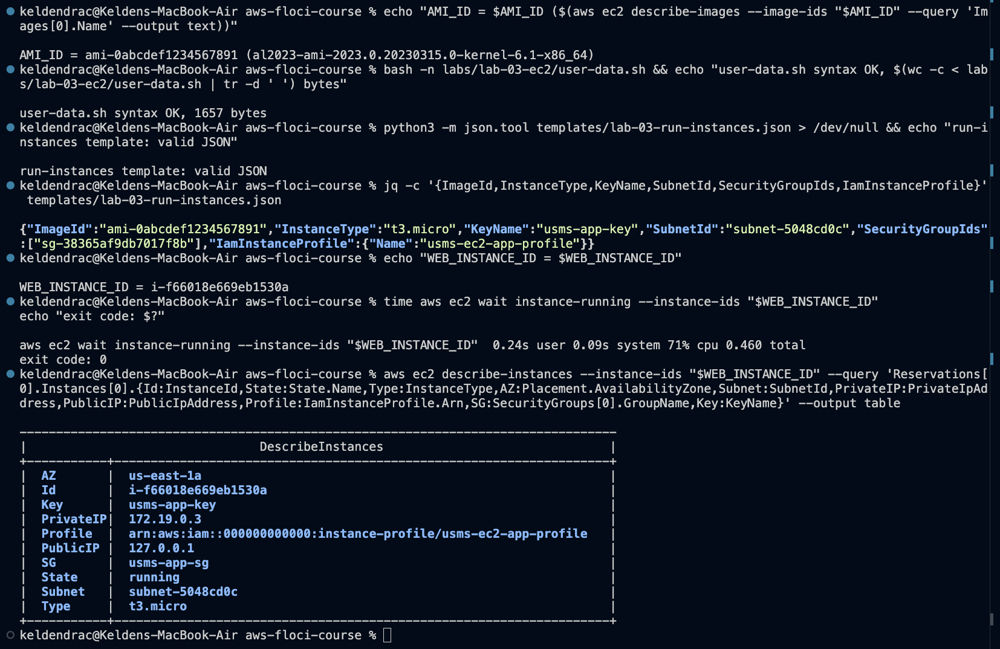

The waiter returned in 0.46 s with exit code 0. On real AWS
`instance-running` takes 30-60 s, and a script that relies on Floci's speed
has a race condition in it. The table confirms what the step asks for: `State
running`, `Subnet subnet-5048cd0c` (= `$USMS_PUBLIC_SUBNET_A`), `SG
usms-app-sg` (not `default`), `Key usms-app-key` and a non-null instance
profile ARN.

Two fields do not match the lab text, and both are Floci's doing. `PrivateIP`
is `172.19.0.3`, not an address inside `10.0.1.0/24`, because Floci runs the
instance as a container on its Docker network and reports that address.
`PublicIP` is `127.0.0.1`, the loopback address Floci gives every instance
(Section 7). The *configuration* that produces a real public address on AWS,
`MapPublicIpOnLaunch=True` on the subnet, was verified in Lab 2.

### 3.3 Checkpoint 3 - the permission chain and the user data

**Step 11** follows the chain one link at a time, each link read from the
API: instance -> `usms-ec2-app-profile` -> `usms-ec2-app-role` ->
`USMSStudentDataReadWrite` (v1). The policy body was saved to
`outputs/lab-03-instance-policy.json` and printed one statement per line. It
allows `s3:ListBucket` and `s3:GetBucketLocation` on
`arn:aws:s3:::usms-student-data`, allows `s3:GetObject`, `s3:PutObject` and
`s3:DeleteObject` on `arn:aws:s3:::usms-student-data/*`, and explicitly
denies `s3:DeleteBucket`. That bucket does not exist yet. The policy is
nonetheless valid, because IAM policies are statements about ARNs, not
references to existing objects (`notes/lab-03-notes.md`, question 2).

**Step 12 needed a different proof than the lab text gives.** On this build,
`describe-instance-attribute --attribute userData` returns no `UserData`
field at all, so the CLI prints `None` and the decode-and-diff the lab
prescribes compares the script with the four characters `None`. The first
attempt failed exactly that way and was discarded. But Floci *does* hand the
script to the instance: it copies it into the instance container as
`/tmp/user-data.sh` and runs it. So the proof was made on the instance
itself, which is stronger than an API echo.

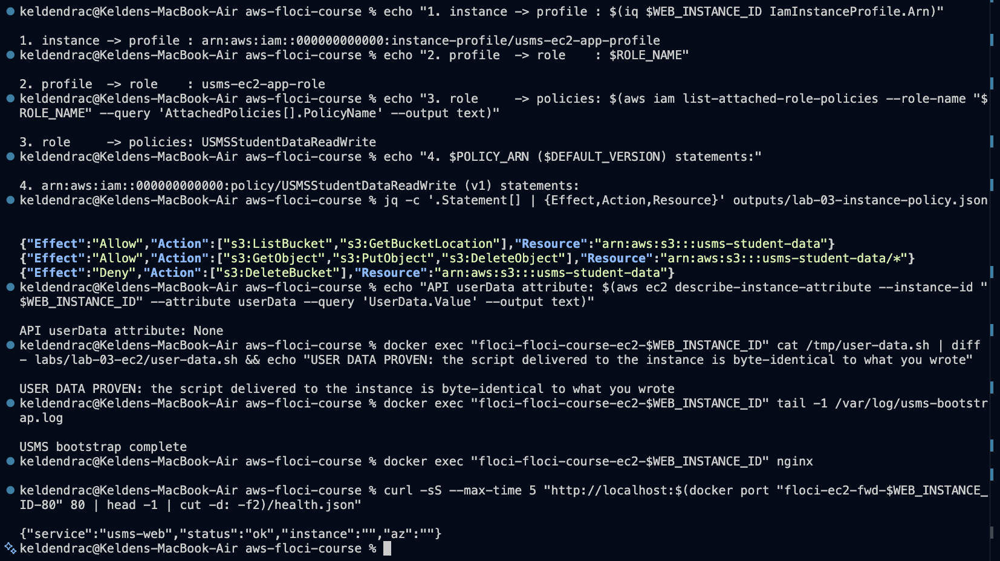

- `diff` between the script on the instance and `labs/lab-03-ec2/user-data.sh`
  printed nothing. **USER DATA PROVEN.**
- `/var/log/usms-bootstrap.log` ends `USMS bootstrap complete`. The script
  *ran*: `dnf` installed nginx, and `index.html` and `health.json` were
  written.
- `systemctl enable --now nginx` failed inside the container ("System has not
  been booted with systemd"), so nginx was started by hand with `docker exec`.
  `curl` through the host port Floci publishes for the instance's port 80
  then returned the bootstrap's own `health.json`. That is a real HTTP
  response from the instance, which the lab text did not expect to be
  possible on Floci.
- `instance` and `az` in that JSON are empty because Floci failed to install
  its IMDS proxy in the container ("Could not install IMDS proxy dependencies
  ... aarch64"). This is the lab's own Step 11 limitation note made concrete:
  without IMDS, the `meta` function gets nothing. On real AWS the same script
  would fill in both fields.

`verify-lab-03.sh` was changed to check the same thing (Section 3.10).

### 3.4 Elastic IP and Checkpoint 4 - reachability

**Step 13.** `usms-web-eip` was allocated (`eipalloc-fd4200366485f54e6`) and
associated (`eipassoc-efe924b80598eb31d`) - two IDs for two different things,
the address and the relationship. Address: `54.178.180.91`.

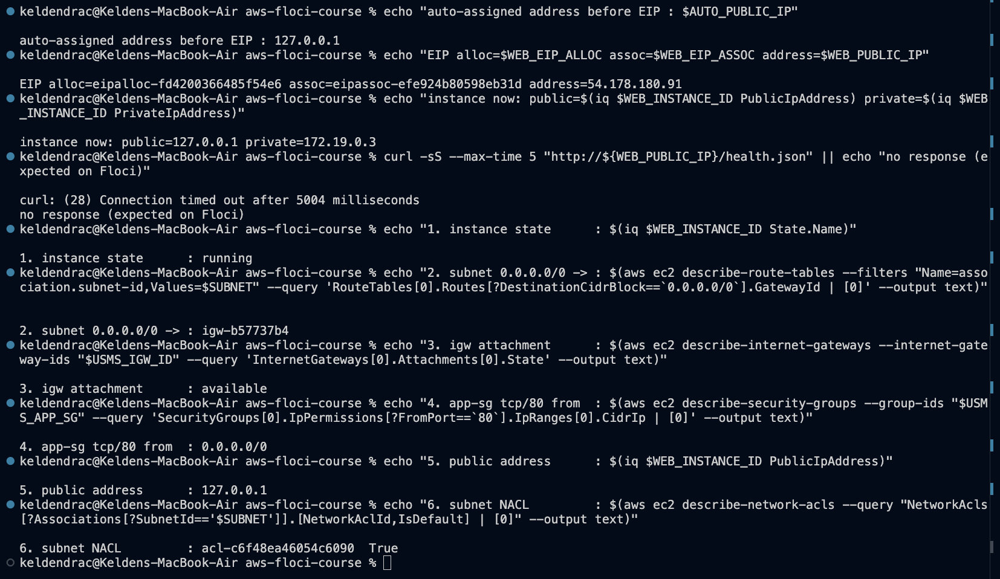

On real AWS, associating an EIP releases the auto-assigned address, and the
instance's `PublicIpAddress` becomes the EIP. Floci records the association
correctly (`describe-addresses` names `usms-web-01`; see also screenshot 06),
but it never updates the instance's own `PublicIpAddress` field, which stays
`127.0.0.1`. That is a limitation in how Floci reflects the association, not
a sign the association failed.

**Step 14.** `curl` to the EIP timed out, as it was expected to. Nothing
routes to a Floci EIP. The fallback then checked six links, and none came
back `None`:

| Link | Result |
|---|---|
| 1 instance running | `running` |
| 2 subnet's `0.0.0.0/0` target | `igw-b57737b4` |
| 3 internet gateway attached | `available` |
| 4 `usms-app-sg` admits tcp/80 from | `0.0.0.0/0` |
| 5 public address | `127.0.0.1` (Floci's placeholder; the EIP is `54.178.180.91`) |
| 6 NACL on the subnet | `acl-c6f48ea46054c6090`, default `True` (allow all) |

The NACL lookup filters `Associations[].SubnetId` client-side in JMESPath
rather than with `--filters`, because Lab 2 found Floci ignores some
server-side NACL filters.

The seventh link, a process listening on port 80, was the one the lab said
Floci cannot give. On this build it partly can: Section 3.3 showed nginx
answering on the instance through Floci's local port-forward. It cannot be
reached at the EIP, because the EIP is not routable.

### 3.5 The data volume, and the AZ constraint

`usms-web-data-vol` was created as 8 GiB `gp3`, with its AZ **derived from
the instance** (`us-east-1a`) rather than typed. Then the attach failed:

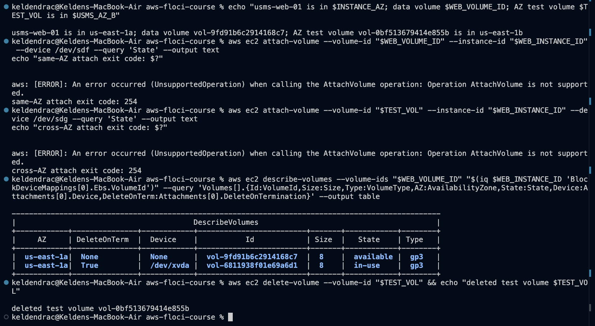

**Floci 1.5.34 has no `AttachVolume`.** Both the real attach and the Step 15
"Your turn" cross-AZ attempt (`us-east-1b` volume to a `us-east-1a`
instance) return `UnsupportedOperation`. The first time, the
`volume-in-use` waiter that followed would have polled for ten minutes and
was interrupted. A launch-time alternative was also tested: a second
`--block-device-mappings` entry with `DeleteOnTermination=false`, on a
throwaway untagged instance (`i-da66773801fefca61`, terminated afterwards).
Floci ignored it and created only the root volume. So:

- The data volume exists, in the correct AZ, but cannot be attached.
  `verify-lab-03.sh`'s "attached" and "DeleteOnTermination is False" checks
  fail for that reason alone. The guide names the second as a known benign
  failure.
- The table still shows the property the step teaches. The root volume
  `vol-6811938f01e69a6d1` is attached at `/dev/xvda` with `DeleteOnTerm True`
  and would be destroyed at terminate. The data volume is a separate resource
  with its own lifecycle. Exercise 4 later observed Floci honour `True`: the
  terminated admin host's root volume was gone, leaving no orphan.
- **AZ constraint, stated for real AWS:** attaching the `us-east-1b` volume
  to the `us-east-1a` instance fails with `InvalidVolume.ZoneMismatch`. A
  volume lives in one AZ's storage, and moving data across AZs means a
  snapshot (regional) restored into the other AZ. The test volume was then
  deleted.

### 3.6 Checkpoint 5 - two tiers

`usms-db-01` was launched with the long-form command line (no
`--cli-input-json`), into `usms-private-subnet-a`, with `usms-db-sg` and
**no `--iam-instance-profile`**. The data tier has no reason to call S3.

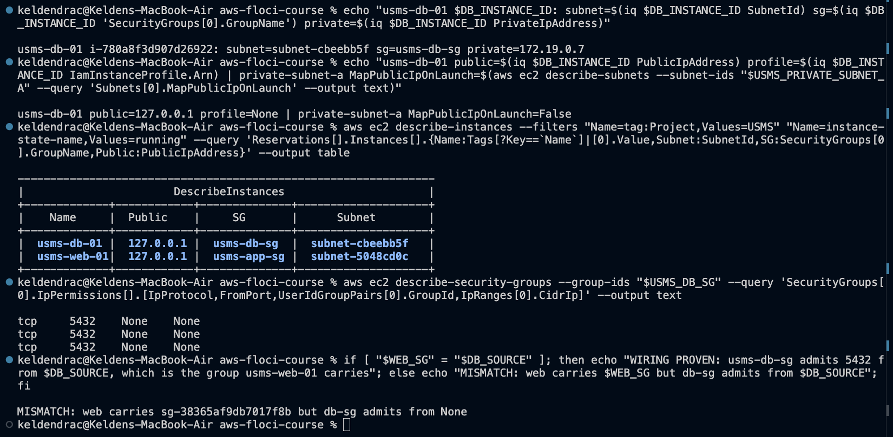

- Subnet `subnet-cbeebb5f` = `$USMS_PRIVATE_SUBNET_A`. SG `usms-db-sg`.
  Profile `None`, on purpose.
- `MapPublicIpOnLaunch=False` on the subnet. On real AWS this is why the
  instance has no public address. Floci shows `127.0.0.1` anyway, the same
  placeholder every instance gets. This is the first of the two benign
  failures the guide predicts for `verify-lab-03.sh`. The subnet attribute,
  which is the configuration that matters, is correct.
- **`WIRING PROVEN` could not be shown; `MISMATCH ... admits from None` was
  shown instead.** This is Lab 2's three-times-confirmed limitation: Floci
  accepts a `UserIdGroupPairs` rule and never stores the group reference. The
  three `tcp 5432 None None` rows are Lab 2's original rule and its two
  retries, each stored without a source. The intended rule, 5432 from
  `usms-app-sg` by group ID, is in `policies/usms-db-sg-ingress.json` and was
  correct when submitted.
- The private route table (screenshot 08, top) completes the checkpoint:
  `10.0.0.0/16 local`, `0.0.0.0/0 -> nat-dc59b1563c5597c36`, and no internet
  gateway route. Outbound only. That routing asymmetry makes `usms-db-01`
  unreachable from the internet independently of any security group.

**A real build mistake here, not a Floci one.** The first `instance-running`
wait for `usms-db-01` was interrupted (Floci takes about 27 s to boot an
instance container, and the waiter polls every 15 s), and the launch block
was then run again. That created a duplicate `usms-db-01`. The duplicate
(`i-25384e4e31341c673`) was terminated, keeping the one held in
`$DB_INSTANCE_ID`, and this screenshot was retaken. It remains visible as
`terminated` in screenshot 08b's audit.

### 3.7 Stop and start

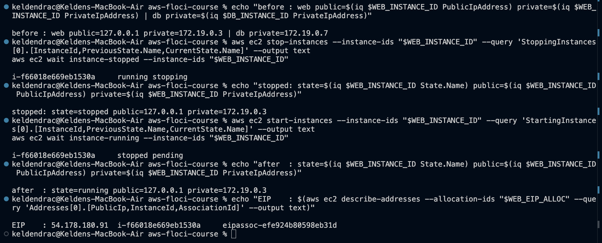

What was observed:

1. **The private address never changed** (`172.19.0.3` before, while stopped
   and after).
2. **The Elastic IP association survived the stop**: same address, same
   instance, same association ID `eipassoc-efe924b80598eb31d`.
3. **The public-address field did *not* clear while stopped.** It read
   `127.0.0.1` throughout. This is the "build-dependent" Floci behaviour the
   lab warns about. On real AWS a stopped instance has no public address at
   all. On start, an instance relying on an auto-assigned address gets a
   *different* one, and every DNS record pointing at the old address breaks.
   The EIP is the fix for exactly that.

The first attempt at this step went wrong, and it is worth recording.
`start-instances` was sent while the instance was still `stopping`. Floci's
container start failed (`Error starting EC2 container ... Status 304`), the
instance settled in `stopped`, and the `instance-running` waiter could never
succeed. The waiter exists to prevent this ordering mistake. The step was
redone with the stop waiter allowed to finish first.

### 3.8 Checkpoint 6 - persistence

Before the restart, `usms-web-02` was launched (Step 18 "Your turn") from a
copy of the template that differs by exactly three fields: the subnet and two
`Name` values. That is the argument for `--cli-input-json`, because the diff
between two launches is small and reviewable.

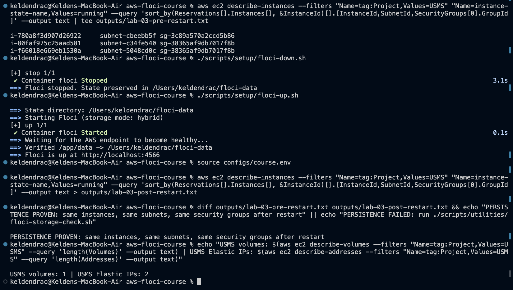

Every lookup after the restart was **by tag**, never by `$WEB_INSTANCE_ID`.
Reusing the variable would only prove that the shell remembers a string.
Instance IDs, subnets and security groups were identical. The tagged-volume
count is **1**, not the lab's expected 3-4, because Floci ignores `volume`
entries in `run-instances --tag-specifications`, so root volumes carry no
`Project` tag. `create-tags` on a root volume stores the tag in Floci's tag
index (`describe-tags` shows it), but `describe-volumes` never displays it.
The EIP count is 2: `usms-nat-eip` and `usms-web-eip`.

**What the API did not show:** a Floci restart can kill instance containers
(`Exited (137)`) while the API continues to report them `running`. This was
discovered later, in Section 3.10, and fixed with an API stop/start.
"Persistence" on Floci means the control-plane records persist. The running
container behind each record is not guaranteed to.

### 3.9 Golden image and audit - Checkpoint 7

**Floci 1.5.34 has no `CreateImage`.** The call itself is part of the
evidence, at the top of screenshot 08. The golden image was therefore
**registered** with `register-image` as `usms-web-golden-20261004`
(`ami-902456dfbd32c64ab`, `available`). It is an image record with the right
name and description, not a capture of the configured instance. On real AWS,
`create-image --no-reboot` snapshots the root volume of the running instance,
so the next launch is a copy of nginx-installed, page-deployed state rather
than a rebuild. The trade-off of `--no-reboot` is a filesystem captured while
writes may be in flight. That is acceptable for static web content and not
for a database. Floci also dropped the image's tags (`Project` reads `None`),
so `write-lab-03-env.sh` finds the image by name prefix instead of by tag.

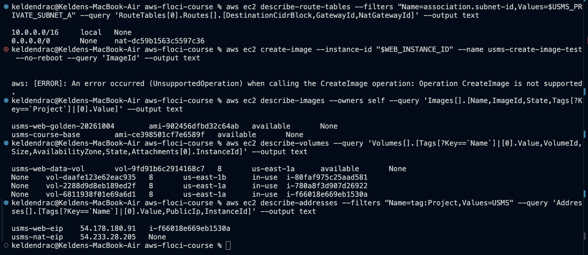

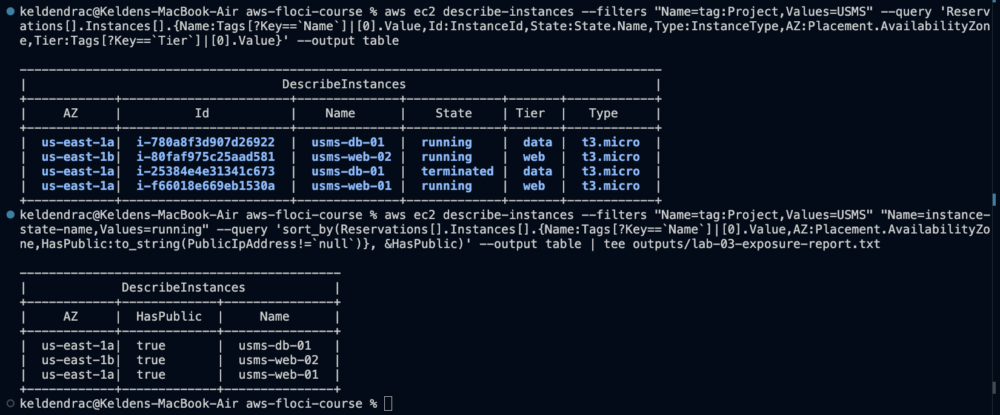

The **Step 21 "Your turn" exposure report** sorts instances by whether they
have a public address, mapping the nullable `PublicIpAddress` to an orderable
string with `to_string(PublicIpAddress != \`null\`)` so `"false"` sorts
before `"true"`. On real AWS, `usms-db-01` would appear first as `false`. On
Floci every row is `true`, because every instance has `127.0.0.1`. The query
is correct, and Floci's data defeats it.

### 3.10 Verification

`verify-lab-03.sh` is the lab's script with one deliberate change. The check
"usms-web-01 has user data stored" tested only that the API returned
*something* (`test -n`), and the literal string `None` passes that test, so
the check would always pass on Floci while proving nothing. It was replaced
with "usms-web-01 user data reached the instance byte-identical", which diffs
`/tmp/user-data.sh` inside the instance container against the repository
file. The check count is still 36.


| Failing check | Cause | Real AWS |
|---|---|---|
| data volume is attached to `usms-web-01` | `AttachVolume` unsupported (3.5) | Attaches; `in-use` |
| data volume `DeleteOnTermination` is `False` | No attachment, so nothing to read; the guide lists this as a known benign failure | `False` for a separately attached volume |
| `usms-db-01` has NO public address | Every Floci instance gets `127.0.0.1`; the subnet attribute is correctly `False` (3.6). The guide lists this one too | No public address |

The first run of this screenshot read `FAIL=4`. The extra failure was the
user-data check, and the cause was not the check. `usms-web-01`'s container
had been dead since the failed start in 3.7, while the API still said
`running`. An API stop/start brought it back, and the screenshot was retaken.

### 3.11 Recording state and committing - Checkpoint 8

`configs/lab-03.env` is generated by `scripts/utilities/write-lab-03-env.sh`.
That is the lab's Step 22 heredoc moved into a script, so every value comes
from a lookup at write time. The base AMI is passed in as an argument because
it cannot be looked up by tag. The instance lookups filter
`instance-state-name=running,stopped`, which matters here: Floci keeps
terminated instances visible, including the duplicate `usms-db-01`.

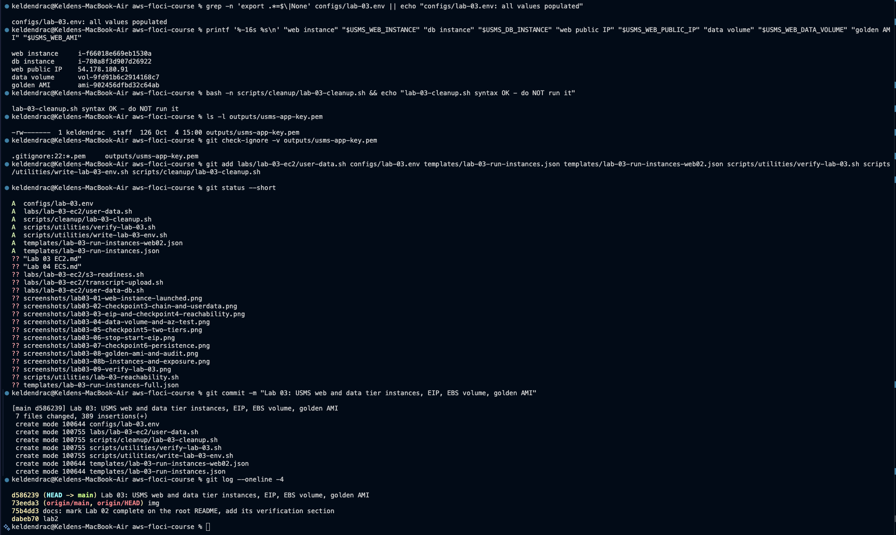

- `git check-ignore -v` names `.gitignore:22:*.pem`. Git reports the *last*
  matching rule, and the key is also covered by `outputs/*` on line 7, so it
  is ignored twice over. `git ls-files outputs/` lists only `.gitkeep`, which
  proves the directory pattern is `outputs/*` rather than `outputs/`.
- Seven files were staged by name. Nothing under `outputs/` was staged, and
  neither was `templates/lab-03-run-instances-full.json`.
- `scripts/cleanup/lab-03-cleanup.sh` passes `bash -n` and has not been run.
  It was later adjusted to delete the key pair by ID, because Floci ignores a
  delete by name (3.1).

---

## 4. Exercises 1-5

Full commands, output and the Exercise 4 analysis are in
[`exercises.md`](exercises.md).

| # | Deliverable | Result |
|---|---|---|
| 1 | Maintenance instance | `usms-admin-01-host` `i-c5c064c4786abc867`, `t3.micro`, `us-east-1b`, `usms-app-sg`, no profile, `Ephemeral=true`; long-form command, waiter; not in `lab-03.env` |
| 2 | Self-describing, idempotent DB bootstrap | `user-data-db.sh` (1278 bytes, `bash -n` clean, marker-guarded); `usms-db-02` `i-16073b1702bcb7feb` in `usms-private-subnet-b`; delivered byte-identical |
| 3 | `lab-03-reachability.sh` | Verdict computed from route table + public address + SG rules; identical output from `~` and from `labs/lab-03-ec2/` |
| 4 | Right-size and clean up | Scale-up vs scale-out with cited prices; CPU-credit analysis; admin host terminated with danger admonitions; no orphans; verify unchanged |
| 5 | S3 hand-off for Lab 4 | `transcript-upload.sh` (no credentials, validates args, exit 2); `outputs/lab-03-s3-readiness.txt` with the `head-bucket` 404 captured |

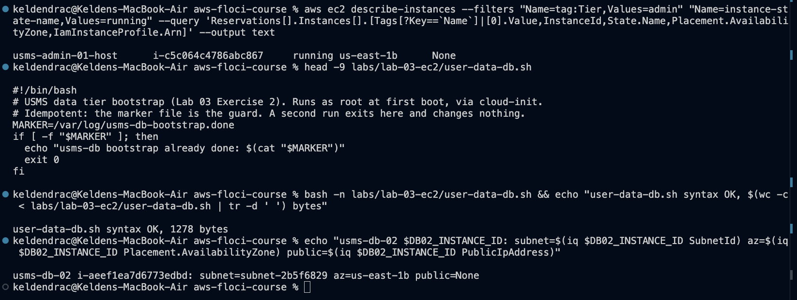

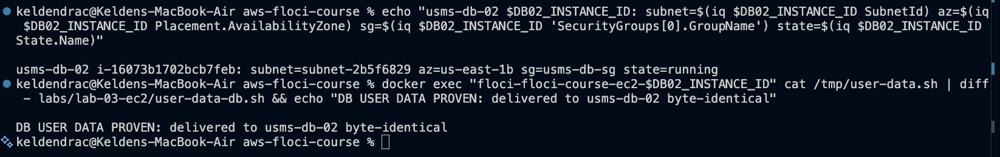

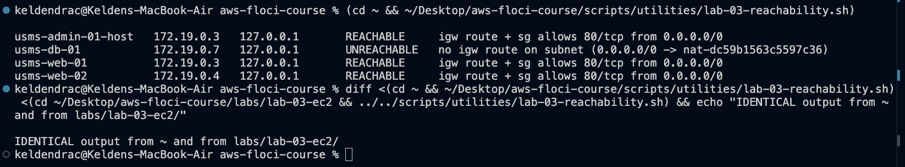

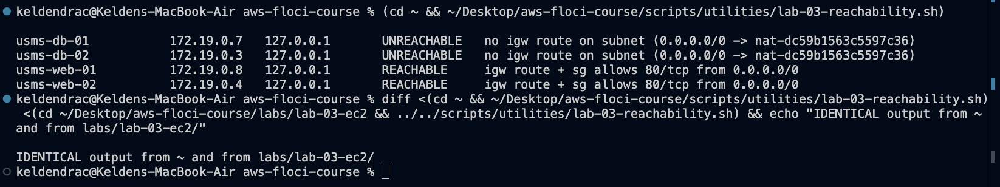

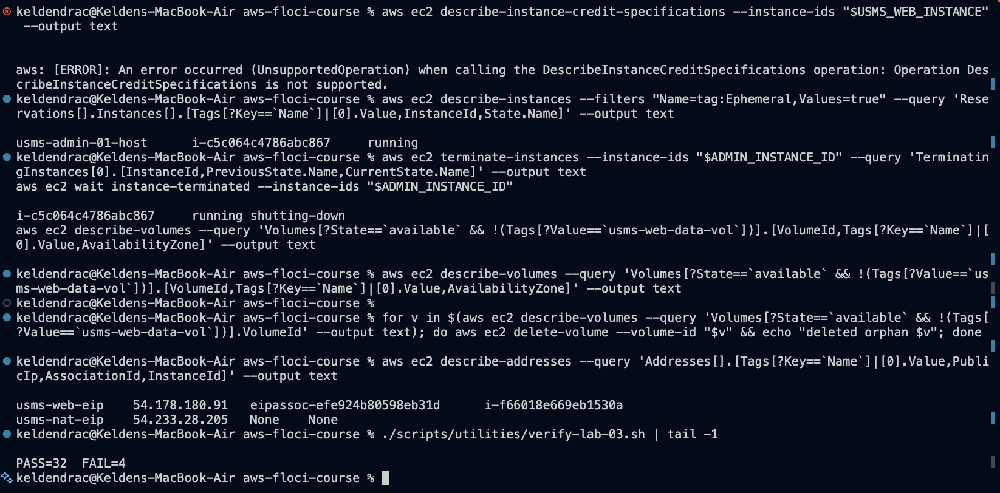

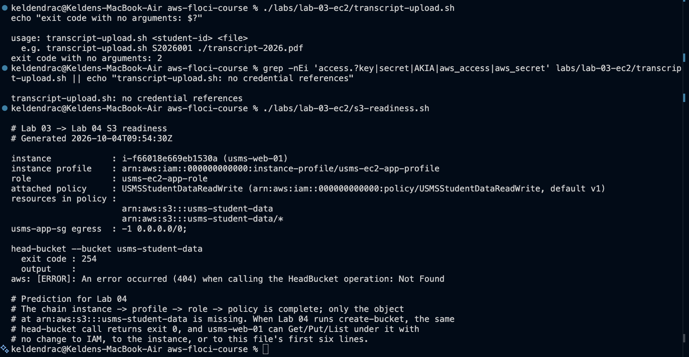

Three findings from the exercises are worth raising here rather than leaving
in the appendix.

**Floci's SSH-port allocator breaks after an emulator restart.** The first
`usms-db-02` launch (screenshot 11, `public=None`) was marked `terminated`
within a second. The Floci log shows `Bind for 0.0.0.0:2201 failed: port is
already allocated`. Each instance container publishes an SSH port from
2200 upwards, and after a restart Floci forgets which ports its running
containers already hold. Two more attempts collided on 2200. The fix was
configuration, not a retry: `FLOCI_SERVICES_EC2_SSH_PORT_RANGE_START=2210`
in `docker-compose.yml`. The next launch took port 2210 and succeeded.

**Exercise 2's bootstrap failed in exactly the way it was designed to.**
PostgreSQL installed, then `postgresql-setup --initdb` needed systemd, which
the container does not have. `set -e` stopped the script, and the marker,
written *last*, was never created. On real AWS the next boot would therefore
not skip a half-finished setup. A marker written first would have made this
partial install look complete.

**The failed `usms-db-02` record shows the addresses Floci *would* have
given it.** That record never got a container, and it reads private
`10.0.4.10` (inside `usms-private-subnet-b`'s `10.0.4.0/24`) with no public
address. Those are exactly the values real AWS would assign. Every instance
that did get a container shows a Docker address and `127.0.0.1` instead. So
Floci computes subnet-correct addressing and then overwrites it with the
container's. That explains why all three address-based results in this lab
look wrong on Floci: Step 16's `Public None`, the exposure report's ordering,
and verify's db-01 check. Exercise 3's verdicts are unaffected. They come
from route tables and security-group rules, and both of those are stored
faithfully, so the script classifies the admin host and both web servers
`REACHABLE` and both data-tier instances `UNREACHABLE` (via NAT), which is
what real AWS would give.

---

## 5. Review questions

Answered in full in [`../../notes/lab-03-notes.md`](../../notes/lab-03-notes.md).
Summarised:

1. **Five inputs to one `run-instances`.** A nonexistent subnet, security
   group, profile or key fails immediately with a named error. The silent
   failures are the *valid-but-wrong* or *omitted* ones: a private subnet
   leaves the instance unreachable with no error, an omitted SG means the
   `default` group, an omitted profile surfaces only in Lab 4 as
   `NoCredentialsError`, an omitted key means no SSH ever, and a broken
   script fails quietly at boot.
2. **A policy for a bucket that does not exist** is valid. IAM matches ARNs,
   not objects. Today it grants nothing usable. The moment `create-bucket`
   runs, it takes effect with no change to IAM or the instance.
3. **"Restart redeploys it" does not work.** User data runs once per
   instance. What does work is baking a new AMI and replacing instances, or
   having a boot-time service or deployment agent (systemd unit, SSM,
   CodeDeploy) pull the release.
4. **Auto-assigned vs Elastic IP** compared on ownership, change, cost and
   stop behaviour. The failover procedure is to move the EIP to a standby
   with `associate-address --allow-reassociation`.
5. **Volume vs snapshot.** Volumes are zonal and snapshots are regional (S3).
   Surviving an AZ loss needs data that already exists outside the AZ:
   scheduled snapshots, or replication.
6. **Are six configuration checks a substitute?** As preconditions, yes. As
   proof of reachability, no. They cannot detect host-level faults, and this
   lab hit exactly one: nginx installed but not running because `systemctl`
   failed.
7. **Every difference between `usms-web-01` and `usms-db-01`**, each assigned
   to instance, subnet or VPC.

---

## 6. Problems encountered

Fifteen issues came up. Full write-ups are in [`README.md`](README.md). These
three carry the most transferable lessons:

**A command that "succeeds" against a missing feature can hang a script.**
`attach-volume` returned `UnsupportedOperation`. The `volume-in-use` waiter on
the next line then polled for its full ten minutes, because the state it was
waiting for could never come. The same happened with `create-image` followed
by `image-available`, where the waiter got an empty image ID. A waiter
checks a condition; it does not check that the action before it worked.
Pairing an action with its wait in one block is only safe when the action's
failure stops the block, for example with `&&`.

**The API's state and the machine's state can disagree.** After the botched
start (3.7), and again after each Floci restart, the API reported instances
`running` whose containers had exited with code 137. Nothing in
`describe-instances` showed it. The user-data verify check caught it, because
it reads from the instance rather than from the API, which is the argument
for verifying on the machine where possible. An API stop/start
re-synchronised them. It also changed `usms-web-01`'s private address from
`172.19.0.3` to `172.19.0.8`, which a real stop/start never does.

**Interrupting a launch-and-wait and running it again creates a second
instance.** `run-instances` had already returned when the wait was
interrupted, so re-running the block launched a duplicate `usms-db-01`.
Launches are not idempotent unless you make them so. The real-AWS mechanism
for that is `--client-token`. Recovery here was a lookup by name, terminating
the instance not held in `$DB_INSTANCE_ID`, and retaking the screenshot.

---

## 7. Floci limitations versus real AWS

The lab's Section 12 predicts that Floci models the EC2 API but boots no
operating system. On 1.5.34 the first half is weaker than predicted and the
second half is stronger.

| Behaviour | Floci 1.5.34 (observed) | Real AWS |
|---|---|---|
| Instances | Each instance is a real `amazonlinux:2023` Docker container; user data copied to `/tmp/user-data.sh` and executed | Real VM; cloud-init runs user data as root at first boot |
| `systemd` inside the instance | Absent; `systemctl` fails, so services must be started by hand | Present; `systemctl enable --now` works |
| IMDS | Proxy failed to install on this ARM host; instance metadata empty | IMDSv1/v2 at `169.254.169.254` |
| `describe-instance-attribute --attribute userData` | No `UserData` returned (`None`) | Base64 user data returned |
| Private IP | Docker network address (`172.19.0.x`), not from the subnet CIDR; changes when the container is recreated | From the subnet CIDR; fixed for the instance's life |
| Public IP | `127.0.0.1` on every instance, including in subnets with `MapPublicIpOnLaunch=False`; not cleared on stop; not replaced by an associated EIP | Only if the subnet or launch assigns one; released on stop; replaced by an EIP |
| Elastic IP | Allocate/associate/describe correct; not routable; `usms-nat-eip` shows no association | Routable; association visible |
| `AttachVolume` | `UnsupportedOperation` | Supported; `ZoneMismatch` across AZs |
| Extra `--block-device-mappings` at launch | Ignored; only the root volume is created | Each mapping creates and attaches a volume |
| `volume` tag specifications on `run-instances` | Ignored; root volumes untagged; `create-tags` stored but not shown by `describe-volumes` | Applied |
| `DeleteOnTermination=True` on root | Honoured (root volume deleted at terminate) | Honoured |
| `CreateImage` | `UnsupportedOperation`; `register-image` works | Snapshots the root volume |
| `DeregisterImage` | `UnsupportedOperation` | Supported |
| Image tags on `register-image` | Dropped | Applied |
| `delete-key-pair --key-name` | Returns `true`, key kept; `--key-pair-id` works | Either works |
| Key pair | 126-byte dummy key, zero fingerprint, `KeyType None`, tags dropped | Real RSA/ED25519 key and fingerprint |
| `DescribeInstanceCreditSpecifications` | `UnsupportedOperation` | Returns `standard`/`unlimited` |
| SSM public AMI parameters | `ParameterNotFound` | Always present |
| Instance start latency | About 27 s to boot the container; waiters return in 30-45 s | 30-60 s to `running`, more to `status-ok` |
| Start while `stopping` | Container start fails (`Status 304`); instance stuck `stopped` | Rejected with `IncorrectInstanceState` |
| Emulator restart | Some instance containers killed (exit 137) while API says `running`; SSH port allocator forgets held ports | Not applicable |
| Security group group references | Accepted, never stored (Lab 2) | Stored and enforced |

**Observed versus reasoned about.** *Observed in this lab:* instances created
in specific subnets with specific SGs; the profile association and its chain
to a named policy; user data delivered byte-identical and executed (nginx
installed, pages written, one page served through a local port-forward); root
`DeleteOnTermination True` honoured at terminate; the Elastic IP association
surviving stop/start; control-plane persistence across a restart. *Reasoned
about, not observed:* the EIP being reachable from the internet; IMDS
credentials reaching the instance; a security group permitting or refusing a
packet; the auto-assigned address being released on stop; the AZ mismatch
error; a real snapshot-backed AMI; any cost.

---

## 8. Section 14 - Lab Assessment Checklist

### Lab 02 - VPC

- [x] `verify-lab-02.sh` reports `FAIL=0` *(reports `PASS=32 FAIL=1`, the single documented Lab 2 group-reference limitation, unchanged)*
- [x] `configs/lab-02.env` committed, no empty values, no `None`
- [x] Four subnets across two Availability Zones (five across three, with Lab 2 Exercise 1)
- [x] `usms-private-rt` has no route to any internet gateway - `08` (`0.0.0.0/0 -> nat-...`)

### Lab 03 - EC2

- [x] `verify-lab-03.sh` reports `FAIL=0` *(reports `PASS=33 FAIL=3`; all three are Floci limitations, two of them named by the lab itself as known benign failures - Section 3.10)* - `09`
- [x] `usms-web-01` running in `usms-public-subnet-a` with `usms-app-sg` and `usms-ec2-app-profile` - `01`, `09`
- [x] `usms-db-01` running in `usms-private-subnet-a` with `usms-db-sg`, no public address, no profile - `05` *(no profile confirmed; the subnet's `MapPublicIpOnLaunch=False` confirmed; Floci shows `127.0.0.1` on every instance regardless)*
- [x] Step 12's `USER DATA PROVEN` line captured - `02` *(proven on the instance itself, because Floci does not return the `userData` attribute)*
- [x] Step 19's `PERSISTENCE PROVEN` line captured - `07`
- [x] `usms-web-data-vol` attached, with `DeleteOnTermination` `False` *(volume created in the correct AZ - `04`, `08`; Floci has no `AttachVolume`, and a launch-time mapping was also tried and ignored - Section 3.5)*
- [x] `usms-web-golden` AMI exists - `08` *(registered; Floci has no `CreateImage`)*
- [x] `outputs/usms-app-key.pem` is `chmod 600` and `git check-ignore -v` names the rule - `10`

### Written work

- [x] `notes/lab-03-notes.md` answers all seven review questions in prose
- [x] `labs/lab-03-ec2/exercises.md` contains all five exercises
- [x] Every Floci limitation hit is recorded with what real AWS would have done - Section 7, `README.md`
- [x] Screenshots for Checkpoints 3, 5 and 6 - `02`; `05` + `08`; `07`

**Every box is satisfied.** Four carry the qualification stated inline. In
each case the command, configuration and intent are correct and evidenced,
and the shortfall is an operation the emulator does not implement, not a gap
in what was built.

---

## 9. Reproducing this lab

```bash
cd ~/Desktop/aws-floci-course
source configs/course.env
./scripts/setup/floci-up.sh
source configs/lab-01.env
source configs/lab-02.env
source configs/lab-03.env
./scripts/utilities/verify-lab-03.sh
```

Expected: `PASS=33  FAIL=3`. If the user-data check also fails, an emulator
restart has killed `usms-web-01`'s container (Section 6). Recover with an API
stop/start, waiting for `instance-stopped` before starting.
