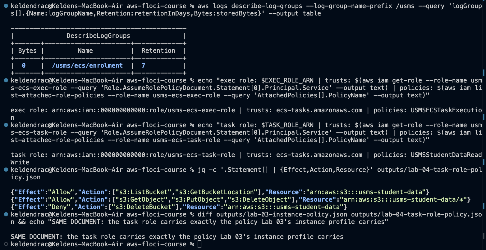
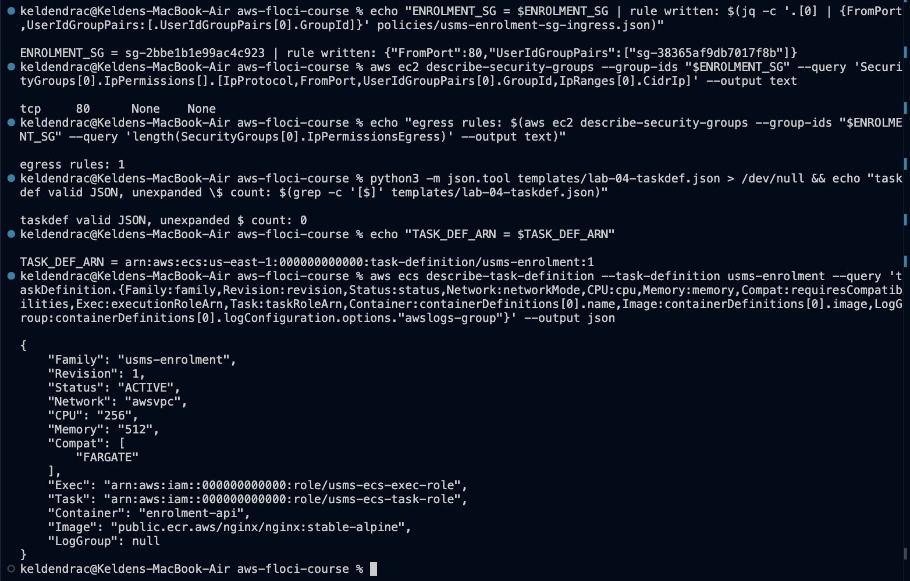
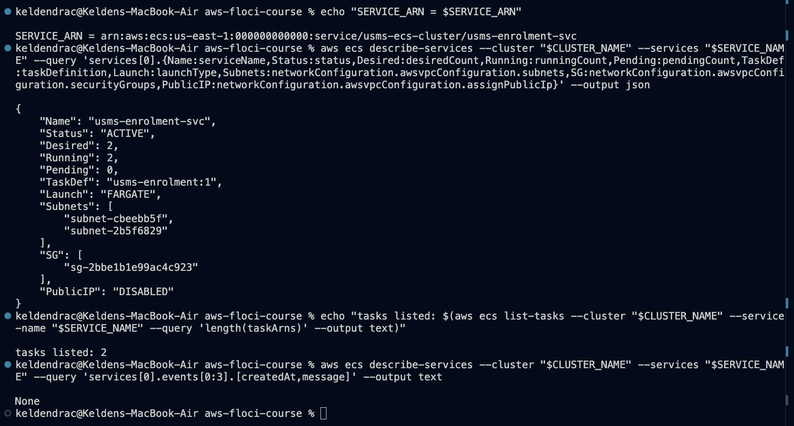

# Lab 04 - Amazon ECS - completed

Full write-up: [lab-04-report.md](lab-04-report.md) - exercises: [exercises.md](exercises.md) - review questions: [../../notes/lab-04-notes.md](../../notes/lab-04-notes.md)

**Support path: B - ECS only** (Application Auto Scaling is not implemented on this Floci build).

## What exists after this lab

- Cluster `usms-ecs-cluster` (`ACTIVE`, tagged `Project=USMS`)
- Log group `/usms/ecs/enrolment`, 7-day retention
- `usms-ecs-exec-role` + customer managed policy `USMSECSTaskExecution`
  (ECR pull, log writes to the one log group only)
- `usms-ecs-task-role` + Lab 1's `USMSStudentDataReadWrite`, unchanged and
  byte-identical to what Lab 3's instance profile carries
- Security group `usms-enrolment-sg` (`sg-2bbe1b1e99ac4c923`): tcp/80 from
  `usms-app-sg` as written, nothing from `0.0.0.0/0`
- Task definition family `usms-enrolment`: `:1` (256/512) and `:2` (256/1024,
  `USMS_LOG_LEVEL=info`, Exercise 2), both `ACTIVE`
- Service `usms-enrolment-svc`: desired 2, running 2, both private subnets,
  `assignPublicIp DISABLED`, pointing at `:2`
- `configs/lab-04.env` (17 exports), `scripts/utilities/verify-lab-04.sh`,
  `scripts/utilities/write-lab-04-env.sh`,
  `scripts/utilities/lab-04-ecs-inventory.sh` (Exercise 3),
  `labs/lab-04-ecs/lab03-linkage.sh` (Exercise 5),
  `scripts/cleanup/lab-04-cleanup.sh` (never run)
- `policies/trust-ecs-tasks.json`, `policies/usms-ecs-task-execution-policy.json`,
  `policies/usms-enrolment-sg-ingress.json`, `templates/lab-04-taskdef.json`,
  `templates/lab-04-taskdef-v2.json`

## Reproduce

    cd ~/Desktop/aws-floci-course
    source configs/course.env
    ./scripts/setup/floci-up.sh
    source configs/lab-01.env
    source configs/lab-02.env
    source configs/lab-03.env
    source configs/lab-04.env
    ./scripts/utilities/verify-lab-04.sh

Expected: `PASS=37  FAIL=1`. The one failure is the security group's group
reference, which Floci does not store (problem 9 below).

## Evidence

The three checkpoint screenshots Section 14 requires, plus the verification
result.

### 1. Checkpoint 2 - log group and both ECS roles

### 2. Checkpoint 3 - the task definition

### 3. Checkpoint 4 - the service

### 4. verify-lab-04.sh

All 11 screenshots are displayed in context in
[lab-04-report.md](lab-04-report.md).

## Problems I hit and how I fixed them

### 1. The guide builds two ARNs that come out doubled

Step 4's `arn:aws:iam::${ACCOUNT_ID}:role/${USMS_ROLE_DEVELOPER}` and Step 7's
`arn:aws:iam::${ACCOUNT_ID}:policy/${USMS_POLICY_S3_RW}` both wrap a variable
that `configs/lab-01.env` already stores as a full ARN. The result is
`arn:aws:iam::000000000000:role/arn:aws:iam::...`. Fixed by using the
variables directly.

### 2. The guide's Step 3 probe misreads both kinds of answer

The guide's `probe` treats any non-zero exit as "not available".
`describe-services --cluster probe` exits non-zero with
`ClusterNotFoundException`, which means ECS *answered*. An unimplemented API
also exits non-zero, with `UnknownOperationException`. The probe used here
classifies by error text instead.

### 3. Application Auto Scaling is not implemented (Path B)

All three `application-autoscaling` reads return `UnknownOperationException:
AnyScaleFrontendService...`. This doesn't affect Lab 04, but Lab 06 must take
its Path B fallback.

### 4. Three command blocks were skipped in the first pass

The task-role `attach-role-policy`, the task-definition `jq`, and the
`create-service` were each missed. The next commands still ran and printed
something that looked like output:
- an empty `policies:` field
- a `ClientException`
- a `null` service

The missing service cascaded through six screenshots, a commit, and a verify
run reading `PASS=31 FAIL=7`. The Floci log showed no `CreateService` call
for it at all. Each block was run, and the affected screenshots were retaken.

### 5. `lab-04.env` was first written with two `None` values

That was a direct consequence of problem 4: `USMS_ENROLMENT_SERVICE_ARN` and
`USMS_ECS_DESIRED_BASELINE` were `None` because the service did not exist,
and the first Lab 04 commit (`f48dc83`) contains that version. The file was
regenerated once the service existed (17 exports, no `None`, verified by
`verify-lab-04.sh`) and goes into the final Lab 04 commit. Writing the file by
lookup, as the guide insists, is what made the missing service visible.

### 6. `wait services-stable` crashes on this build

It fails immediately with `In function length(), invalid type for value:
None`, because Floci returns `deployments: null` and the waiter's JMESPath
calls `length()` on it. The guide's fallback is a `sleep` loop. This lab used
`aws ecs wait tasks-running --tasks $(aws ecs list-tasks ...)` instead, which
waits on task state that Floci does populate. Run it as its own block, a few
seconds after `create-service`: Floci's reconciler lists the tasks about 4 s
after creation.

### 7. Floci does not roll a deployment

After `update-service --task-definition usms-enrolment:2`, the service reports
`:2`, but both running tasks are still `:1`, and their containers lack
`USMS_LOG_LEVEL`. Real ECS replaces them in a rolling deployment. This also
means the Exercise 3 inventory, which reads the service's pointer, reports
`:2` for a fleet running `:1`. That blind spot is written up in
`exercises.md`.

### 8. Several things are accepted and not stored

| Accepted | What Floci did |
|---|---|
| `containerInsights=enabled` on the cluster | Not stored (`Settings: null`) |
| `logConfiguration` | Not stored, so no log streams, 0 bytes, and the `options."awslogs-group"` query reads `null` |
| Task-definition `tags` | Not stored |
| `--role-session-name` | Reports `floci-session` (as Lab 1 found) |

Cluster and service tags, and the 7-day retention, *were* stored.

### 9. The enrolment security group's group reference is not stored

The rule was written with `UserIdGroupPairs` naming `usms-app-sg` and is
stored as `tcp 80 None None`. This is the fourth confirmation of Lab 2's
limitation, on a fourth group, and it is verify's one failure. Exercise 5
therefore resolves the source group from the ingress document, and records
that it did.

### 10. `instance.group-id` filter is ignored

Exercise 5's server-side filter returned all four running instances. The
client-side check, comparing each instance's `SecurityGroups`, returned the
correct two (`usms-web-01`, `usms-web-02`).

### 11. No service events

`describe-services ... events` is always empty, so the Step 11 "Your turn"
evidence is the desired, running and pending counts rather than the service's
own event narration.

### 12. Running count lags desired by a reconcile cycle

Desired changes instantly, and Floci's reconciler acts about every 30 s. This
is not a bug; it is the service model the lab teaches. But a single wait
taken immediately after `update-service --desired-count 3` waited on the 2
tasks already listed, not on the 3rd that did not exist yet.

### 13. Task containers get static credentials

Floci injects `AWS_ACCESS_KEY_ID=test`, `AWS_SECRET_ACCESS_KEY=test` and
`AWS_ENDPOINT_URL=http://floci:4566` into every task container. Real Fargate
provides rotating task-role credentials through
`AWS_CONTAINER_CREDENTIALS_RELATIVE_URI`, and no key is ever placed in the
environment.

### 14. The guide's "no secret is tracked by git" check always fails

`! git ls-files | grep -q '^outputs/'` matches `outputs/.gitkeep`, which is
tracked deliberately. `verify-lab-04.sh` now fails only on a file under
`outputs/` other than `.gitkeep`.
