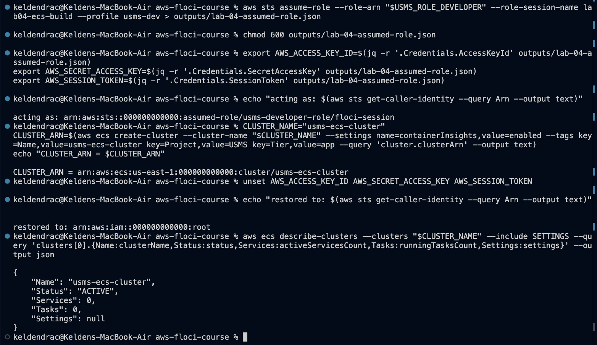
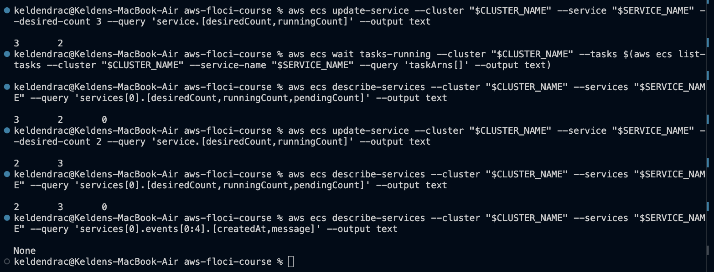
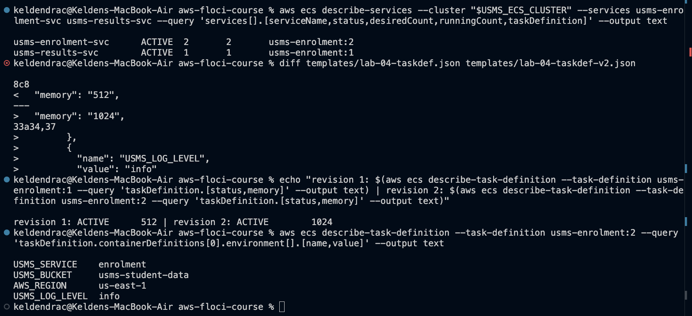
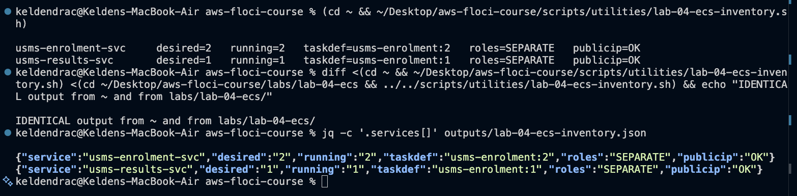
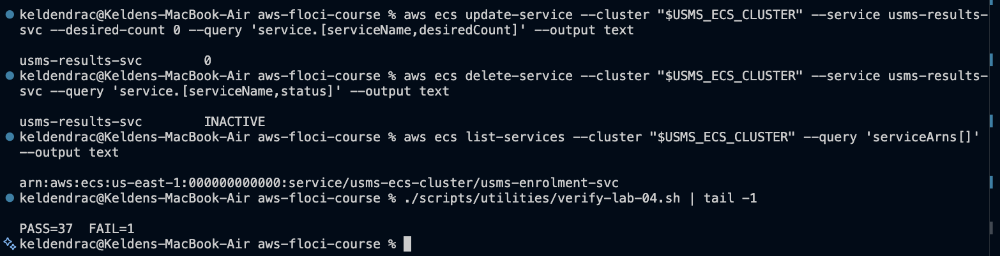
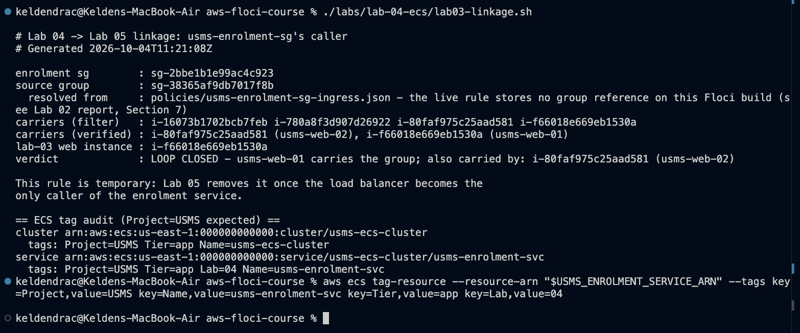

# Lab 04 - Amazon ECS

## 1. Summary

This lab moved the USMS enrolment service onto Amazon ECS on Fargate, inside
the private subnets Lab 2 built. It created five things:

- a cluster, created while holding Lab 1's `usms-developer-role`
- a log group with a seven-day retention policy
- two ECS roles: an execution role with a least-privilege policy written for
  it, and a task role carrying Lab 1's `USMSStudentDataReadWrite` unchanged
- a security group whose only inbound rule names the web tier's group
- an immutable task definition, and a service holding `desiredCount` at 2
  across both Availability Zones

The resources were the easy part. The lab's real result is three connections
back to earlier labs, each evidenced:

- **Lab 1 to Lab 3 to Lab 4.** The task role carries a policy document
  byte-identical to the one Lab 3's instance profile carries (screenshot 03).
- **Lab 2.** The service runs in subnets whose only way out is Lab 2's NAT
  gateway.
- **Lab 3.** The security group's source group resolves back to `usms-web-01`
  (Exercise 5: `LOOP CLOSED`).

Floci 1.5.34 actually runs ECS tasks. Each one is a real
`public.ecr.aws/nginx/nginx:stable-alpine` Docker container, so `runningCount`
is a genuine count, not a modelled number. The build also has specific gaps,
each recorded in Section 7:

- no Application Auto Scaling
- no `containerInsights` setting stored
- no `logConfiguration` stored, so no log streams
- no service `events`
- no `deployments` array, which crashes the `services-stable` waiter
- no rolling deployment when a service's task definition changes
- the security group's group reference not stored (Lab 2's limitation)

**What exists at the end of this lab**

| Category | Resources |
|---|---|
| Cluster | `usms-ecs-cluster`, `ACTIVE`, tagged `Project=USMS` |
| Log group | `/usms/ecs/enrolment`, retention 7 days |
| IAM | `usms-ecs-exec-role` + `USMSECSTaskExecution` (ECR pull, logs to one group); `usms-ecs-task-role` + Lab 1's `USMSStudentDataReadWrite` |
| Security group | `usms-enrolment-sg` `sg-2bbe1b1e99ac4c923` - tcp/80 from `usms-app-sg` (intended), nothing from `0.0.0.0/0`, default egress |
| Task definition | `usms-enrolment:1` (256 CPU / 512 MiB) and `:2` (256 / 1024 MiB, `USMS_LOG_LEVEL=info`, Exercise 2) - both `ACTIVE`, `awsvpc`, `FARGATE` |
| Service | `usms-enrolment-svc` - desired 2, running 2, both private subnets, `assignPublicIp DISABLED`, pointing at `:2` |
| Files | `policies/trust-ecs-tasks.json`, `policies/usms-ecs-task-execution-policy.json`, `policies/usms-enrolment-sg-ingress.json`, `templates/lab-04-taskdef.json` (+ `-v2.json`), `configs/lab-04.env`, `scripts/utilities/verify-lab-04.sh`, `write-lab-04-env.sh`, `lab-04-ecs-inventory.sh`, `labs/lab-04-ecs/lab03-linkage.sh`, `scripts/cleanup/lab-04-cleanup.sh` (never run) |

---

## 2. Evidence index

Each screenshot is cleared before capture and shown in the section that
discusses it. Checkpoint 1 was recorded from terminal output rather than a
screenshot, because Section 14 asks for it in the notes, not as an image.

| # | Proves | Section |
|---|---|---|
| 02 | Cluster created as `usms-developer-role`; identity restored to root; cluster `ACTIVE`, 0/0; `Settings: null` | [3.2](#32-the-cluster-created-as-the-developer-role) |
| 03 | Checkpoint 2 - log group 7-day retention; both roles trust `ecs-tasks.amazonaws.com`; policies attached; **same document as Lab 3** | [3.3](#33-checkpoint-2---logs-and-the-two-roles) |
| 04 | Security group (rule written by group, stored without it); Checkpoint 3 - `usms-enrolment:1`, two different role ARNs | [3.4](#34-security-group-and-checkpoint-3---the-task-definition) |
| 05 | Checkpoint 4 - service `ACTIVE`, 2/2/0, both private subnets, `DISABLED`, 2 tasks | [3.5](#35-checkpoint-4---the-service) |
| 06 | Step 11 "Your turn" - desired 3, back to 2, running catching up | [3.6](#36-desired-count-by-hand) |
| 07 | `verify-lab-04.sh` - `PASS=37 FAIL=1` | [3.7](#37-verification) |
| 08 | `lab-04.env` regenerated: 17 exports, no `None`; check-ignore names the rule; Lab 04 commit in the log | [3.8](#38-recording-state-and-committing) |
| 09 | Exercises 1-2 - two `ACTIVE` services; revision 2 diff; revision 1 still `ACTIVE` | [4](#4-exercises-1-5) |
| 10 | Exercise 3 - inventory; identical from two directories; JSON | [4](#4-exercises-1-5) |
| 11 | Exercise 4 - results service to 0, `INACTIVE`; verify unchanged | [4](#4-exercises-1-5) |
| 12 | Exercise 5 - `LOOP CLOSED`; ECS tag audit | [4](#4-exercises-1-5) |

---

## 3. Build walkthrough (Steps 1-13)

### 3.1 Resuming, and Checkpoint 1

Floci was resumed and the four env files sourced. All eight values Step 1
names printed non-empty: both private subnets, `usms-app-sg`, the VPC, the
NAT gateway, `usms-web-01`, region and account.

`usms-web-01` was first put through an API stop/start. Lab 3 found that
emulator restarts can leave an instance container dead while the API reports
`running` (Lab 3 README, problem 13). The instance containers had been
stopped between sessions, so this revived it.

The two previous labs' verification scripts then reported their documented
states:

| Script | Result | The failures |
|---|---|---|
| `verify-lab-02.sh` | `PASS=32 FAIL=1` | group-reference rule not stored |
| `verify-lab-03.sh` | `PASS=33 FAIL=3` | `AttachVolume` unsupported (two checks); universal `127.0.0.1` public address |

Neither touches the two failures Step 2 warns would silently ruin this lab:
"private rt has NO route to an internet gateway" and "usms-web-01 carries
usms-app-sg" both pass.

**Step 3, the support probe.** The guide's `probe` function counts any
non-zero exit as "not available". That misreads two cases:
`describe-services --cluster probe` exits non-zero with
`ClusterNotFoundException`, which proves ECS *answered*, and an unimplemented
API returns `UnknownOperationException`, which the guide's function cannot
tell apart from a bad argument. The probe used here classifies by error
*text* instead (`UnknownOperation`, `UnsupportedOperation`, `InvalidAction`,
`Could not connect`, `invalid choice` mean unsupported). The result:

```text
ecs list-clusters                  SUPPORTED
ecs register-task-definition       SUPPORTED
ecs describe-services              SUPPORTED   (ClusterNotFoundException - the service answered)
describe-scalable-targets          not available
describe-scaling-policies          not available
describe-scheduled-actions         not available
cloudwatch put-metric-data         SUPPORTED
cloudwatch describe-alarms         SUPPORTED
cloudwatch set-alarm-state         SUPPORTED
logs describe-log-groups           SUPPORTED
```

So this build is on **Path B, ECS only**. Application Auto Scaling answers
`UnknownOperationException: AnyScaleFrontendService.DescribeScalableTargets`.
Nothing in Lab 4 needs it. Lab 6 will, and this recording is what Lab 6's
documented fallback reads. The path is also stated at the top of
`notes/lab-04-notes.md`.

### 3.2 The cluster, created as the developer role

The first build action was taken as the least-privileged identity, as in
Lab 2 Step 3:

1. `assume-role` into `usms-developer-role` with the `usms-dev` profile.
2. Write the response to `outputs/lab-04-assumed-role.json` (`chmod 600`,
   git-ignored) and export the three credential variables from it.
3. Confirm the identity, create the cluster, unset the variables, and confirm
   root is restored.

The guide builds the role ARN as
`arn:aws:iam::${ACCOUNT_ID}:role/${USMS_ROLE_DEVELOPER}`. That doubles the
ARN, because `configs/lab-01.env` already stores `USMS_ROLE_DEVELOPER` as a
full ARN. The variable was used as-is.



The screenshot confirms each claim:

- **`acting as: ...assumed-role/usms-developer-role/...`** shows the cluster
  was created under the role.
- **`restored to: arn:aws:iam::000000000000:root`** shows the credentials
  were cleared rather than left to expire into confusing `ExpiredToken`
  errors.
- **The cluster** is `ACTIVE` with 0 services and 0 tasks.

Two Floci details are visible:

- **The session name reads `floci-session`**, not `lab04-ecs-build`. Lab 1
  found the same thing: Floci ignores `--role-session-name`.
- **`Settings` is `null`.** `containerInsights=enabled` was accepted and not
  stored. On real AWS it is what publishes per-service CPU and memory into
  `AWS/ECS`, so Lab 6's target-tracking policy would have no CPU metric to
  read here. A custom metric becomes the only workable scaling signal, which
  is the finding the guide asks to be recorded.

ECS's tag syntax is lower-case `key=...,value=...`. EC2 uses `Key=/Value=`,
IAM uses `Key=/Value=` without `ResourceType`, and Logs uses a plain
`K=V` map. That makes four conventions across four services in one lab.

### 3.3 Checkpoint 2 - logs and the two roles

**Step 5.** `/usms/ecs/enrolment` was created with a tag map and then given a
**separate** `put-retention-policy` of 7 days. Without that second call a log
group keeps and bills its data forever.

**Steps 6-7.** Both roles use one trust document,
`policies/trust-ecs-tasks.json`, whose principal is
`ecs-tasks.amazonaws.com`. That is correct for both, because the same service
principal assumes both. What differs is *who* uses each role and *when*:

- **The execution role** is used by Fargate before the container starts. It
  carries `USMSECSTaskExecution`, written as least privilege:
  - ECR pull actions on `*`, because `ecr:GetAuthorizationToken` takes no
    resource.
  - `logs:CreateLogStream` and `logs:PutLogEvents` on **one** log group's ARN
    (`...:log-group:/usms/ecs/enrolment:*`). AWS's managed policy uses `*`
    here, which would let any task write into any log group, including an
    audit group.
- **The task role** is the application's own identity. It carries Lab 1's
  `USMSStudentDataReadWrite`, attached by `$USMS_POLICY_S3_RW` directly
  (another full ARN in `lab-01.env`).


The last line is the point of the step. `diff` between the policy document
Lab 3 saved for the instance profile (`outputs/lab-03-instance-policy.json`)
and the one saved here for the task role printed nothing. It is the **same
document**, delivered to a different kind of compute by a different
mechanism: an instance profile in Lab 3, and `taskRoleArn` here. Neither
needs a key on disk, and both start working the moment a bucket exists at
`arn:aws:s3:::usms-student-data` (`notes/lab-04-notes.md`, question 2).

The first capture of this screenshot showed the task role with no policies.
The `attach-role-policy` command had been skipped, and the "SAME DOCUMENT"
line still passed because it reads the policy, not the attachment. The
attachment was made and the screenshot retaken. That gap between "the
document is right" and "the role carries it" is exactly what verify's "task
role REUSES Lab 01's USMSStudentDataReadWrite" check exists to catch.

### 3.4 Security group, and Checkpoint 3 - the task definition

**Step 8.** `usms-enrolment-sg` was created in `usms-vpc`. Its ingress
document, `policies/usms-enrolment-sg-ingress.json`, was generated with
`jq -n --arg g "$USMS_APP_SG"`. The guide uses an unquoted heredoc, and both
bake the real group ID into the file at write time.

**Step 9.** The task definition was generated the same way, with `jq -n`
taking the two role ARNs, the log group and the region as `--arg` values.
This produces valid JSON by construction, and `cpu` and `memory` are written
as the *strings* Fargate requires.


- **The rule as written** names `sg-38365af9db7017f8b`, which is
  `usms-app-sg`. **The rule as stored** reads `tcp 80 None None`. Floci
  accepted the rule, issued a rule ID and dropped the group reference: Lab 2's
  limitation, confirmed a fourth time on a fourth group. It is why verify's
  "sourced from usms-app-sg" check is this lab's one failure. The other half
  of the requirement *is* observable: nothing is admitted from `0.0.0.0/0`,
  and there is exactly one egress rule, the default allow-all.
- **Checkpoint 3** is met. `usms-enrolment:1` is `ACTIVE`, `awsvpc`, `256` /
  `512`, compatible with `FARGATE`, and `Exec` and `Task` are two
  **different** ARNs. Had they been the same, the task would start (the pull
  works) and then get `AccessDenied` on S3 at runtime.
- `LogGroup` reads `null`. That is not a query mistake (`options."awslogs-group"`
  is the correct JMESPath for a hyphenated key). Floci stored no
  `logConfiguration` at all, which `describe-task-definition --output json`
  confirms. Consequently the log group has no streams and 0 stored bytes,
  though the containers do run. Their stdout is visible only with
  `docker logs` on the task container.

As with screenshot 03, a first capture of 04 showed the template file missing
(the `jq` block had been skipped), so the task definition was not registered.
It was written, registered and recaptured.

### 3.5 Checkpoint 4 - the service

`usms-enrolment-svc` was created on `usms-enrolment:1`:

- desired count 2
- `FARGATE`
- `awsvpcConfiguration={subnets=[a,b],securityGroups=[sg],assignPublicIp=DISABLED}`
- `--enable-ecs-managed-tags --propagate-tags SERVICE`

That shorthand takes no spaces and no quotes around the IDs.


- **The ARN's shape** is `service/<cluster>/<service>`, the suffix Lab 6's
  scalable target needs.
- **The four numbers:** desired 2, running 2, pending 0, status `ACTIVE`.
  On this build `runningCount` is real. Floci's reconciler started two Docker
  containers from `public.ecr.aws/nginx/nginx:stable-alpine`, about 4 seconds
  after `create-service`.
- **Both subnets are private**: `subnet-cbeebb5f` (`usms-private-subnet-a`)
  and `subnet-2b5f6829` (`usms-private-subnet-b`), with `assignPublicIp`
  `DISABLED`.
- **The `events` list is `None`.** Floci records no service events, so the
  service's own narration (the first place to look on real AWS when
  `runningCount` will not rise) is unavailable here.

**How a task in a private subnet pulls its image (real AWS):**

```text
task ENI (usms-enrolment-sg, allow-all egress)
  -> usms-private-rt   0.0.0.0/0 -> usms-nat         registry API, image layers
                       pl-...    -> usms-s3-endpoint  layer data stored in S3
  -> usms-nat (usms-public-subnet-a, Elastic IP) -> usms-igw -> public.ecr.aws
```

Lab 2 built all three and could not show that any of them mattered. Here they
are the only reason a private task can start: without the NAT route, the
service would create successfully and every task would fail on an image-pull
timeout. On Floci the image is pulled by the host's Docker daemon, so this
path is **reasoned about, not observed**. The private route table's
`0.0.0.0/0 -> nat-dc59b1563c5597c36` was verified in Lab 3.

**The waiter does not work on this build.** `aws ecs wait services-stable`
fails at once with `In function length(), invalid type for value: None`,
because Floci leaves the service's `deployments` array `null` and the waiter's
JMESPath calls `length()` on it. `aws ecs wait tasks-running` against the
listed task ARNs does work (exit 0), and it replaced `services-stable`
throughout.

**A process mistake, recorded honestly.** The first run of this stage skipped
the `create-service` block, so `SERVICE_ARN` was empty. Every later screenshot
(06-12) was then built on a missing service, and verify read `PASS=31 FAIL=7`.
The Floci log showed no `CreateService` call for this service at all. The
block was run, and screenshots 05-07 and 09-12 were retaken.

### 3.6 Desired count by hand

The Step 11 "Your turn": desired 3, then back to 2, with no Application Auto
Scaling involved. This is exactly what a scaling policy will later do on its
own.



`desiredCount` moved to 3 and back to 2 **instantly**. `runningCount` lagged a
step behind in each direction: 2 while desired was 3, and 3 just after desired
returned to 2. The Floci log shows why. Its reconciler runs on a roughly
30-second cycle: it started the third task at 11:13:25 and stopped one at
11:13:35, settling at 2/2 (confirmed afterwards, and by screenshot 07's
"desiredCount is 2" check).

This is the interlude's model, observed:

| Number | Who changes it | How |
|---|---|---|
| `desiredCount` | you, or a scaling policy | written directly, instantly |
| `runningCount` | the service controller | reconciles towards desired, in its own time |

The guide expected the evidence of this to be the `events` list. On Floci
that list is empty, so the evidence is the counts themselves.

### 3.7 Verification

`verify-lab-04.sh` is the lab's script with one fix. The guide's
`no secret is tracked by git` check is `! git ls-files | grep -q '^outputs/'`.
That always fails, because `outputs/.gitkeep` is tracked on purpose (Lab 1's
`outputs/*` + `!outputs/.gitkeep` design). The check now fails only on a file
under `outputs/` *other than* `.gitkeep`, which is the property it means to
test.


| Failing check | Cause | Real AWS |
|---|---|---|
| `usms-enrolment-sg is sourced from usms-app-sg (not a CIDR)` | Floci accepts `UserIdGroupPairs` and stores no group reference (Lab 2 report, Section 7; fourth confirmation) | Stored and enforced |

All four checks the guide calls "the ones worth having" are covered:

| Check | Result |
|---|---|
| exec and task roles DIFFERENT | ok |
| service spans TWO subnets | ok |
| sourced from `usms-app-sg` | **FAIL**, the Floci limitation above. "admits NOTHING from 0.0.0.0/0" is ok |
| log group has retention | ok |

### 3.8 Recording state and committing

`configs/lab-04.env` is generated by `scripts/utilities/write-lab-04-env.sh`,
the guide's Step 12 heredoc moved into a script. Every value is a lookup at
write time.


The file's first generation showed the env file's own safeguard working.
`grep 'export .*=$\|None'` flagged `USMS_ENROLMENT_SERVICE_ARN=None` and
`USMS_ECS_DESIRED_BASELINE=None` **because the service did not exist yet**.
The two `None` values were evidence of the missing resource, which is the
guide's argument for recording by lookup rather than from shell variables.
That version went into the first Lab 04 commit (`f48dc83`, nine files staged
by name, nothing under `outputs/`). After the service was created the file
was regenerated, and the screenshot shows the corrected file:
- all values populated
- `baseline desired 2`
- 17 exports

It goes in the final Lab 04 commit. The rest of the screenshot is the
Step 13 discipline:
- `git check-ignore -v` names `.gitignore:8:outputs/*` for the assumed-role
  credentials. Git matches the rule by path, so this holds even after the
  expired file is deleted per Section 16.2.
- `git ls-files outputs/` lists only `.gitkeep`.

One subtlety in the regenerated file: it records
`USMS_ENROLMENT_TASK_REVISION=2` and `USMS_ECS_TASK_MEMORY=1024`.
`describe-task-definition --task-definition usms-enrolment` returns the
family's **latest** revision, and `:2` was already registered from the first
pass of Exercise 2. Since Exercise 2 points the service at `:2`, the recorded
values now match what the service runs.

---

## 4. Exercises 1-5

Full commands, output and the Exercise 4 capacity plan are in
[`exercises.md`](exercises.md).

| # | Deliverable | Result |
|---|---|---|
| 1 | Second service | `usms-results-svc`, desired 1, both private subnets, `usms-enrolment-sg`, tagged `Service=results`; not in `lab-04.env` |
| 2 | New revision, deployed | `usms-enrolment:2` (1024 MiB, `USMS_LOG_LEVEL=info`) from a *copy* of the template; service now points at `:2`; `:1` still `ACTIVE` |
| 3 | `lab-04-ecs-inventory.sh` | Roles and public-IP verdicts computed from the service and its task definition; identical from `~` and `labs/lab-04-ecs/`; JSON written |
| 4 | Enrolment-week capacity plan | Why a fixed count cannot answer 08:03; min 2 / scheduled floor 6 / max 10 with derivations; Fargate cost comparison with cited prices; results service switched off |
| 5 | Loop back to Lab 3 | `LOOP CLOSED` - `usms-web-01` carries the source group (and `usms-web-02` too, explained); ECS tags audited; file for Lab 05 |









Three findings from the exercises:

**Floci does not roll a deployment.** After Exercise 2's `update-service
--task-definition usms-enrolment:2`, the service reports `:2`, but
`describe-tasks` shows both running tasks still on `usms-enrolment:1`
(started 11:12:55 and 11:13:25, before the update). The container environment
confirms it: no `USMS_LOG_LEVEL`. Real ECS would start `:2` tasks, wait for
them to be healthy and stop the `:1` tasks, which is the rolling deployment
that does not drop traffic. Here only the *pointer* changed. That is also a
blind spot in Exercise 3's inventory, which reports the service's
`taskDefinition`: a drift report that reads only the service would call this
service up to date. A stricter version would also compare each running
task's `taskDefinitionArn`.

**Floci ignores `instance.group-id`.** Exercise 5's server-side filter
returned all four running instances, including both database instances. The
client-side check, asking which instances' `SecurityGroups` actually contain
`usms-app-sg`, returned the correct two. That is the second Floci EC2 filter
found not to filter (Lab 2 found the NACL tag filter). It is why the script
asks the question both ways and records both answers.

**The loop closes on two instances, not one.** `usms-web-01` carries
`usms-app-sg`, which matches `$USMS_WEB_INSTANCE`, so the verdict is
`LOOP CLOSED`. `usms-web-02`, from Lab 3 Step 18's "Your turn", carries it
too. The guide names exactly this case, and the file says so rather than
calling it a mismatch. Lab 5's cutover removing this rule affects both web
servers.

---

## 5. Review questions

Answered in full in [`../../notes/lab-04-notes.md`](../../notes/lab-04-notes.md).
Summarised:

1. **"Auto scaling on the task definition" is wrong three ways.** Lab 6
   attaches it to the *service*, as a scalable target
   `service/usms-ecs-cluster/usms-enrolment-svc`. It modifies only
   `desiredCount`. The *service* controller does the work of making reality
   match. Because ECS knows nothing of the scalable target, a manual
   `update-service --desired-count` is silently overridden at the next
   scaling evaluation.
2. **One policy, two delivery mechanisms.** An instance profile is served
   through IMDS. A task role is served through the container credentials
   endpoint
   (`AWS_CONTAINER_CREDENTIALS_RELATIVE_URI`). Both deliver short-lived,
   rotating credentials. Both start working the instant a bucket exists at
   the ARN.
3. **Execution role vs task role:** "the task never starts" points at the
   execution role, and "it started, then my code got AccessDenied" points at
   the task role. They share one trust policy because the same principal
   assumes both.
4. **Group, not CIDR:** the rule names *what* the caller is, not *where* it
   is, and that is right even at a fixed count. Once tasks and web servers
   scale, addresses churn and only a group reference stays true.
5. **Fargate removes** the instances (patching, capacity, AMIs). It **does
   not remove** the network. A task has its own ENI, security group and route
   table, which is why Lab 2's NAT gateway is on the image-pull path.
6. **Memory vs hybrid:** a read before any restart, or `docker ps` showing
   the task containers, looks identical in both modes. `describe-services`
   by name *after* `floci-down`/`floci-up` does not.

---

## 6. Problems encountered

Fourteen issues came up; full write-ups are in [`README.md`](README.md). The
three with the most transferable lessons:

**Skipped commands produced plausible screenshots.** Three long command
blocks were missed in the first pass:
- the task-role attachment
- the task-definition `jq`
- the `create-service`

Each time, the commands after it still ran, printed something, and looked
like evidence: an empty `policies:` field, a `ClientException`, a `null`
service. The empty service cascaded through six more screenshots and a
commit before verify's `FAIL=7` made it unmissable. Fix the first failure,
not the last. A verify script that reads the API, not your shell's memory,
is what found it.

**A waiter's JMESPath can fail on emulator data.** `services-stable` is not
"slow" on Floci. It crashes, because Floci returns `deployments: null` and
the waiter calls `length()` on it. The guide's fallback is a `sleep` loop.
The deterministic alternative that works here is
`aws ecs wait tasks-running --tasks $(list-tasks ...)`, which waits on a
different field Floci does populate.

**The service pointer is not the running fleet.** After Exercise 2 the
service said `usms-enrolment:2` while every running task was `:1`. On real
AWS that state exists briefly during every deployment, and permanently when a
deployment is stuck. Anything that reports "what version is deployed" from
the service alone, including this lab's own inventory script, would be wrong.

---

## 7. Floci limitations versus real AWS

| Behaviour | Floci 1.5.34 (observed) | Real AWS |
|---|---|---|
| Application Auto Scaling | `UnknownOperationException` (Path B) | Full; Lab 6's subject |
| Fargate tasks | Real Docker containers (`nginx:stable-alpine`) started about 4 s after a desired-count change; reconciler cycle about 30 s | Real tasks; 20-60 s to start |
| `containerInsights` cluster setting | Accepted, not stored (`Settings: null`) | Stored; publishes `AWS/ECS` CPU and memory |
| `logConfiguration` in a task definition | Not stored; no log streams; stdout only in `docker logs` | `awslogs` streams per task |
| Task definition `tags` | Not stored | Stored |
| Service `events` | Always empty | The service's own narration |
| Service `deployments` | `null`; crashes `wait services-stable` | Populated; the waiter works |
| `update-service --task-definition` | Pointer changes; running tasks are not replaced | Rolling deployment to the new revision |
| Task ENI / private address | Not modelled (`attachments` empty) | One ENI per task, with an address from the subnet |
| Task credentials | Static `test`/`test` keys injected as environment variables | Rotating credentials from the task role via the container credentials endpoint |
| Assumed-role session name | Always `floci-session` | The `--role-session-name` given |
| Security group group reference | Accepted, never stored | Stored and enforced |
| `describe-instances --filters Name=instance.group-id` | Ignored; returns every instance | Filters |
| Security group enforcement | Not enforced | Every packet |
| NAT / endpoint path to the registry | Not used (host Docker pulls the image) | The only path out of a private subnet |
| `put-retention-policy` | Stored (7 days) | Stored |
| ECS tags on cluster and service | Stored, readable with `list-tags-for-resource` | Stored |

**Observed versus reasoned about** (Section 12.1, placed honestly).

*Observed in this lab:*
- the cluster, an immutable task-definition family with two revisions, and
  the service
- the service in two private subnets with no public IP
- two roles with the same trust policy and different policies
- Lab 1's policy on a second kind of compute, byte-identical
- the group-referenced rule *as written*, though not as stored
- `desiredCount` moved by hand, with `runningCount` following
- **containers actually running**: this moved from the guide's "conceptual"
  list to "observed" on this build

*Reasoned about, not observed:*
- the group-referenced rule as stored and enforced
- the image pull over NAT
- any container logging to CloudWatch
- Container Insights metrics
- task-role credentials reaching code (Floci injects static keys instead)
- a rolling deployment
- service events
- the cost

---

## 8. Reproducing this lab

```bash
cd ~/Desktop/aws-floci-course
source configs/course.env
./scripts/setup/floci-up.sh
source configs/lab-01.env
source configs/lab-02.env
source configs/lab-03.env
source configs/lab-04.env
./scripts/utilities/verify-lab-04.sh
```

Expected: `PASS=37  FAIL=1`. After an emulator restart, compare
`describe-services` (desired/running) with `docker ps` before trusting either.
Lab 3 found that Floci's API state and its containers can disagree after a
restart, and this lab did not test ECS across one.
