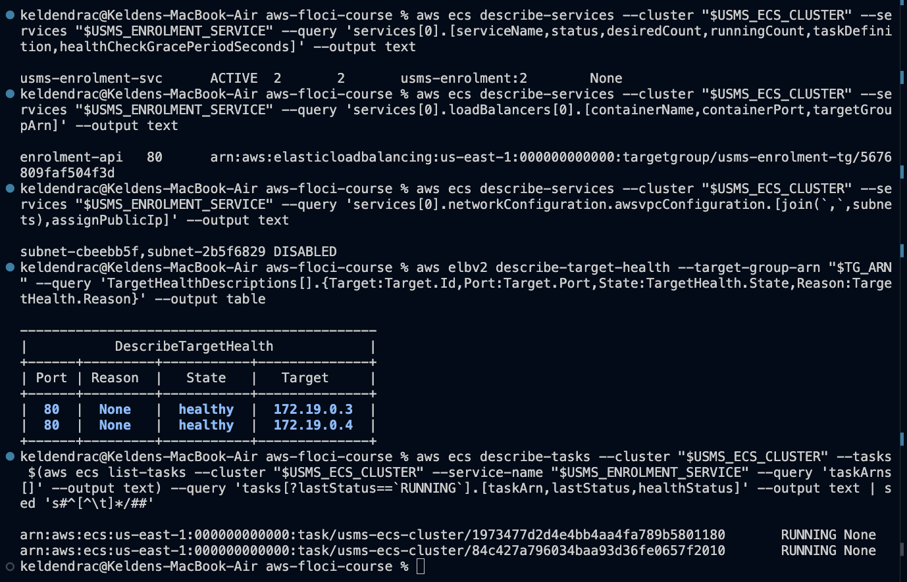
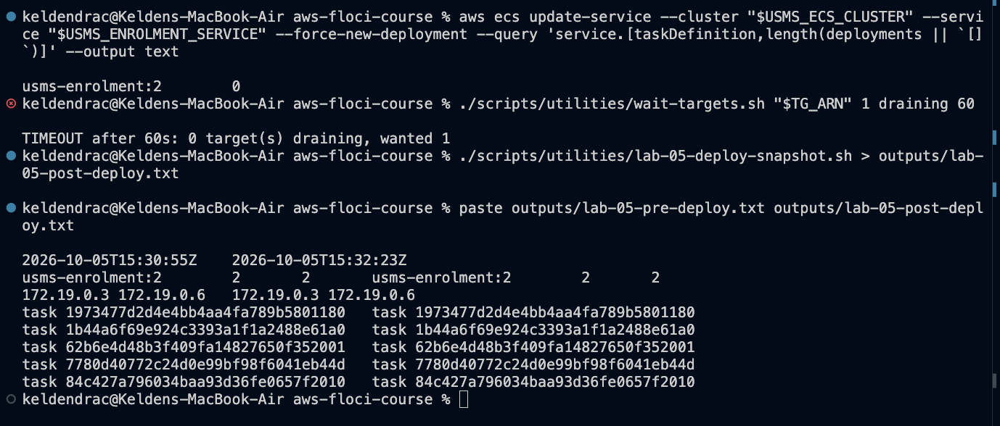
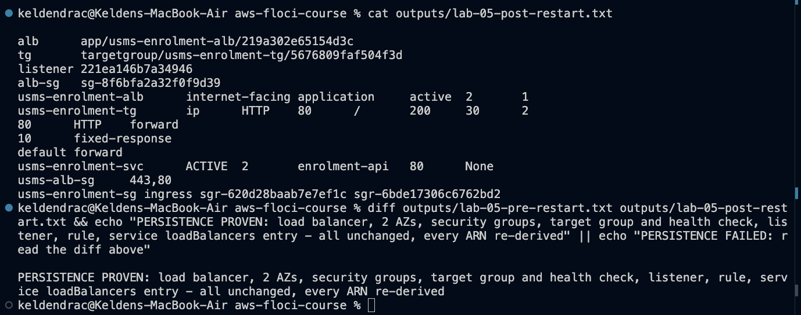
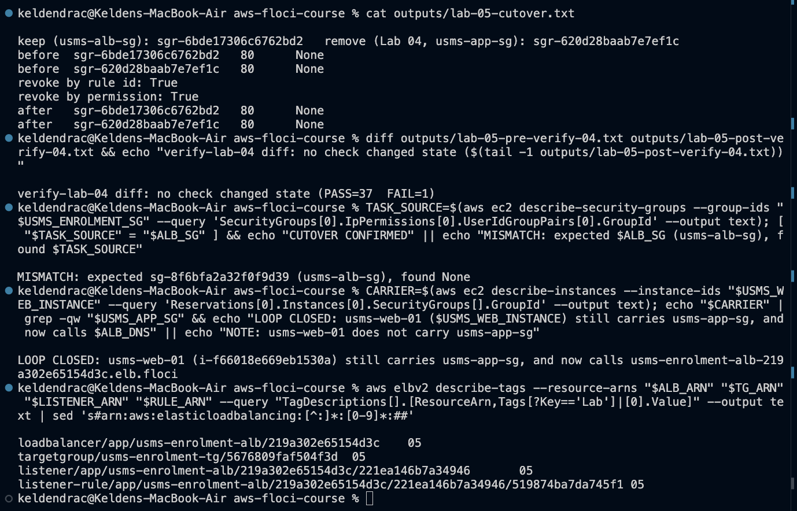
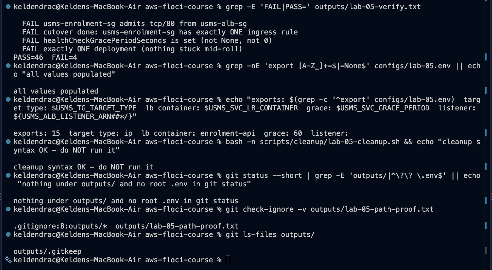

# Lab 05 - ECS behind an Application Load Balancer - completed

Full write-up: [lab-05-report.md](lab-05-report.md) - exercises: [exercises.md](exercises.md) - review questions: [../../notes/lab-05-notes.md](../../notes/lab-05-notes.md)

**Support path: B, plus a data path inside Docker.** ELBv2 is fully modelled
and health checks and forwarding run inside the Docker network, but the load
balancer's DNS name does not resolve from the host. Application Auto Scaling
is still not implemented.

## What exists after this lab

- **Security groups:**
  - `usms-alb-sg` (`sg-8f6bfa2a32f0f9d39`): tcp/80 and tcp/443 from
    `0.0.0.0/0`, the only internet-wide rule in the design
  - `usms-enrolment-sg`: a new tcp/80 rule from `usms-alb-sg`
    (`sgr-6bde17306c6762bd2`). Lab 04's rule from `usms-app-sg` is still
    there, because Floci's revoke is a no-op (problem 4)
- **Load balancer** `usms-enrolment-alb`: `internet-facing`, `application`,
  `active`, nodes in `usms-public-subnet-a` (us-east-1a) and `-b`
  (us-east-1b), idle timeout 60, invalid headers dropped
- **Target group** `usms-enrolment-tg`:
  - `ip`, HTTP/80, `usms-vpc`
  - health check `GET /` every 30 s, timeout 5, healthy 2, unhealthy 2,
    matcher `200`
  - deregistration delay 30, `least_outstanding_requests`
- **Listener** HTTP:80, default `forward` to the target group, plus rule
  priority 10: `/alb-health` -> fixed-response 200
- **Service** `usms-enrolment-svc`, recreated (same name, settings and tags)
  with one `loadBalancers` entry: `enrolment-api` / 80. Still on
  `usms-enrolment:2`, desired 2
- **Config:** `configs/lab-05.env`, 16 exports including Exercise 5's
  `USMS_ALB_RESOURCE_LABEL`
- **Scripts** (cleanup never run):
  - `scripts/utilities/`: `verify-lab-05.sh`, `write-lab-05-env.sh`,
    `lab-05-probe.sh`, `wait-targets.sh`, `lab-05-path-proof.sh`,
    `lab-05-deploy-snapshot.sh`, `lab-05-restart-facts.sh`,
    `usms-lb-report.sh` (Exercise 3), `usms-resource-label.sh` (Exercise 5)
  - `labs/lab-05-ecs-alb/lab06-readiness.sh` (Exercise 5)
  - `scripts/cleanup/lab-05-cleanup.sh`
- **Policies:** `usms-alb-sg-ingress.json`, `usms-alb-sg-ingress-https.json`,
  `usms-enrolment-sg-ingress-alb.json`
- **Templates:** `lab-05-listener-default-actions.json`,
  `lab-05-rule-conditions.json`, `lab-05-rule-actions.json`,
  `lab-05-service-load-balancers.json`, plus Exercise 1's
  `lab-05-results-rule-*.json`
- **`scripts/utilities/verify-lab-04.sh`** repaired in Exercise 2

## Reproduce

    cd ~/Desktop/aws-floci-course
    source configs/course.env
    ./scripts/setup/floci-up.sh
    source configs/lab-01.env
    source configs/lab-02.env
    source configs/lab-03.env
    source configs/lab-04.env
    source configs/lab-05.env
    ./scripts/utilities/verify-lab-05.sh

Expected: `PASS=46  FAIL=4`. All four are Floci limitations: group
references not stored, revoke a no-op, grace period not stored, and
`deployments` null. See report Section 3.9.

## Evidence

The three checkpoint screenshots Section 14.2 requires, the cutover/loop
evidence, and the verification result.

### 1. Checkpoint 4 - the service registers its own targets

### 2. Checkpoint 5 - a forced deployment

### 3. Checkpoint 7 - persistence

### 4. Cutover attempt and closing the loop

### 5. verify-lab-05.sh and hygiene

## Problems I hit and how I fixed them

### 1. The first pass ran with no Lab 02 or Lab 04 variables

The terminal used for Stages 1-5 had never sourced the env files. Every
`$USMS_*` was empty, with these results:
- `create-load-balancer` failed with `SubnetNotFound: The subnet ID ''`
- `usms-alb-sg` and `usms-enrolment-tg` landed in `vpc-default`
- the service-load-balancers template got `containerName: ""`
- every ECS call named the empty cluster, so Floci silently auto-created a
  `default` cluster

The real Lab 04 service and security group were untouched, because the
destructive calls went to the empty cluster. The broken objects were
deleted, the empty outputs removed, and the lab re-run after a one-line echo
of all six critical variables. Lesson: check the variables, not the prompt.

### 2. `update-service --load-balancers` is accepted and not stored

It returned `LB: null, Grace: null`. The guide's fallback was taken: scale
to 0, wait, delete, and recreate with the same name and settings plus
`--load-balancers`. `create-service` *does* store the entry and registers
targets. I confirmed this on a throwaway service before relying on it.

### 3. The guide's fallback has two broken parts

- It waits with `aws ecs wait services-stable`, which crashes on this build
  because `deployments` is `null` (Lab 04, problem 6). I replaced it with
  `wait tasks-stopped` on the old task ARNs, captured first.
- It reads `templates/lab-04-deployment-config.json`, which Lab 04 never
  created. I passed the same values inline:
  `maximumPercent=200,minimumHealthyPercent=100`.

### 4. `revoke-security-group-ingress` is a no-op, so the cutover cannot happen

Every form returns `True` and removes nothing: by rule ID, by group pair, by
CIDR, and by the source-less stored form. This was tested on a throwaway
group first, then on the real one. Both tcp/80 rules remain on
`usms-enrolment-sg`. I did not work around it by recreating the group,
because that would change an ID three other scripts and Lab 06 depend on.

### 5. Group references are still not stored

The new rule from `usms-alb-sg` reads back as `tcp 80 None`, just like Lab
04's. This is the fifth confirmation of Lab 02's limitation. As a
consequence, the guide's Step 13 lookup (filter by `ReferencedGroupInfo`)
finds nothing. The Lab 04 rule was identified as "the ingress rule that is
not `$ALB_RULE_ID`", using the ID from Step 9's own output.

### 6. A check that passed vacuously

The guide's "cutover done: no longer admits `usms-app-sg`" check greps the
stored source groups for `usms-app-sg`. With nothing stored, it passes
whether or not the rule was removed. `verify-lab-05.sh` now also asserts
"exactly ONE ingress rule", which correctly fails here.

### 7. The guide's `lab-05.env` heredoc writes an empty listener ARN

`--query 'Listeners[?Port==\`80\`]...'` sits inside a `$(...)` in an
unquoted heredoc, and the backslashes reach JMESPath intact. The query
fails, and `USMS_ALB_LISTENER_ARN=` is written empty. `write-lab-05-env.sh`
now looks the listener up before the heredoc.

### 8. The guide's empty-value grep can't fail on macOS

`grep -n 'export .*=$\|None'` relies on GNU `\|` alternation in a basic
regex. BSD `grep` treats it literally, so it printed "all values populated"
over the empty value from problem 7. It was replaced with
`grep -nE 'export [A-Z_]+=$|=None$'`. Verify caught the bug because it
already used `-E`.

### 9. The grace period is not stored

`--health-check-grace-period-seconds 60` is accepted on both `create-service`
and `update-service` and reads back `None`. The env file records the
requested 60 with a comment saying why. Verify still reads the API and fails
the check.

### 10. A forced deployment replaces nothing

`--force-new-deployment` is accepted and no task changes: same IDs, same
addresses, no `draining` within 60 s. The same was true of Exercise 5's
90-second measurement, so its "replacement time" is reported as not
measurable, with what to size against instead.

### 11. The data path exists, but only inside Docker

The DNS name `*.elb.floci` doesn't resolve from the host, and only port 4566
is published. Floci's ELBv2 data plane binds the listener port inside its own
container, though. `docker exec floci curl http://localhost:80/` and the same
request from `usms-web-01`'s container both returned nginx's `200`. I didn't
publish extra ports, per the environment contract.

### 12. Target addresses are Docker addresses

Targets are `172.19.0.x`, the containers' addresses on Floci's Compose
network, not ENI addresses in `10.0.3.0/24` / `10.0.4.0/24`. The path-proof
script classifies them as such instead of calling them "not in a Lab 02
subnet - investigate".

### 13. `list-tasks` includes stopped tasks

The deploy snapshots list five task IDs for a 2/2 service: Lab 04's two
originals and the one from the scale to 3 and back. A per-task loop
therefore printed `STOPPED` rows. The Checkpoint 4 command now filters
`tasks[?lastStatus=='RUNNING']`.

### 14. A restart left orphan task containers

After `floci-down`/`floci-up`, Floci started two new task containers and kept
the two old ones. All four registered and are `healthy`, behind a service
that reports 2/2. Exercise 3's report, which counts targets, is what showed
it.

### 15. The guide's "no secret is tracked by git" check always fails

`! git ls-files | grep -q '^outputs/'` matches `outputs/.gitkeep`, which is
tracked on purpose. This is the same fix as Lab 04.

### 16. The guide's cleanup header contradicts itself

It says to run it "AFTER lab-04-cleanup.sh and BEFORE lab-04-cleanup.sh".
Section 9.3's order block shows the first should be Lab 06's. The script
says so, refuses while a scalable target exists, and uses `wait
tasks-stopped` instead of the crashing `services-stable`.

### 17. `verify-lab-03.sh` reads `PASS=32 FAIL=4` after the restart

It was 33/3 in Lab 03. The extra failure is "user data reached the instance
byte-identical", which reads the instance container. After an emulator
restart that container is a new one (Lab 03, problem 13). It isn't caused by
this lab.
