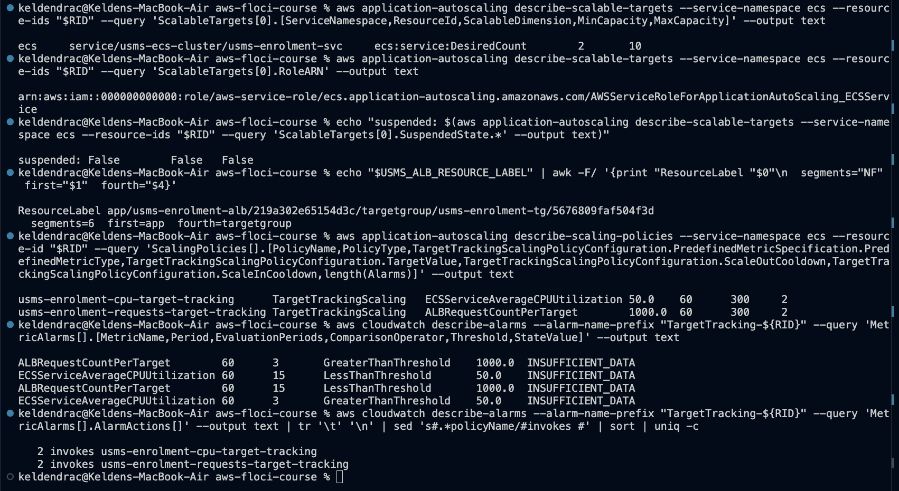
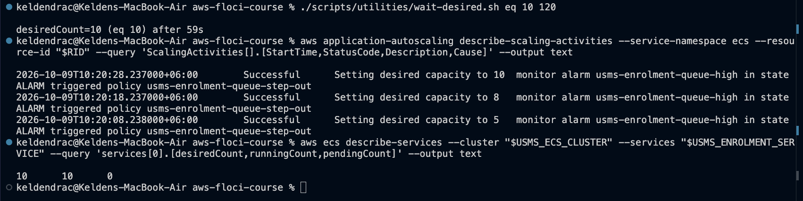
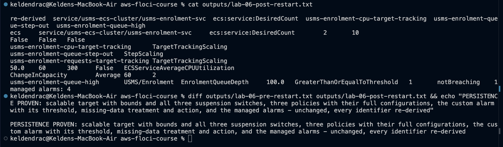
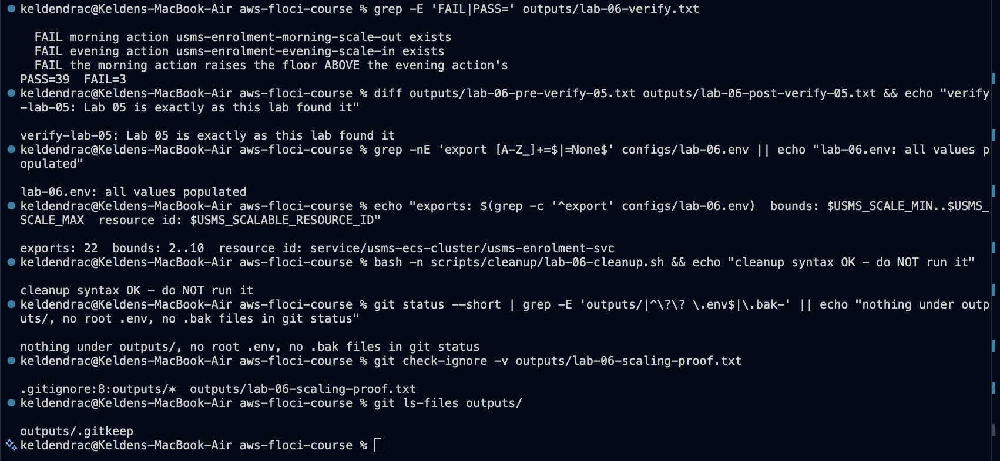

# Lab 06 - ECS service auto scaling - completed

Full write-up: [lab-06-report.md](lab-06-report.md) - exercises: [exercises.md](exercises.md) - review questions: [../../notes/lab-06-notes.md](../../notes/lab-06-notes.md)

**Support path: A, on Floci 2.2.0.** The course's Floci 1.5.34 has no
Application Auto Scaling (path C). The emulator was upgraded for this lab,
after testing 2.2.0 against a copy of the Lab 1-5 state. On 2.2.0 the scaling
loop really runs. Scheduled actions are not implemented.

## What exists after this lab

- **Scalable target** `service/usms-ecs-cluster/usms-enrolment-svc`:
  dimension `ecs:service:DesiredCount`, min 2 and max 10, no suspension
  switch set
- **Target tracking policies:**
  - `usms-enrolment-cpu-target-tracking`: `ECSServiceAverageCPUUtilization`
    50.0, cooldowns 60 out / 300 in
  - `usms-enrolment-requests-target-tracking`: `ALBRequestCountPerTarget`
    1000.0, `ResourceLabel` from Lab 05 Exercise 5
- **Step policy** `usms-enrolment-queue-step-out`: +1 for a breach of 0-100,
  +3 above 100, cooldown 60
- **Alarms:**
  - `usms-enrolment-queue-high` on `USMS/Enrolment EnrolmentQueueDepth >= 100`,
    invoking the step policy
  - four managed `TargetTracking-...` alarms
- **Unchanged:** the service, task definition, target group and load balancer
- **Config:** `configs/lab-06.env`, 24 exports including Exercise 5's two
- **Templates:** `lab-06-target-tracking-{cpu,requests,memory}.json`,
  `lab-06-step-scaling-{out,in}.json`, `lab-06-suspended-state.json`
- **Scripts** (cleanup never run):
  - `scripts/utilities/`: `verify-lab-06.sh`, `write-lab-06-env.sh`,
    `lab-06-probe.sh`, `wait-desired.sh`, `lab-06-scaling-proof.sh`,
    `lab-06-restart-facts.sh`, `lab-06-chain.sh`, `usms-scaling-report.sh`
    (Exercise 3), `usms-scaling-history.sh` (Exercise 5)
  - `labs/lab-06-ecs-autoscaling/lab10-readiness.sh` (Exercise 5)
  - `scripts/cleanup/lab-06-cleanup.sh`
- **`docker-compose.yml`** pinned to `floci/floci:2.2.0`
- **Rollback point:** `~/floci-data-lab-05-complete-1.5.34.tar.gz`, outside
  the repository

## Reproduce

    cd ~/Desktop/aws-floci-course
    ./scripts/setup/floci-up.sh
    source configs/course.env
    source configs/lab-01.env
    source configs/lab-02.env
    source configs/lab-03.env
    source configs/lab-04.env
    source configs/lab-05.env
    source configs/lab-06.env
    ./scripts/utilities/verify-lab-06.sh

Expected: `PASS=39  FAIL=3`. All three failures are the scheduled-action
checks: Floci 2.2.0 answers `PutScheduledAction` and
`DescribeScheduledActions` with `UnsupportedOperation`.

## Evidence

### 1. Checkpoint 3 - the scalable target and two target tracking policies

### 2. Checkpoint 5 - a scaling activity whose Cause names the alarm and the policy

### 3. Checkpoint 7 - persistence

### 4. verify-lab-06.sh and hygiene

## Problems I hit and how I fixed them

### 1. Floci 1.5.34 has no Application Auto Scaling

Every call returned `UnknownOperationException`, which is support path C.
Floci 2.2.0 (released 2026-10-06) implements the service. Before switching, I
checked four things on throwaway containers:
- the whole lab chain on empty data
- the Lab 1-5 state on a **copy** of `~/floci-data`: 36 facts compared,
  identical
- persistence across a restart
- the alarm timing

Only then did the real environment change: `floci-down`, a tarball backup, the
compose image pinned to `2.2.0`, `floci-up`.

### 2. The first pass ran with empty variables, and Floci accepted a target called `None`

Stages 1-3 first ran in a terminal without the env files. `describe-services
--cluster ""` returned `None`, `${SVC_ARN##*:}` turned it into the string
`None`, and Floci registered a scalable target with resource ID `None`, then
attached the CPU policy and two managed alarms to it. The policy, the target
and the orphan alarms were deleted, the bad outputs removed, and the stages
re-run behind a `READY` guard and an explicit `RID OK` check.

### 3. Floci ignores cooldowns and re-fires every ~10 s

While the alarm is in ALARM, Floci invokes the step policy on every
evaluation. So 2 -> 10 took 59 s instead of minutes, and a careless reset can
be undone seconds later. A dry run caught this: after resetting desired to 2,
the policy scaled back to 10, because a low value pushed into the same minute
as the 260 left the minute's average above the threshold.

The reset now suspends scale-out first, lowers the metric, waits for `OK`
with `aws cloudwatch wait alarm-exists --state-value OK`, then sets the
count. Suspension was confirmed to block scale-out on this build.

### 4. Scheduled actions are unsupported

`PutScheduledAction` and `DescribeScheduledActions` return
`UnsupportedOperation` for `cron`, for `at()`, and with or without
`--timezone`. Step 11 is recorded, not built, and those three checks are
verify's three failures. Exercise 4's plan specifies the actions anyway.

### 5. Bounds are stored but not enforced at registration

Re-registering with min 5 (Step 6's "Your turn") and min = max = 3
(Exercise 3) both left `desiredCount` at 2. Exercise 5's "raise the floor and
time it" therefore had no capacity to time. The script records that and times
desired -> running by hand instead (7 s).

### 6. The service-linked role gets the wrong name

`create-service-linked-role` makes `AWSServiceRoleForEcsApplicationAutoscaling`,
so a `get-role` on `AWSServiceRoleForApplicationAutoScaling_ECSService`
returns `NoSuchEntity`. The target's `RoleARN` still names the correct role.

### 7. The step policy's `Alarms` list is empty on Floci

The alarm's `AlarmActions` names the policy, and the loop fires, but
`describe-scaling-policies` shows no alarm on the step policy. My Exercise 3
report therefore said the policy "can never fire", and my Exercise 5 history
export left the alarm out. Both scripts now also find alarms from the alarm
side (any `AlarmActions` containing a policy ARN), and both were re-run.
Their original outputs are kept.

### 8. The guide's Step 17 repair would have broken a correct script

The Lab 04 and 05 cleanup scripts already name `lab-06-cleanup.sh` as the
script to run first. The three `lab-04-cleanup.sh` mentions the guide's
`grep` finds are the correct "run BEFORE lab-04-cleanup.sh" instructions. The
guide's replace-all would have rewritten them wrongly, so I skipped it.

### 9. The guide's verify and env checks, again

The guide's verify uses `! git ls-files | grep -q '^outputs/'`, which always
fails because `outputs/.gitkeep` is tracked; the same fix as Labs 04 and 05.
Its empty-value grep uses `\|`, which BSD `grep` on macOS treats literally;
`grep -E` is used instead.

Floci 2.2.0's managed alarms also differ from AWS:
- the metric name is the predefined type string
- the ALB alarms are in `AWS/ECS`
- the high and low thresholds are equal

All of this is in the report's Section 7.
